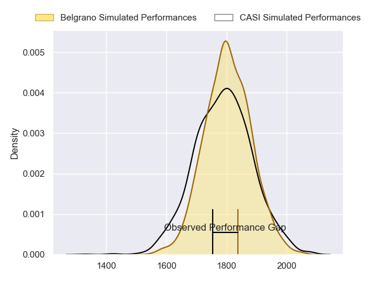
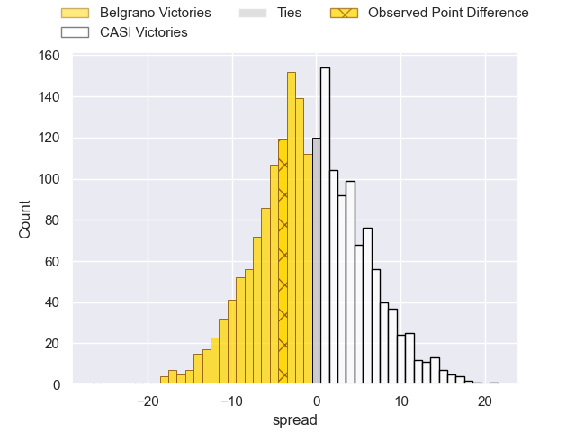
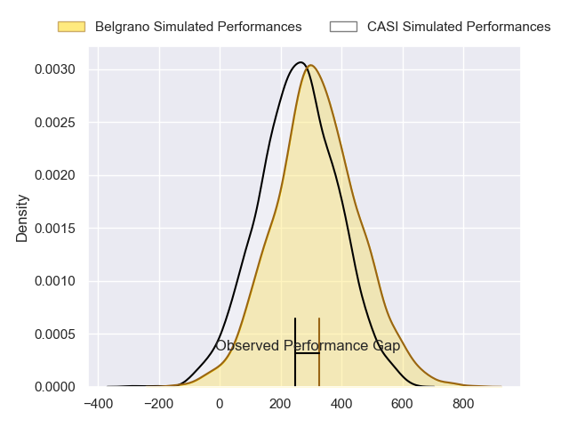
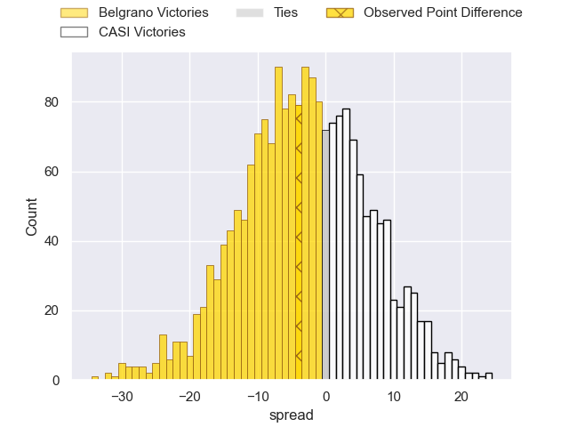

---  
layout: page  
title: Belgrano at CASI; 41-37  
date: 2024-07-14 18:00:00 -0500  
categories: "URBA Top 12 2024" match review  
---
# Belgrano at CASI; 41-37

# Club Level Predictions

The first set of predictions treats a club as the smallest object, as the club develops its members, organizes a gameplan, and deploys its players as needed for each match. This club model has a prediction of 0.481, which translates to predicting Belgrano to win by 0.7.

Our Over/Under is 60.5 - and combined with the spread above, we have a predicted scoreline of 31 to 30

Each club has a rating and a rating deviation (similar to a Glicko rating), and expected performances can be generated. This allows for simulated matches and spreads like the ones below.
## Projected Performances - Club Model

## Projected Spreads - Club Model

## Projected Results - Club Model

# Player Level Predictions

Treating teams instead as an entity made up of the currently active players, I have ratings for each player in an altogether different system. These can be combined to form team ratings once teamsheets are announced, weighting starters a bit higher than the reserves. After the match is played, players can be weighted by their minutes on the field, allowing for an accurate measure of the team's composition. With these compiled team ratings, we can make predictions, measure inaccuracy, and update the individual player ratings.
## Prediction without Player Minutes: Belgrano by 2.4

Belgrano by 6.5 on a neutral pitch

## Projected Performances - Player Model

## Projected Spreads - Player Model

## Projected Results - Player Model

|   Away Minutes | Away Player            |   Away Percentile |   Number |   Home Percentile | Home Player                |   Home Minutes |
|---------------:|:-----------------------|------------------:|---------:|------------------:|:---------------------------|---------------:|
|             80 | Francisco Ferronato    |             89.35 |        1 |             56.63 | Facundo Scaiano            |             80 |
|             80 | Francisco Lusarreta    |             89.86 |        2 |             86.69 | Juan Torres Obeid          |             80 |
|             80 | Lisandro Garcia Dragui |             83.52 |        3 |             85.06 | Juan Ignacio Nieto Sanchez |             80 |
|             80 | Luciano Tecca          |             89.87 |        4 |             63.79 | Agustin Posleman           |             80 |
|             80 | Ramon Duggan           |             68.95 |        5 |             71.95 | Leo Mazzini                |             80 |
|             80 | Joaquin de la Serna    |             86.4  |        6 |             86.86 | Eugenio Sartori            |             80 |
|             80 | Augusto Vaccarino      |             79.37 |        7 |             36.73 | Benjamin Rocca Rivarola    |             80 |
|             80 | Franco Vega            |             83.93 |        8 |             68.65 | Luis Briatore              |             80 |
|             80 | Ignacio Marino         |             77.47 |        9 |             42.6  | Tobias Casaurang           |             80 |
|             80 | Juan Aparicio          |             70.53 |       10 |             76.81 | Felipe Hileman             |             80 |
|             80 | Ignacio Diaz           |             85.71 |       11 |             71.34 | Jeronimo Tumbarello        |             80 |
|             80 | Juan Brescia           |             40.68 |       12 |             78.22 | Bruno Devoto               |             80 |
|             80 | Tomas Etchepare        |             82.25 |       13 |             78.22 | Jeronimo Solveyra          |             80 |
|             80 | Pedro Arana            |             37.58 |       14 |             81.98 | Santiago David             |             80 |
|             80 | Juan Lando             |             81.44 |       15 |             77.64 | Juan Akemeier              |             80 |
|              0 | Santiago Garcia Botta  |            nan    |       16 |            nan    | Facundo Andreotti          |              0 |
|              0 | Justo Duranona         |             62.91 |       17 |            nan    | Felix Paolucci             |              0 |
|              0 | Mikael Quesada         |             63.04 |       18 |            nan    | Hugo Garcia                |              0 |
|              0 | Jose Saporitti         |            nan    |       19 |             78.61 | Salvador Ochoa             |              0 |
|              0 | Joaquin Mihura         |             69.39 |       20 |            nan    | Matias Dirube              |              0 |
|              0 | Theo Blaksley          |             65.13 |       21 |            nan    | Ignacio Larrague           |              0 |
|              0 | Francisco Gradin       |             31.45 |       22 |            nan    | Tomas Phelan               |              0 |
|              0 | Tobias Bernabe         |             82.07 |       23 |             68.86 | Bautista Belleze           |              0 |

