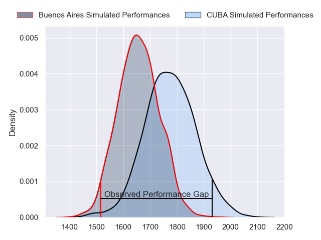
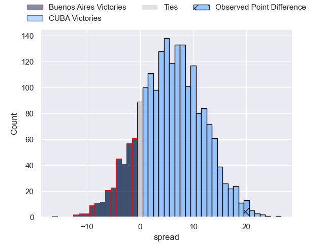
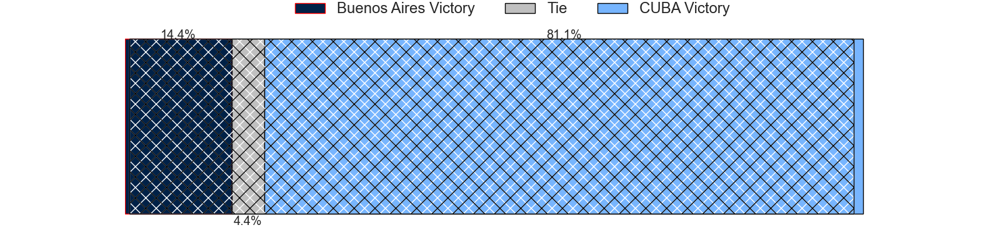
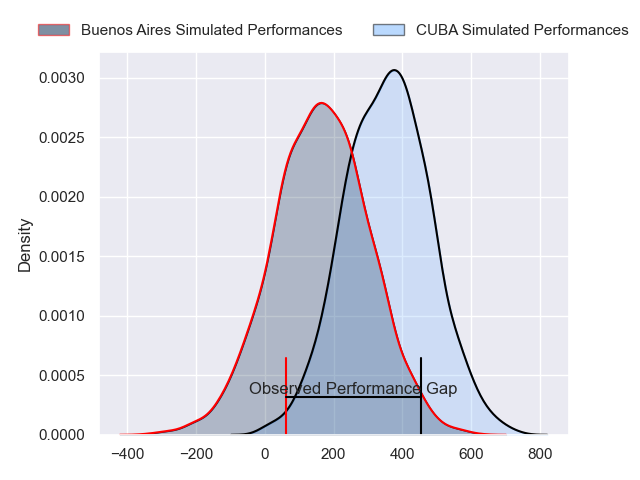
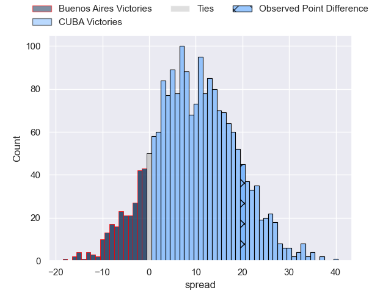
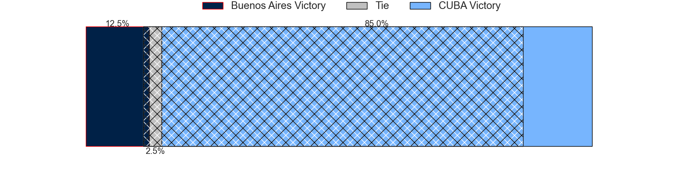

---  
layout: page  
title: Buenos Aires at CUBA; 10-30  
date: 2024-07-14 18:00:00 -0500  
categories: "URBA Top 12 2024" match review  
---
# Buenos Aires at CUBA; 10-30

# Club Level Predictions

The first set of predictions treats a club as the smallest object, as the club develops its members, organizes a gameplan, and deploys its players as needed for each match. This club model has a prediction of 0.66, which translates to predicting CUBA to win by 5.9.

Our Over/Under is 52.5 - and combined with the spread above, we have a predicted scoreline of 23 to 29

Each club has a rating and a rating deviation (similar to a Glicko rating), and expected performances can be generated. This allows for simulated matches and spreads like the ones below.
## Projected Performances - Club Model

## Projected Spreads - Club Model

## Projected Results - Club Model

# Player Level Predictions

Treating teams instead as an entity made up of the currently active players, I have ratings for each player in an altogether different system. These can be combined to form team ratings once teamsheets are announced, weighting starters a bit higher than the reserves. After the match is played, players can be weighted by their minutes on the field, allowing for an accurate measure of the team's composition. With these compiled team ratings, we can make predictions, measure inaccuracy, and update the individual player ratings.
## Prediction without Player Minutes: CUBA by 9.9

CUBA by 6.0 on a neutral pitch

## Projected Performances - Player Model

## Projected Spreads - Player Model

## Projected Results - Player Model

|   Away Minutes | Away Player            |   Away Percentile |   Number |   Home Percentile | Home Player             |   Home Minutes |
|---------------:|:-----------------------|------------------:|---------:|------------------:|:------------------------|---------------:|
|             80 | Pablo Gaston Vaca      |             76.16 |        1 |             89.29 | Facundo Aguirre         |             80 |
|             80 | Tomas Rosasco          |             44.21 |        2 |             31.13 | Tomas Anderlic          |             80 |
|             80 | Tomas Gallo            |             30.3  |        3 |             84.59 | Estanislao Carullo      |             80 |
|             80 | Tomas Alvarez Bayon    |             45.25 |        4 |             87.71 | Santiago Uriarte        |             80 |
|             80 | Bautista Duranona      |             37.52 |        5 |             87.62 | Santiago Landau         |             80 |
|             80 | Jaime McGrech          |             33.21 |        6 |             85.33 | Francisco Sied          |             80 |
|             80 | Matias Espina          |             36.72 |        7 |             83.49 | Segundo Pisani          |             80 |
|             80 | Jordi Dieguez          |             47.51 |        8 |             82.9  | Benito Ortiz de Rozas   |             80 |
|             80 | Mateo Freire           |             22.59 |        9 |             78.23 | Rafael Iriarte          |             80 |
|             80 | Tomas Bunge            |             23.15 |       10 |             87.1  | Valentin Mastroizi      |             80 |
|             80 | Benjamin Handley       |             20.65 |       11 |             86.93 | Marcos Moroni           |             80 |
|             80 | Agustin Lamensa Sanudo |             39.66 |       12 |             73.99 | Felipe de la Vega       |             80 |
|             80 | Ramiro Costa           |             34.72 |       13 |             65.38 | Marcos Elicagaray       |             80 |
|             80 | Alfonso Latorre        |             61.95 |       14 |             90.62 | Bautista Casaurang      |             80 |
|             80 | Julian Quetglas Bojar  |             38.14 |       15 |             50.4  | Simon Benitez Cruz      |             80 |
|              0 | Valentino Minoyetti    |             41.8  |       16 |            nan    | Esteban Iribarne        |              0 |
|              0 | Tomas Herrador         |             12.76 |       17 |            nan    | Emilio Perez Maraviglia |              0 |
|              0 | Blas Armando Coria     |             56.34 |       18 |            nan    | Jeronimo Conte Grand    |              0 |
|              0 | Tomas Etcheverry       |             18.49 |       19 |            nan    | Nicolas Amadeo          |              0 |
|              0 | Luis Prieto Martinez   |            nan    |       20 |             52.49 | Lucas Campion           |              0 |
|              0 | Juan Monasterio        |             64.32 |       21 |            nan    | Felipe Mendonca         |              0 |
|              0 | Juan Pablo Barzi       |            nan    |       22 |             45.09 | Pedro Mesones           |              0 |
|              0 | Simon Mimessi          |             20.11 |       23 |             79.03 | Felipe Perdomo          |              0 |

