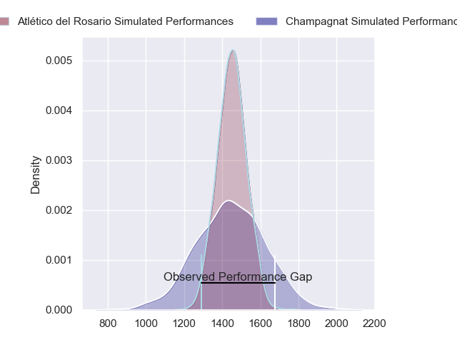
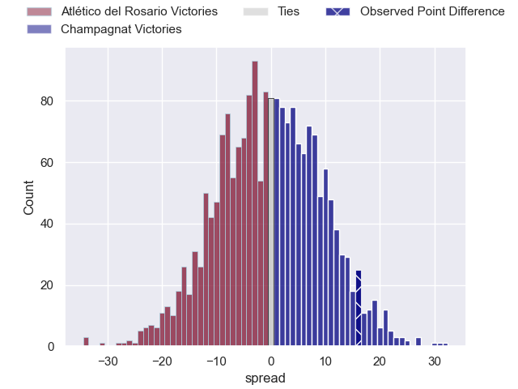
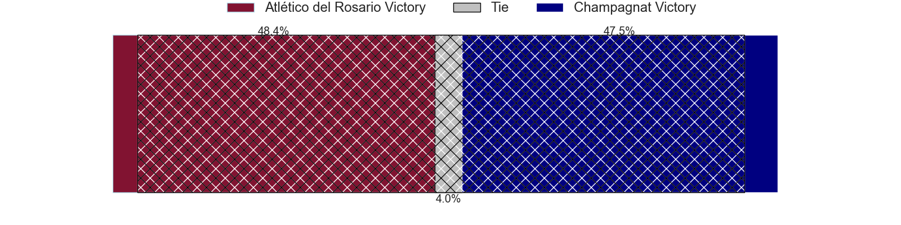
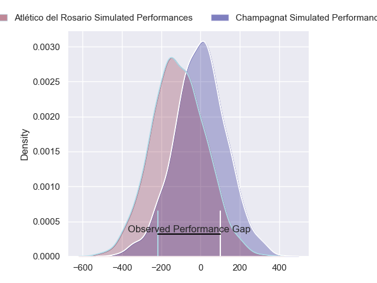
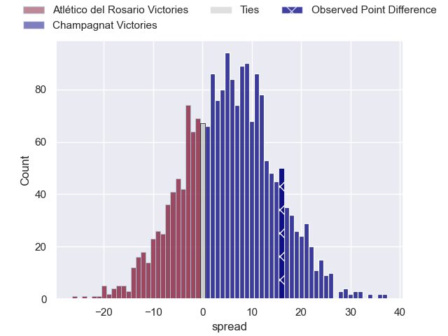
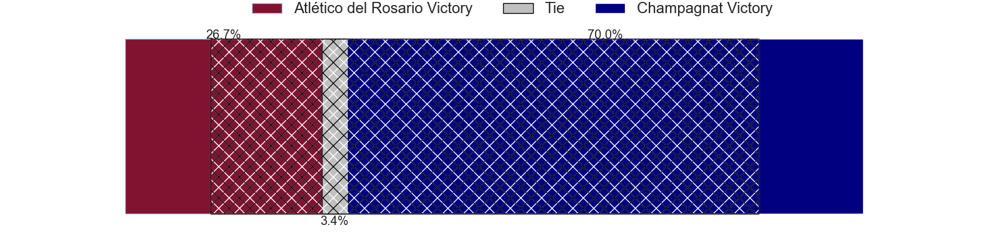

---  
layout: page  
title: Atletico del Rosario at Champagnat; 20-36  
date: 2024-07-14 18:00:00 -0500  
categories: "URBA Top 12 2024" match review  
---
# Atletico del Rosario at Champagnat; 20-36

# Club Level Predictions

The first set of predictions treats a club as the smallest object, as the club develops its members, organizes a gameplan, and deploys its players as needed for each match. This club model has a prediction of 0.491, which translates to predicting Atlético del Rosario to win by 0.3.

Our Over/Under is 46.5 - and combined with the spread above, we have a predicted scoreline of 23 to 23

Each club has a rating and a rating deviation (similar to a Glicko rating), and expected performances can be generated. This allows for simulated matches and spreads like the ones below.
## Projected Performances - Club Model

## Projected Spreads - Club Model

## Projected Results - Club Model

# Player Level Predictions

Treating teams instead as an entity made up of the currently active players, I have ratings for each player in an altogether different system. These can be combined to form team ratings once teamsheets are announced, weighting starters a bit higher than the reserves. After the match is played, players can be weighted by their minutes on the field, allowing for an accurate measure of the team's composition. With these compiled team ratings, we can make predictions, measure inaccuracy, and update the individual player ratings.
## Prediction without Player Minutes: Champagnat by 4.2

Champagnat by 1.6 on a neutral pitch

## Projected Performances - Player Model

## Projected Spreads - Player Model

## Projected Results - Player Model

|   Away Minutes | Away Player                 |   Away Percentile |   Number |   Home Percentile | Home Player         |   Home Minutes |
|---------------:|:----------------------------|------------------:|---------:|------------------:|:--------------------|---------------:|
|             80 | Ezequiel Reyes              |             11.19 |        1 |             39.31 | Tomas Distel        |             80 |
|             80 | Matias Malanos              |             13.92 |        2 |             23.45 | Joaquin Guerra      |             80 |
|             80 | Agustin Fernandez           |              1.46 |        3 |             31.42 | Marcos Magaro       |             80 |
|             80 | Matias Kremer               |              4.13 |        4 |             15.01 | Inaki Ustariz       |             80 |
|             80 | Octavio Capella             |              3.56 |        5 |             35.74 | Tobias Rivas Orozco |             80 |
|             80 | Jose Ignacio Ferrer         |             14.15 |        6 |             18.32 | Matias Alonso Boto  |             80 |
|             80 | Jose Caseres                |             17.11 |        7 |             30.16 | Lucas Moresco       |             80 |
|             80 | Lucas Malanos               |              2.78 |        8 |             17.66 | Matias Muniagurria  |             80 |
|             80 | Felipe Nogues               |             15.62 |        9 |             13.49 | Martin Graciarena   |             80 |
|             80 | Ramiro Musio                |             14.07 |       10 |             17.49 | Santos Panela       |             80 |
|             80 | Maximiliano Nicoli Fiscella |              5.64 |       11 |             17.47 | Tomas Baca Castex   |             80 |
|             80 | Pedro de Aro                |              2.39 |       12 |             16.55 | Tobias Imbrosciano  |             80 |
|             80 | Federico Martin             |             31.61 |       13 |             21.73 | Tomas Cotter        |             80 |
|             80 | Facundo Gerosa              |              5    |       14 |             26.11 | Facundo Rufino      |             80 |
|             80 | Guido Vidalle               |              4.59 |       15 |             53.49 | Gonzalo Costaguta   |             80 |
|              0 | Away Team 16                |            nan    |       16 |             23.75 | Manuel Mauvecin     |              0 |
|              0 | Jose Carro                  |            nan    |       17 |             19.16 | Alberto Adissi      |              0 |
|              0 | Bruno Montenegro            |             27.43 |       18 |            nan    | Federico Dominguez  |              0 |
|              0 | Ignacio Sapino              |            nan    |       19 |             27.77 | Santiago Escuti     |              0 |
|              0 | Martin Del Pazo             |             28.78 |       20 |             34.32 | Tomas Alonso Boto   |              0 |
|              0 | Nicolas Cripovich           |             31.48 |       21 |            nan    | Pedro Del Piano     |              0 |
|              0 | Juan Ignacio Degani         |            nan    |       22 |             31.51 | Marcos Lafuente     |              0 |
|              0 | Federico Mayol              |             41.26 |       23 |            nan    | Felipe Rojo Bas     |              0 |

