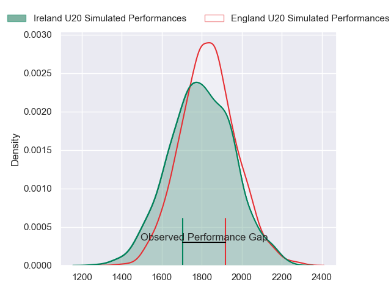
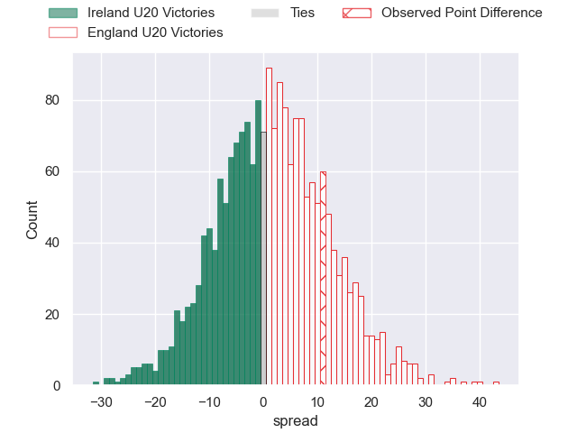
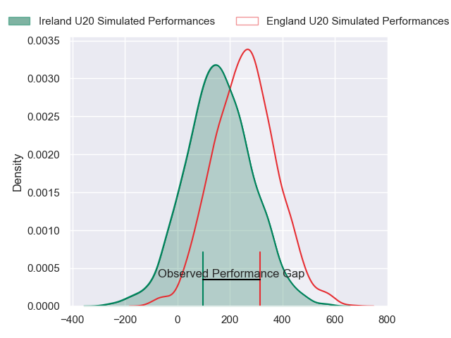
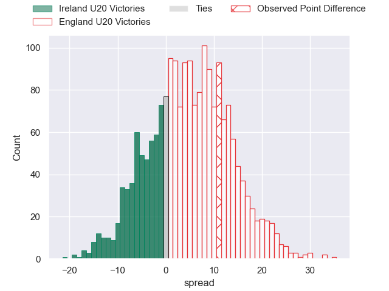
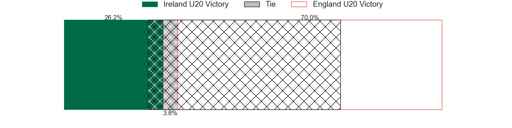

---  
layout: page  
title: Ireland U20 at England U20; 20-31  
date: 2024-07-14 18:00:00 -0500  
categories: "World Rugby U20 Championship 2024" match review  
---
# Ireland U20 at England U20; 20-31

# Club Level Predictions

The first set of predictions treats a club as the smallest object, as the club develops its members, organizes a gameplan, and deploys its players as needed for each match. This club model has a prediction of 0.55, which translates to predicting England U20 to win by 1.9.

Our Over/Under is 77.5 - and combined with the spread above, we have a predicted scoreline of 38 to 40

Each club has a rating and a rating deviation (similar to a Glicko rating), and expected performances can be generated. This allows for simulated matches and spreads like the ones below.
## Projected Performances - Club Model

## Projected Spreads - Club Model

## Projected Results - Club Model

# Player Level Predictions

Treating teams instead as an entity made up of the currently active players, I have ratings for each player in an altogether different system. These can be combined to form team ratings once teamsheets are announced, weighting starters a bit higher than the reserves. After the match is played, players can be weighted by their minutes on the field, allowing for an accurate measure of the team's composition. With these compiled team ratings, we can make predictions, measure inaccuracy, and update the individual player ratings.
## Prediction without Player Minutes: England U20 by 5.0

England U20 by 2.8 on a neutral pitch

## Projected Performances - Player Model

## Projected Spreads - Player Model

## Projected Results - Player Model

|   Away Minutes | Away Player      |   Away Percentile |   Number |   Home Percentile | Home Player          |   Home Minutes |
|---------------:|:-----------------|------------------:|---------:|------------------:|:---------------------|---------------:|
|             58 | Ben Howard       |             38.8  |        1 |             92.03 | Asher Opoku-Fordjour |             80 |
|             48 | Danny Sheahan    |             65.71 |        2 |             72.33 | Craig Wright         |             80 |
|             48 | Patreece Bell    |             58.69 |        3 |             64.69 | Afolabi Fasogbon     |             54 |
|             54 | Alan Spicer      |             57.73 |        4 |             65.74 | Joe Bailey           |             44 |
|             80 | James McKillop   |             46.46 |        5 |             75.88 | Junior Kpoku         |             80 |
|             69 | Sean Edogbo      |             54.34 |        6 |             91.42 | Finn Carnduff        |             80 |
|             80 | Bryn Ward        |             59.41 |        7 |             81.83 | Henry Pollock        |             80 |
|             80 | Brian Gleeson    |             28.23 |        8 |             73.36 | Nathan Michelow      |             27 |
|             68 | Oliver Coffey    |             55.97 |        9 |             70.38 | Ollie Allan          |             54 |
|             69 | Jack Murphy      |             57.87 |       10 |             66.79 | Benjamin Coen        |             80 |
|             80 | Hugo McLaughlin  |             59.96 |       11 |             91.97 | Arron Reed           |             80 |
|             68 | Hugh Gavin       |             44.21 |       12 |             64.19 | Sean Kerr            |             80 |
|             80 | Wilhelm De Klerk |             35.31 |       13 |             61.33 | Angus Hall           |             73 |
|             80 | Finn Treacy      |             60.32 |       14 |             90.26 | Ben Redshaw          |             80 |
|             80 | Ben O'Connor     |             39.92 |       15 |             68.97 | Ioan Jones           |             63 |
|             32 | Andrew Sparrow   |             53.68 |       16 |             61.62 | Kane James           |             53 |
|             32 | Stephen Smyth    |             50.08 |       17 |             54.56 | Olamide Sodeke       |             36 |
|             26 | Luke Murphy      |             52.09 |       18 |            nan    | Lucas Friday         |             26 |
|             22 | Emmett Calvey    |             51.56 |       19 |             59.68 | Jimmy Halliwell      |             26 |
|             12 | Tadhg Brophy     |            nan    |       20 |             59.6  | Toby Cousins         |             17 |
|             12 | Sam Berman       |             54.5  |       21 |             52.18 | Josh Bellamy         |              7 |
|             11 | Sean Naughton    |             53.13 |       22 |            nan    | nan                  |            nan |
|             11 | Billy Corrigan   |             51.68 |       23 |            nan    | nan                  |            nan |

