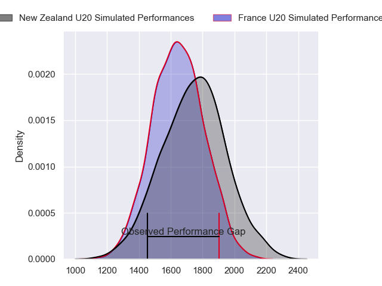
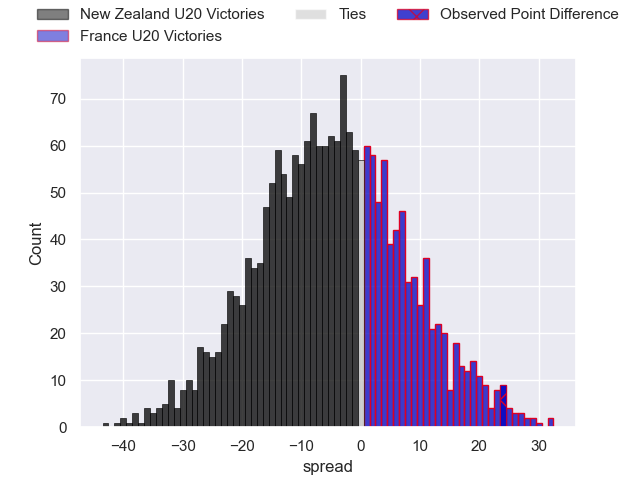
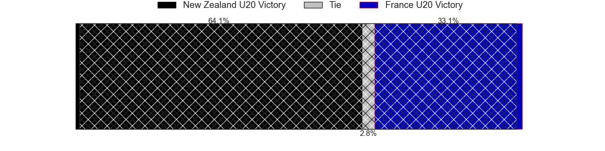
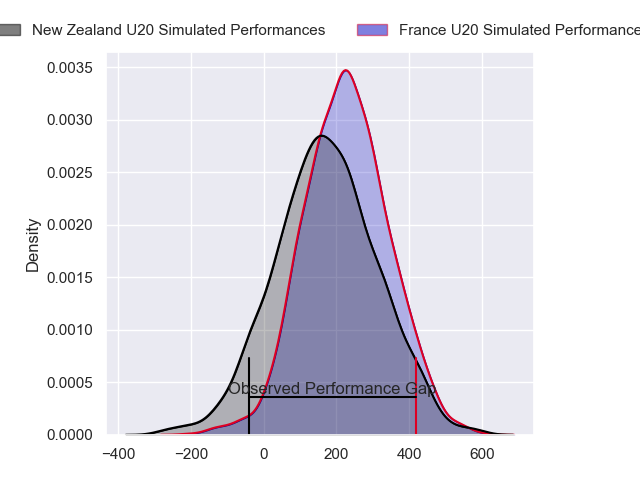
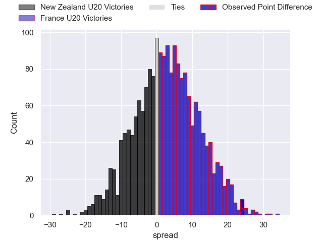
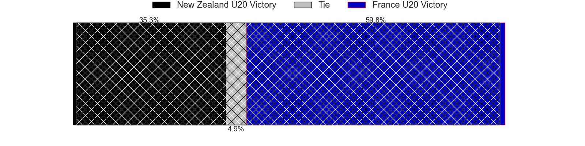

---  
layout: page  
title: New Zealand U20 at France U20; 31-55  
date: 2024-07-14 18:00:00 -0500  
categories: "World Rugby U20 Championship 2024" match review  
---
# New Zealand U20 at France U20; 31-55

# Club Level Predictions

The first set of predictions treats a club as the smallest object, as the club develops its members, organizes a gameplan, and deploys its players as needed for each match. This club model has a prediction of 0.4, which translates to predicting New Zealand U20 to win by 4.1.

Our Over/Under is 68.5 - and combined with the spread above, we have a predicted scoreline of 36 to 32

Each club has a rating and a rating deviation (similar to a Glicko rating), and expected performances can be generated. This allows for simulated matches and spreads like the ones below.
## Projected Performances - Club Model

## Projected Spreads - Club Model

## Projected Results - Club Model

# Player Level Predictions

Treating teams instead as an entity made up of the currently active players, I have ratings for each player in an altogether different system. These can be combined to form team ratings once teamsheets are announced, weighting starters a bit higher than the reserves. After the match is played, players can be weighted by their minutes on the field, allowing for an accurate measure of the team's composition. With these compiled team ratings, we can make predictions, measure inaccuracy, and update the individual player ratings.
## Prediction without Player Minutes: France U20 by 3.4

France U20 by 1.1 on a neutral pitch

## Projected Performances - Player Model

## Projected Spreads - Player Model

## Projected Results - Player Model

|   Away Minutes | Away Player        |   Away Percentile |   Number |   Home Percentile | Home Player             |   Home Minutes |
|---------------:|:-------------------|------------------:|---------:|------------------:|:------------------------|---------------:|
|             80 | Will Martin        |             41.08 |        1 |             67.5  | Samuel Jean-Christophe  |             47 |
|             80 | Vernon Bason       |             12.03 |        2 |             86.92 | Barnabé Massa           |             47 |
|             80 | Joshua Smith       |             57.93 |        3 |             68.72 | Lino Julien             |             55 |
|             80 | Tom Allen          |             62.66 |        4 |             86.13 | Charly Gambini          |             80 |
|             80 | Liam Jack          |             48.7  |        5 |             63.41 | Corentin Mezou          |             60 |
|             80 | Andrew Smith       |             51.66 |        6 |             75.74 | Joe Quere Karaba        |             80 |
|             80 | Johnny Lee         |             41.97 |        7 |             68.08 | Geoffrey Malaterre      |             64 |
|             80 | Mosese Bason       |             47.91 |        8 |             84.69 | Mathis Castro           |             71 |
|             80 | Dylan Pledger      |             44.68 |        9 |             74.3  | Leo Carbonneau          |             60 |
|             80 | Rico Simpson       |             42.5  |       10 |             82.92 | Hugo Reus               |             80 |
|             80 | Stanley Solomon    |             49.5  |       11 |             64.47 | Hoani Bosmorin          |             36 |
|             80 | Mark Tele'a        |             83.78 |       12 |             79.33 | Robin Taccola           |             80 |
|             80 | Aki Tuivailala     |             60.04 |       13 |             72.8  | Fabien Brau-Boirie      |             80 |
|             80 | Xavier TIto-Harris |             67.9  |       14 |             68.17 | Maxence Biasotto        |             80 |
|             80 | Sam Coles          |             37.94 |       15 |             82.21 | Mathis Ferté            |             80 |
|            nan | nan                |            nan    |       16 |             83.2  | Axel Desperes           |             44 |
|            nan | nan                |            nan    |       17 |            nan    | Lorencio Boyer Gallardo |             33 |
|            nan | nan                |            nan    |       18 |             62.56 | Thomas Lacombre         |             33 |
|            nan | nan                |            nan    |       19 |            nan    | Thomas Marceline        |             25 |
|            nan | nan                |            nan    |       20 |             41.11 | Xan Mousques            |             20 |
|            nan | nan                |            nan    |       21 |             61.73 | Charles Kante-Samba     |             20 |
|            nan | nan                |            nan    |       22 |             43.94 | Brent Liufau            |             16 |
|            nan | nan                |            nan    |       23 |             59.59 | Sialevailea Tolofua     |              9 |

