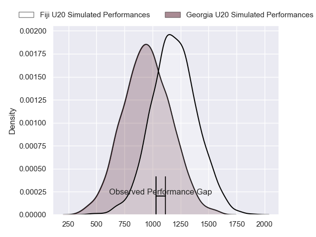
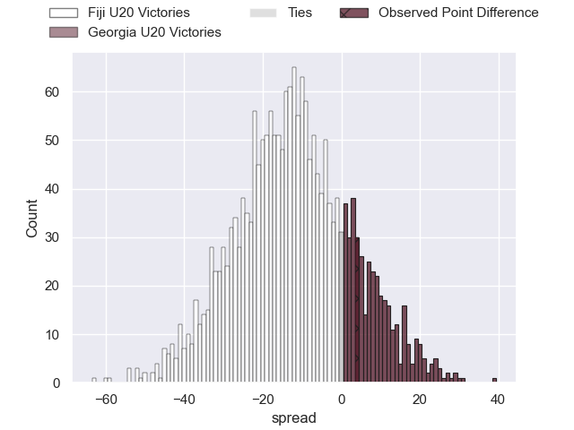
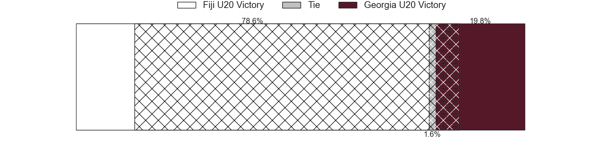
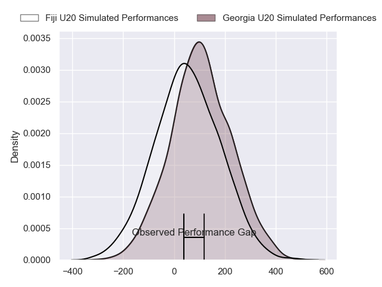
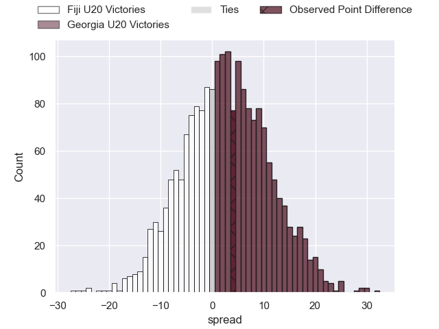

---  
layout: page  
title: Fiji U20 at Georgia U20; 36-40  
date: 2024-07-14 18:00:00 -0500  
categories: "World Rugby U20 Championship 2024" match review  
---
# Fiji U20 at Georgia U20; 36-40

# Club Level Predictions

The first set of predictions treats a club as the smallest object, as the club develops its members, organizes a gameplan, and deploys its players as needed for each match. This club model has a prediction of 0.233, which translates to predicting Fiji U20 to win by 12.3.

Our Over/Under is 60.5 - and combined with the spread above, we have a predicted scoreline of 36 to 24

Each club has a rating and a rating deviation (similar to a Glicko rating), and expected performances can be generated. This allows for simulated matches and spreads like the ones below.
## Projected Performances - Club Model

## Projected Spreads - Club Model

## Projected Results - Club Model

# Player Level Predictions

Treating teams instead as an entity made up of the currently active players, I have ratings for each player in an altogether different system. These can be combined to form team ratings once teamsheets are announced, weighting starters a bit higher than the reserves. After the match is played, players can be weighted by their minutes on the field, allowing for an accurate measure of the team's composition. With these compiled team ratings, we can make predictions, measure inaccuracy, and update the individual player ratings.
## Prediction without Player Minutes: Georgia U20 by 2.7

Georgia U20 by 0.5 on a neutral pitch

## Projected Performances - Player Model

## Projected Spreads - Player Model

## Projected Results - Player Model

|   Away Minutes | Away Player             |   Away Percentile |   Number |   Home Percentile | Home Player            |   Home Minutes |
|---------------:|:------------------------|------------------:|---------:|------------------:|:-----------------------|---------------:|
|             67 | Mataiasi Tuisireli      |             16.55 |        1 |             49.43 | Luka Ungiadze          |             49 |
|             76 | Moses Armstrong-Ravula  |             10.68 |        2 |             47.37 | Mikheil Khakubia       |             59 |
|             54 | Luke Nasau              |             19.82 |        3 |             45.71 | Davit Mtchedlidze      |             60 |
|             80 | Nalani May              |             12.38 |        4 |             43.11 | Davit Lagvilava        |             60 |
|             59 | Malakai Masi            |             31.75 |        5 |             59.12 | Temur Tsulukidze       |             80 |
|             54 | Ebernezer Tuidraki      |              9.41 |        6 |             45.85 | Giorgi Gergedava       |             60 |
|             80 | Ronald Paull Sharma     |             17.99 |        7 |             40.77 | Andro Dvali            |             80 |
|             80 | Simon Koroiyadi         |             11.53 |        8 |             42.94 | Nika Lomidze           |             80 |
|             60 | Samuela Ledua           |             24.22 |        9 |             60.23 | Alexandre Jigauri      |             53 |
|             80 | Isikeli Rabitu          |             14.04 |       10 |             44.97 | Luka Tsirekidze        |             80 |
|             67 | Waisake Salabiau        |             17.4  |       11 |             32.91 | Tarieli Burtikashvili  |             74 |
|             80 | Ponipate Tuberi         |             32.25 |       12 |             38.08 | Giorgi Khaindrava      |             80 |
|             54 | Harry Valevatu          |             17.51 |       13 |             42.83 | Luka Kobauri           |             80 |
|             80 | Aisea Nawai             |             13.71 |       14 |             59.33 | Luka Keshelava         |             80 |
|             80 | Isikeli Basiyalo        |              9.09 |       15 |             38.54 | Otani Metreveli        |             80 |
|             26 | Avakuki Niusalelekitoga |             17.31 |       16 |            nan    | Luka Kotorashvili      |             28 |
|             26 | Breyton Legge           |             26.84 |       17 |            nan    | Mikheil Kavchavashvili |             27 |
|             26 | Iliesa Erenavula        |             13.87 |       18 |             31.43 | Tamaz Tchamiashvili    |             21 |
|             21 | Ratu Nemani Kurucake    |             19.37 |       19 |             30.26 | Murtazi Tskhadadze     |             20 |
|             20 | Pauliasi Korobiau       |            nan    |       20 |             25.46 | Luka Suluashvili       |             20 |
|             13 | Anare Caginavanua       |             26.84 |       21 |            nan    | Davit Kuntelia         |             20 |
|             13 | Benjiman Naivalu        |            nan    |       22 |            nan    | Nuzgari Kevkhishvili   |              6 |
|              4 | Iowane Vakadrigi        |            nan    |       23 |            nan    | Shota Kheladze         |              3 |

