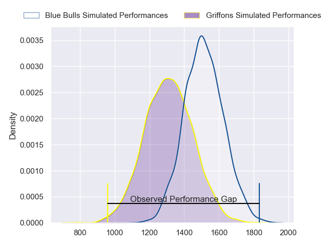
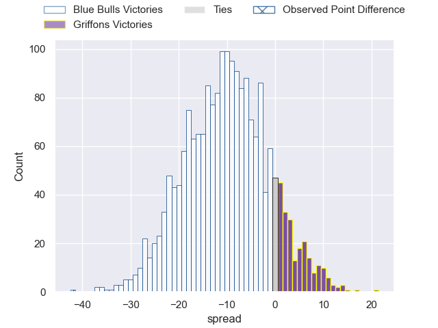
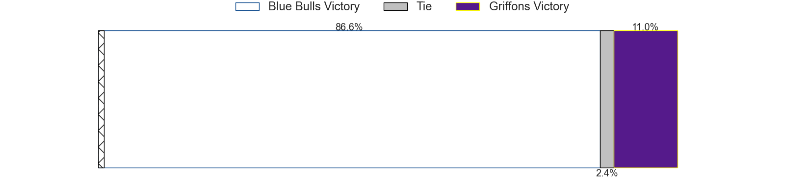
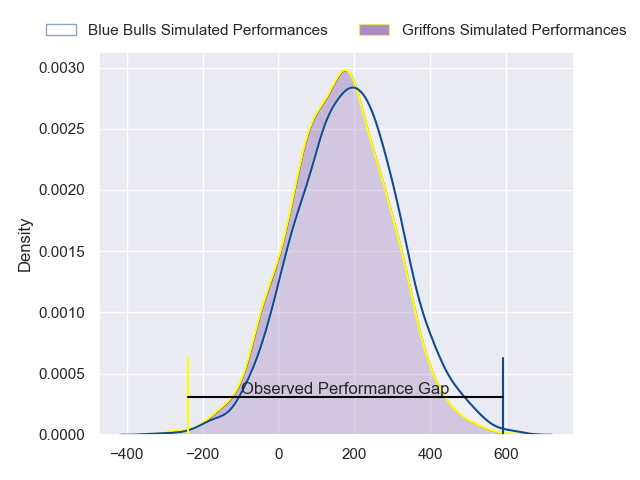
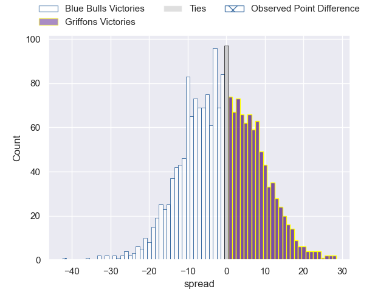

---  
layout: page  
title: Blue Bulls at Griffons; 52-10  
date: 2024-07-14 18:00:00 -0500  
categories: "Currie Cup 2024" match review  
---
# Blue Bulls at Griffons; 52-10

# Club Level Predictions

The first set of predictions treats a club as the smallest object, as the club develops its members, organizes a gameplan, and deploys its players as needed for each match. This club model has a prediction of 0.256, which translates to predicting Blue Bulls to win by 9.8.

Our Over/Under is 74.5 - and combined with the spread above, we have a predicted scoreline of 42 to 33

Each club has a rating and a rating deviation (similar to a Glicko rating), and expected performances can be generated. This allows for simulated matches and spreads like the ones below.
## Projected Performances - Club Model

## Projected Spreads - Club Model

## Projected Results - Club Model

# Player Level Predictions

Treating teams instead as an entity made up of the currently active players, I have ratings for each player in an altogether different system. These can be combined to form team ratings once teamsheets are announced, weighting starters a bit higher than the reserves. After the match is played, players can be weighted by their minutes on the field, allowing for an accurate measure of the team's composition. With these compiled team ratings, we can make predictions, measure inaccuracy, and update the individual player ratings.
## Prediction without Player Minutes: Blue Bulls by 0.7

Blue Bulls by 3.6 on a neutral pitch

## Projected Performances - Player Model

## Projected Spreads - Player Model

## Projected Results - Player Model

|   Away Minutes | Away Player           |   Away Percentile |   Number |   Home Percentile | Home Player               |   Home Minutes |
|---------------:|:----------------------|------------------:|---------:|------------------:|:--------------------------|---------------:|
|             80 | Jan-Hendrik Wessels   |             25.59 |        1 |              5.16 | Xolani Jacobs             |             80 |
|             80 | Joe van Zyl           |             53.83 |        2 |             69.17 | Chadley Wenn              |             80 |
|             80 | Francois Klopper      |             19.59 |        3 |             11.39 | Ebune Moango Ngundue      |             80 |
|             80 | Cobus Wiese           |             96.55 |        4 |              9.59 | Rian Olivier              |             80 |
|             80 | Sintu Manjezi         |             87.06 |        5 |              8.38 | Curtley Thomas            |             80 |
|             80 | Nizaam Carr           |             96.13 |        6 |             27.58 | Thato Siward Mavundla     |             80 |
|             80 | Jannes Kirsten        |             94.1  |        7 |             14.48 | Wikus Nieuwenhuis         |             80 |
|             80 | Celimpilo Gumede      |             61.03 |        8 |             23.66 | Mingo Piti                |             80 |
|             80 | Bernard van der Linde |             51.88 |        9 |             12.6  | Keegan Schaefer           |             80 |
|             80 | Jaco van der Walt     |             84.44 |       10 |             38.14 | Duan Pretorius            |             80 |
|             80 | Stravino Jacobs       |             51.85 |       11 |             10.37 | Andrew Kota               |             80 |
|             80 | Chris Smit            |             71.12 |       12 |              5.54 | Robbie Petzer             |             80 |
|             80 | Aphiwe Dyantyi        |              3.56 |       13 |             10.98 | Keanu Armandio Vers       |             80 |
|             80 | Sergeal Petersen      |             95.67 |       14 |             16.05 | Gilroy Philander          |             80 |
|             80 | Devon Williams        |             89.92 |       15 |             12.85 | Gurshwin Wehr             |             80 |
|              0 | Jacques van Rooyen    |            nan    |       16 |            nan    | Simon Westraadt           |              0 |
|              0 | Dylan Smith           |             88.38 |       17 |            nan    | Mthokozisi Charles Gumede |              0 |
|              0 | Ntuthuko Mchunu       |             28.63 |       18 |            nan    | Buhle Nojekwa             |              0 |
|              0 | Merwe Olivier         |            nan    |       19 |            nan    | Joshua Aiden  Paris       |              0 |
|              0 | Nama Xaba             |              4.06 |       20 |            nan    | Matthew Gray              |              0 |
|              0 | Zak Burger            |             88.54 |       21 |            nan    | Jared Kruger              |              0 |
|              0 | Chris Smith           |             64.9  |       22 |            nan    | Cheslin Arendse           |              0 |
|              0 | Cornal Hendricks      |              3.66 |       23 |            nan    | Christiaan Nel            |              0 |

