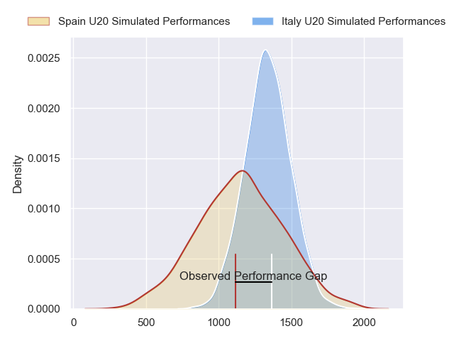
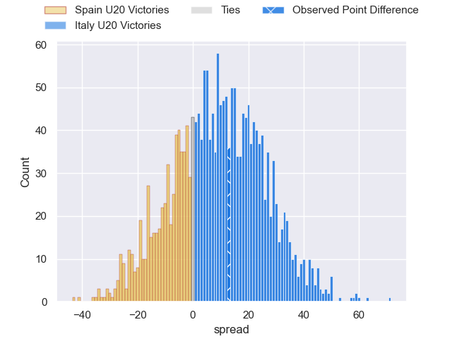
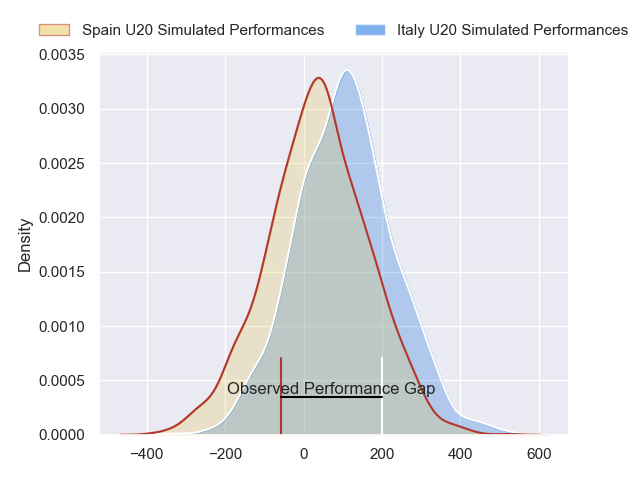
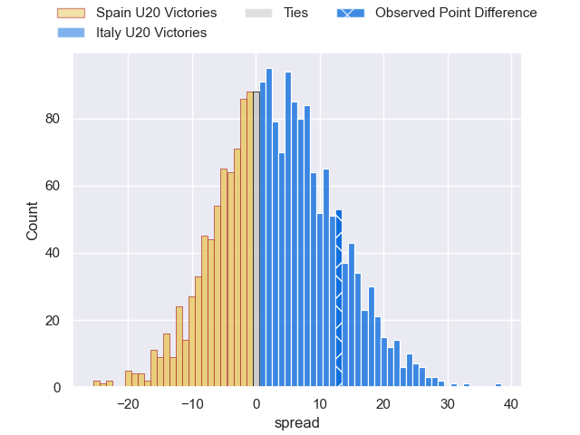
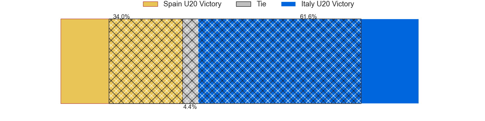

---  
layout: page  
title: Spain U20 at Italy U20; 15-28  
date: 2024-07-14 18:00:00 -0500  
categories: "World Rugby U20 Championship 2024" match review  
---
# Spain U20 at Italy U20; 15-28

# Club Level Predictions

The first set of predictions treats a club as the smallest object, as the club develops its members, organizes a gameplan, and deploys its players as needed for each match. This club model has a prediction of 0.682, which translates to predicting Italy U20 to win by 9.1.

Our Over/Under is 55.5 - and combined with the spread above, we have a predicted scoreline of 23 to 32

Each club has a rating and a rating deviation (similar to a Glicko rating), and expected performances can be generated. This allows for simulated matches and spreads like the ones below.
## Projected Performances - Club Model

## Projected Spreads - Club Model

## Projected Results - Club Model

# Player Level Predictions

Treating teams instead as an entity made up of the currently active players, I have ratings for each player in an altogether different system. These can be combined to form team ratings once teamsheets are announced, weighting starters a bit higher than the reserves. After the match is played, players can be weighted by their minutes on the field, allowing for an accurate measure of the team's composition. With these compiled team ratings, we can make predictions, measure inaccuracy, and update the individual player ratings.
## Prediction without Player Minutes: Italy U20 by 3.3

Italy U20 by 1.1 on a neutral pitch

## Projected Performances - Player Model

## Projected Spreads - Player Model

## Projected Results - Player Model

|   Away Minutes | Away Player           |   Away Percentile |   Number |   Home Percentile | Home Player          |   Home Minutes |
|---------------:|:----------------------|------------------:|---------:|------------------:|:---------------------|---------------:|
|             59 | Hugo Gonzalez         |             15.63 |        1 |             55.33 | Federico Pisani      |             77 |
|             77 | Diego Gonzalez Blanco |             12.25 |        2 |             64.45 | Valerio Siciliano    |             77 |
|             59 | Aniol Franch          |             19.46 |        3 |             37.93 | Davide Ascari        |             55 |
|             69 | Pablo Guirao          |             14.92 |        4 |             57.88 | Samuele Mirenzi      |             41 |
|             73 | Manex Ariceta         |             17.82 |        5 |             66.7  | Piero Gritti         |             80 |
|             80 | Nicolas Moleti        |             11.84 |        6 |             45.98 | Giacomo Milano       |             80 |
|             80 | Jokin Zolezzi         |             13.32 |        7 |             56.43 | Nelson Casartelli    |             77 |
|             80 | Valentino Rizzo       |             15.28 |        8 |             32.14 | Jacopo Botturi       |             80 |
|             69 | Javier Lopez de Haro  |             11.18 |        9 |             55.43 | Lorenzo Casilio      |             41 |
|             80 | Gonzalo Otamendi      |              5.13 |       10 |             53.99 | Simone Brisighella   |             80 |
|             80 | Hugo Pichardie        |             19.93 |       11 |             68.61 | Francesco Imberti    |             80 |
|             62 | Yago Fernandez Vilar  |             16.75 |       12 |             46.26 | Nicola Bozzo         |             77 |
|             80 | Alberto Carmona       |              7.38 |       13 |             26.32 | Federico Zanandrea   |             80 |
|             69 | Julien Burguillos     |             13.28 |       14 |             29.94 | Marco Scalabrini     |             68 |
|             80 | Luciano Richardis     |              9.98 |       15 |             40.12 | Mirko Belloni        |             80 |
|             21 | Alberto Gomez         |             17.78 |       16 |             25.89 | Mattia Midena        |             39 |
|             21 | David Gallego         |            nan    |       17 |             30.59 | Mattia Jimenez       |             39 |
|             18 | Unax Zuriarrain       |             21.24 |       18 |            nan    | Francesco Gentile    |             25 |
|             11 | Nicolas Gali          |            nan    |       19 |             31.18 | Martino Pucciariello |             12 |
|             11 | Martin Serrano        |             20.45 |       20 |             43.07 | Patrick De Villiers  |              3 |
|             11 | Gabriel Rocaries      |              7.58 |       21 |            nan    | Vittorio Padoan      |              3 |
|              7 | Antonio Gamez         |             30.68 |       22 |            nan    | Nicola Bolognini     |              3 |
|              3 | Adam Llinares         |             33.11 |       23 |             28.58 | Cesare Zucconi       |              3 |

