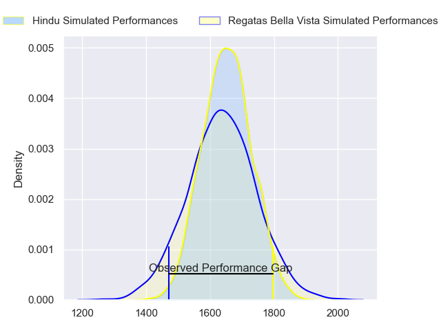
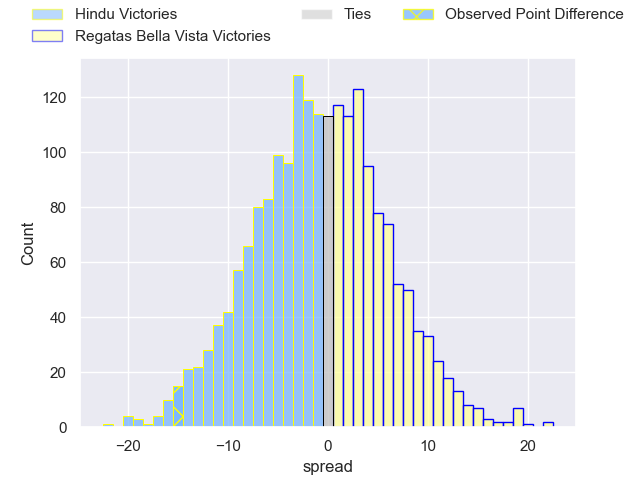
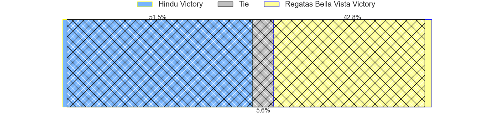
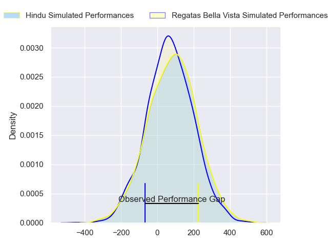
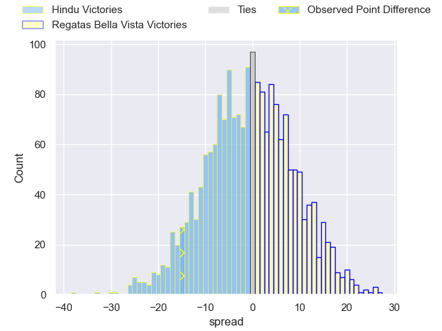
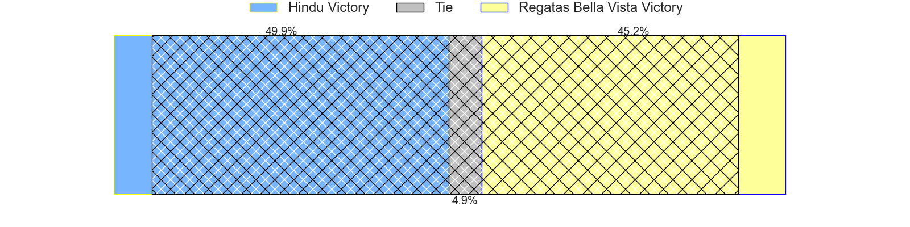

---  
layout: page  
title: Hindu at Regatas Bella Vista; 35-20  
date: 2024-07-14 18:00:00 -0500  
categories: "URBA Top 12 2024" match review  
---
# Hindu at Regatas Bella Vista; 35-20

# Club Level Predictions

The first set of predictions treats a club as the smallest object, as the club develops its members, organizes a gameplan, and deploys its players as needed for each match. This club model has a prediction of 0.475, which translates to predicting Hindu to win by 0.9.

Our Over/Under is 51.5 - and combined with the spread above, we have a predicted scoreline of 26 to 26

Each club has a rating and a rating deviation (similar to a Glicko rating), and expected performances can be generated. This allows for simulated matches and spreads like the ones below.
## Projected Performances - Club Model

## Projected Spreads - Club Model

## Projected Results - Club Model

# Player Level Predictions

Treating teams instead as an entity made up of the currently active players, I have ratings for each player in an altogether different system. These can be combined to form team ratings once teamsheets are announced, weighting starters a bit higher than the reserves. After the match is played, players can be weighted by their minutes on the field, allowing for an accurate measure of the team's composition. With these compiled team ratings, we can make predictions, measure inaccuracy, and update the individual player ratings.
## Prediction without Player Minutes: Hindu by 0.4

Hindu by 4.1 on a neutral pitch

## Projected Performances - Player Model

## Projected Spreads - Player Model

## Projected Results - Player Model

|   Away Minutes | Away Player                |   Away Percentile |   Number |   Home Percentile | Home Player          |   Home Minutes |
|---------------:|:---------------------------|------------------:|---------:|------------------:|:---------------------|---------------:|
|             82 | Juan Ignacio Martinez Sosa |             38.27 |        1 |             11.54 | Tomas Barbaccia      |             82 |
|             82 | Agustin Capurro            |             13.68 |        2 |             33.38 | Beltran Landivar     |             82 |
|             82 | Nicolas Leiva              |             12.22 |        3 |             15.11 | Juan Gobet           |             82 |
|             82 | Carlos Repetto             |             42.27 |        4 |             23.56 | Valentin Sanguinetti |             82 |
|             82 | Juan Ignacio Comolli       |             21.51 |        5 |             20.58 | Tomas Sanguinetti    |             82 |
|             82 | Tomas Scallan              |             36.35 |        6 |             32.38 | Marcos Ferro         |             82 |
|             82 | Nicolas D'Amorim           |             60.33 |        7 |              9.96 | Lucas Gobet          |             82 |
|             82 | Nicolas Amaya              |             33.4  |        8 |             19.09 | Felipe Camerlinckx   |             82 |
|             82 | Lucas Fernandez Miranda    |             36.17 |        9 |             13.58 | Marcos Joseph        |             82 |
|             82 | Santiago Fernandez         |             96.39 |       10 |             15.18 | Mateo Camerlinckx    |             82 |
|             82 | Federico Graglia           |             54.91 |       11 |             14.97 | Enrique Camerlinckx  |             82 |
|             82 | Bautista Farise            |             15.33 |       12 |             14.74 | Ramiro Moadeb        |             82 |
|             82 | Juan Fernandez Miranda     |             45.99 |       13 |             15.63 | Alejo Barrera        |             82 |
|             82 | Alfredo Mayol              |             50.32 |       14 |             22.99 | Rafael Santana       |             82 |
|             82 | Joaquin Diaz Bonilla       |             67    |       15 |             20.16 | Cruz Camerlinckx     |             82 |
|              0 | Benjamin Silveyra          |            nan    |       16 |             53.23 | Mateo Trimarco       |              0 |
|              0 | Franco Diviesti            |             14.96 |       17 |             18.94 | Francisco Pisani     |              0 |
|              0 | Mariano Leiva              |            nan    |       18 |            nan    | Diego Aguero         |              0 |
|              0 | Victor Franco              |            nan    |       19 |            nan    | Manuel Lozano Oneto  |              0 |
|              0 | Santino Amayav             |              8.58 |       20 |            nan    | Bautista Lopez Manan |              0 |
|              0 | Ignacio Garcia Cuerva      |            nan    |       21 |             24.72 | Pedro Vega           |              0 |
|              0 | Pedro Miranda              |            nan    |       22 |            nan    | Home Team 22         |              0 |
|              0 | Nicolas Marzano            |            nan    |       23 |            nan    | Home Team 23         |              0 |

