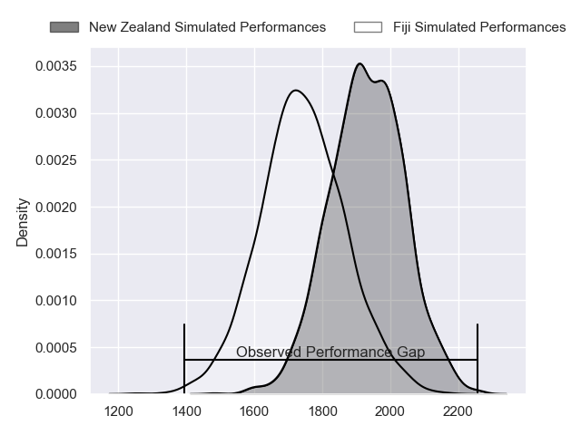
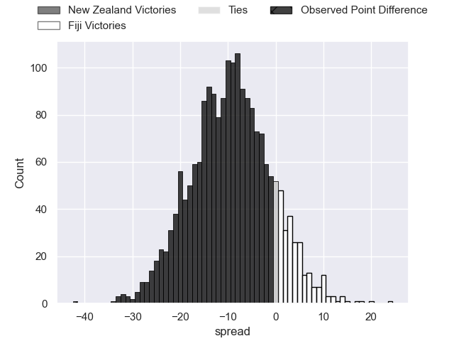
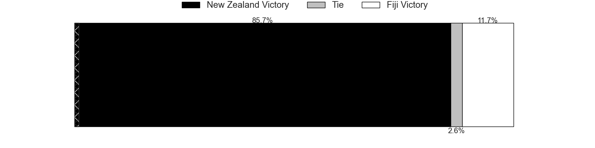
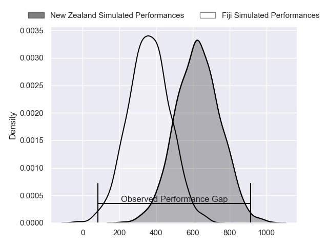
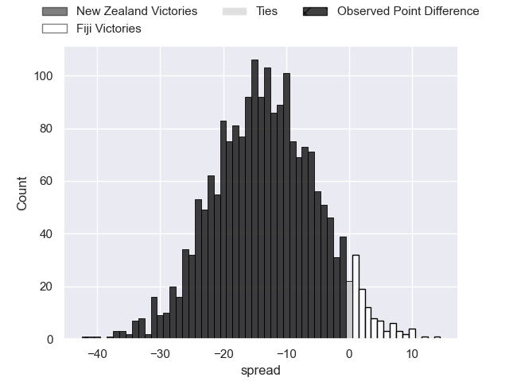
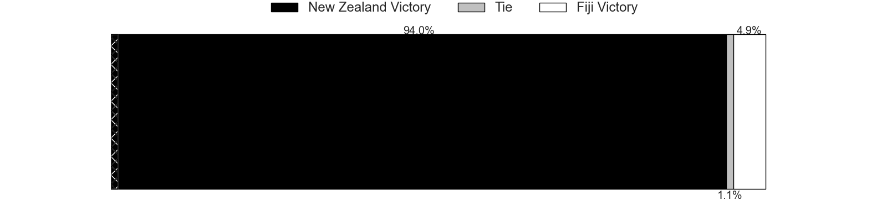

---  
layout: page  
title: New Zealand at Fiji; 47-5  
date: 2024-07-18 18:00:00 -0500  
categories: "International Test Match 2024" match review  
---
# New Zealand at Fiji; 47-5

# Club Level Predictions

The first set of predictions treats a club as the smallest object, as the club develops its members, organizes a gameplan, and deploys its players as needed for each match. This club model has a prediction of 0.262, which translates to predicting New Zealand to win by 9.5.

Our Over/Under is 65.5 - and combined with the spread above, we have a predicted scoreline of 38 to 28

Each club has a rating and a rating deviation (similar to a Glicko rating), and expected performances can be generated. This allows for simulated matches and spreads like the ones below.
## Projected Performances - Club Model

## Projected Spreads - Club Model

## Projected Results - Club Model

# Player Level Predictions

Treating teams instead as an entity made up of the currently active players, I have ratings for each player in an altogether different system. These can be combined to form team ratings once teamsheets are announced, weighting starters a bit higher than the reserves. After the match is played, players can be weighted by their minutes on the field, allowing for an accurate measure of the team's composition. With these compiled team ratings, we can make predictions, measure inaccuracy, and update the individual player ratings.
## Prediction without Player Minutes: New Zealand by 12.7

New Zealand by 15.4 on a neutral pitch

## Projected Performances - Player Model

## Projected Spreads - Player Model

## Projected Results - Player Model

|   Away Minutes | Away Player         |   Away Percentile |   Number |   Home Percentile | Home Player                    |   Home Minutes |
|---------------:|:--------------------|------------------:|---------:|------------------:|:-------------------------------|---------------:|
|             51 | Tamaiti Williams    |             90.24 |        1 |             81.18 | Eroni Mawi                     |             41 |
|             56 | Asafo Aumua         |             96.16 |        2 |             90.48 | Tevita Ikanivere               |             67 |
|             56 | Fletcher Newell     |              1.55 |        3 |             43.07 | Mesake Doge                    |             41 |
|             80 | Scott Barrett       |             94.58 |        4 |             73.55 | Isoa Nasilasila                |             80 |
|             60 | Tupou Vaa'i         |             95.34 |        5 |             91.34 | Temo Mayanavanua               |             80 |
|             80 | Luke Jacobson       |             96.78 |        6 |             73.42 | Lekima Tagitagivalu            |             80 |
|             80 | Ethan Blackadder    |             99.15 |        7 |             11.35 | Kitione Salawa                 |             53 |
|             56 | Ardie Savea         |             99.8  |        8 |             72.27 | Viliame Mata                   |             60 |
|             36 | Cortez Ratima       |             83    |        9 |             82.5  | Frank Lomani                   |             27 |
|             80 | Damian McKenzie     |             98.83 |       10 |             25.29 | Isaiah Armstrong-Ravula        |             60 |
|             80 | Caleb Clarke        |             86.08 |       11 |             99.45 | Semi Radradra                  |             80 |
|             80 | Anton Lienert-Brown |             96.96 |       12 |             63.29 | Inia Tabuavou                  |             47 |
|             80 | Billy Proctor       |             96.75 |       13 |             96.65 | Waisea Nayacalevu Vuidravuwalu |             80 |
|             60 | Sevu Reece          |             82.6  |       14 |             92.67 | Jiuta Wainiqolo                |             80 |
|             73 | Beauden Barrett     |            100    |       15 |             62.48 | Vilimoni Botitu                |             80 |
|             24 | George Bell         |              9.83 |       16 |             31.03 | Zuriel Togiatama               |             13 |
|             29 | Ethan de Groot      |             63.05 |       17 |             94.35 | Haereiti Hetet                 |             39 |
|             24 | Pasilio Tosi        |             51.12 |       18 |            nan    | Samu Tawake                    |             39 |
|             20 | Sam Darry           |             64.22 |       19 |             89.69 | Albert Tuisue                  |             20 |
|             24 | Wallace Sititi      |             66.6  |       20 |             72.87 | Elia Canakaivata               |             27 |
|             44 | Noah Hotham         |             76.67 |       21 |             11.5  | Simione Kuruvoli               |             53 |
|              7 | Jordie Barrett      |             96.04 |       22 |             70.43 | Caleb Muntz                    |             20 |
|             20 | Emoni Narawa        |             94.32 |       23 |             61.87 | Sireli Maqala                  |             33 |

