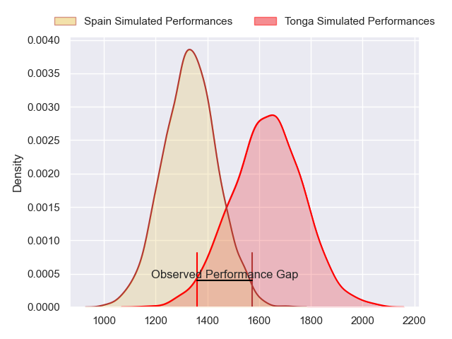
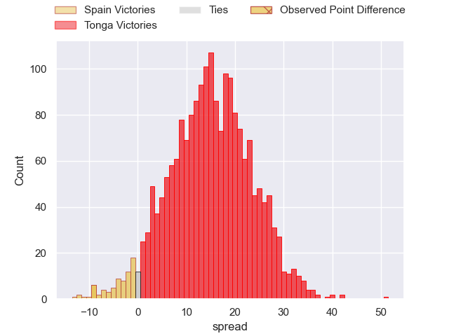
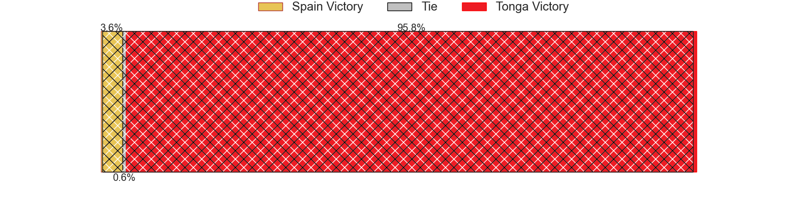
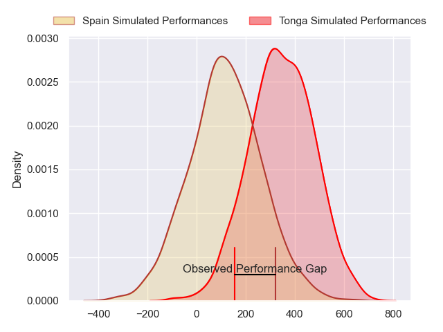
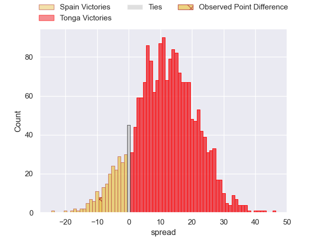
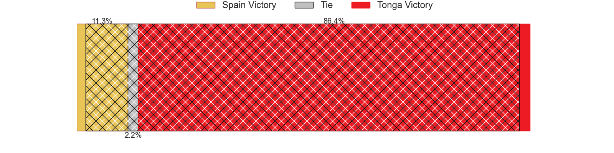

---  
layout: page  
title: Spain at Tonga; 29-20  
date: 2024-07-18 18:00:00 -0500  
categories: "Tests Matchs 2023" match review  
---
# Spain at Tonga; 29-20

# Club Level Predictions

The first set of predictions treats a club as the smallest object, as the club develops its members, organizes a gameplan, and deploys its players as needed for each match. This club model has a prediction of 0.836, which translates to predicting Tonga to win by 14.9.

Our Over/Under is 45.5 - and combined with the spread above, we have a predicted scoreline of 15 to 30

Each club has a rating and a rating deviation (similar to a Glicko rating), and expected performances can be generated. This allows for simulated matches and spreads like the ones below.
## Projected Performances - Club Model

## Projected Spreads - Club Model

## Projected Results - Club Model

# Player Level Predictions

Treating teams instead as an entity made up of the currently active players, I have ratings for each player in an altogether different system. These can be combined to form team ratings once teamsheets are announced, weighting starters a bit higher than the reserves. After the match is played, players can be weighted by their minutes on the field, allowing for an accurate measure of the team's composition. With these compiled team ratings, we can make predictions, measure inaccuracy, and update the individual player ratings.
## Prediction without Player Minutes: Tonga by 11.7

Tonga by 9.3 on a neutral pitch

## Projected Performances - Player Model

## Projected Spreads - Player Model

## Projected Results - Player Model

|   Away Minutes | Away Player           |   Away Percentile |   Number |   Home Percentile | Home Player      |   Home Minutes |
|---------------:|:----------------------|------------------:|---------:|------------------:|:-----------------|---------------:|
|             80 | Titi Futeu Youtcheu   |             21.79 |        1 |             60.36 | Tau Koloamatangi |             80 |
|             80 | Santiago Ovejero      |             66.02 |        2 |             22.86 | Sosefo Sakalia   |             80 |
|             80 | Hugo Pirlet           |             56.42 |        3 |             96.05 | Ben Tameifuna    |             80 |
|             80 | Asier Usarraga        |             71.97 |        4 |             98.32 | Adam Coleman     |             80 |
|             80 | Imanol Urraza         |             81.94 |        5 |             17.97 | Harrison Mataele |             80 |
|             80 | Mario Pichardi Garcia |             70.11 |        6 |             64.02 | Josh Kaifa       |             80 |
|             80 | Marc Sánchez          |             68.91 |        7 |             15.22 | Fotu Lokotui     |             80 |
|             80 | Raphaël Nieto         |             60.04 |        8 |              3.78 | Lotu Inisi       |             80 |
|             80 | Estanislao Bay        |             61.37 |        9 |             20.62 | Manu Paea        |             80 |
|             80 | Gonzalo Vinuesa       |             45.16 |       10 |             15.94 | James Faiva      |             80 |
|             80 | Gauthier Minguillon   |             65.19 |       11 |             16.86 | Hosea Saumaki    |             80 |
|             80 | Álvar Gimeno          |             76.16 |       12 |             68.25 | Malakai Fekitoa  |             80 |
|             80 | Alejandro Alonso      |             59.94 |       13 |             25.62 | Fetuli Paea      |             80 |
|             80 | Manuel Alfaro         |             68.62 |       14 |             22.18 | John Tapueluelu  |             80 |
|             80 | John Wessel Bell      |             67.19 |       15 |             99.8  | Telusa Veainu    |             80 |
|              0 | Álvaro Garcia         |             73.23 |       16 |            nan    | Solomone Aniseko |              0 |
|              0 | Raúl Calzón           |            nan    |       17 |            nan    | Jethro Felemi    |              0 |
|              0 | Lucas Santamaria      |             45.56 |       18 |            nan    | Brandon Televave |              0 |
|              0 | Ignacio Piñeiro       |             74.86 |       19 |            nan    | Kelemete Finau   |              0 |
|              0 | Alex Saleta           |             42.07 |       20 |            nan    | Sione Takai      |              0 |
|              0 | Pablo Pérez           |            nan    |       21 |             21.77 | Aisea Halo       |              0 |
|              0 | Bautista Guemes       |             72.87 |       22 |            nan    | Tyler Pulini     |              0 |
|              0 | Inaki Mateu Spuches   |             10.88 |       23 |            nan    | Nikolai Foliaki  |              0 |

