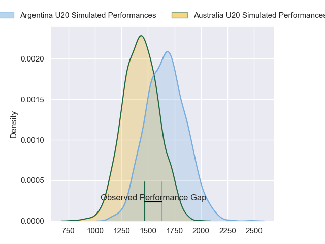
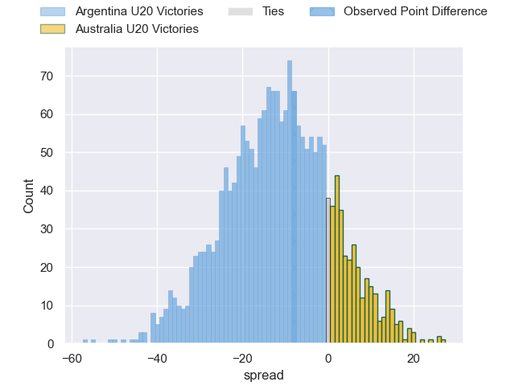
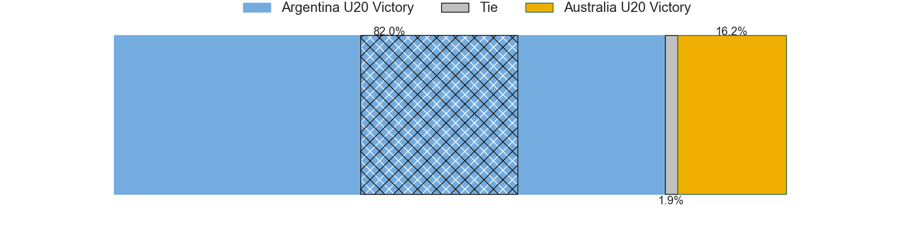
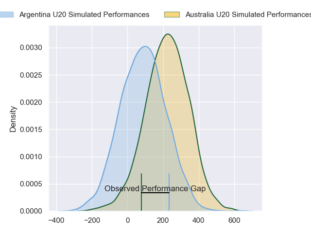
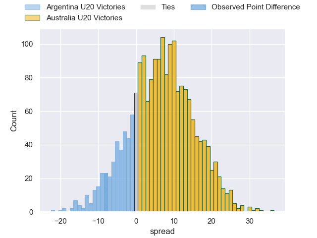
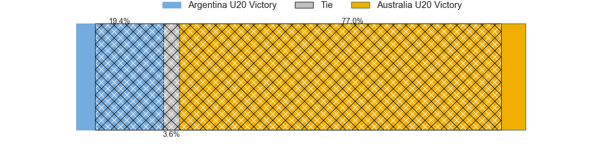

---  
layout: page  
title: Argentina U20 at Australia U20; 14-6  
date: 2024-07-19 18:00:00 -0500  
categories: "World Rugby U20 Championship 2024" match review  
---
# Argentina U20 at Australia U20; 14-6

# Club Level Predictions

The first set of predictions treats a club as the smallest object, as the club develops its members, organizes a gameplan, and deploys its players as needed for each match. This club model has a prediction of 0.238, which translates to predicting Argentina U20 to win by 11.7.

Our Over/Under is 56.5 - and combined with the spread above, we have a predicted scoreline of 34 to 22

Each club has a rating and a rating deviation (similar to a Glicko rating), and expected performances can be generated. This allows for simulated matches and spreads like the ones below.
## Projected Performances - Club Model

## Projected Spreads - Club Model

## Projected Results - Club Model

# Player Level Predictions

Treating teams instead as an entity made up of the currently active players, I have ratings for each player in an altogether different system. These can be combined to form team ratings once teamsheets are announced, weighting starters a bit higher than the reserves. After the match is played, players can be weighted by their minutes on the field, allowing for an accurate measure of the team's composition. With these compiled team ratings, we can make predictions, measure inaccuracy, and update the individual player ratings.
## Prediction without Player Minutes: Australia U20 by 6.9

Australia U20 by 4.7 on a neutral pitch

## Projected Performances - Player Model

## Projected Spreads - Player Model

## Projected Results - Player Model

|   Away Minutes | Away Player                  |   Away Percentile |   Number |   Home Percentile | Home Player               |   Home Minutes |
|---------------:|:-----------------------------|------------------:|---------:|------------------:|:--------------------------|---------------:|
|             45 | Diego Correa                 |             84.74 |        1 |             18.28 | Lington Ieli              |             54 |
|             45 | Marcos Camerlinckx           |             69.89 |        2 |             26.57 | Ottavio Tuipulotu         |             65 |
|             65 | Tomas Rapetti                |             76.99 |        3 |             38.42 | Nick Bloomfield           |             60 |
|             80 | Efrain Elias                 |             95.05 |        4 |             38.25 | Toby McPherson            |             80 |
|             80 | Alvaro Garcia Iandolino      |             71.65 |        5 |             39.68 | Harvey Cordukes           |             80 |
|             80 | Ignacio Torrado              |             72.66 |        6 |             31.22 | Aden Ekanayake            |             80 |
|             47 | Santos Fernandez De Oliveira |             79.28 |        7 |             36.05 | Dane Sawers               |             58 |
|             80 | Juan Pedro Bernasconi        |             77.73 |        8 |             32.59 | Jack Harley               |             54 |
|             67 | Tomas Di Biase               |             74.33 |        9 |             38.17 | Daniel Nelson             |             71 |
|             80 | Santino Di Lucca             |             72.37 |       10 |             56.23 | Harry McLaughlin-Phillips |             80 |
|             61 | Franco Rossetto              |             81.14 |       11 |             50.73 | Archer Saunders           |             80 |
|             80 | Faustino Sánchez Valarolo    |             86.41 |       12 |             36.11 | Jarrah McLeod             |             64 |
|             80 | Tomas Medina                 |             78.6  |       13 |             28.6  | Kadin Pritchard           |             80 |
|             80 | Timoteo Silva                |             81.32 |       14 |             53.48 | Ronan Leahy               |             80 |
|             80 | Benjamin Elizalde            |             68.46 |       15 |             32.73 | Shane Wilcox              |             65 |
|             35 | Estanislao  Rodriguez        |            nan    |       16 |            nan    | Nate Tiitii               |             26 |
|             35 | Juan Ignacio Greising Revol  |             78.19 |       17 |            nan    | Eamon Doyle               |             26 |
|             33 | Agustin Sarelli              |             62.06 |       18 |            nan    | Austin Durbridge          |             22 |
|             19 | Felipe Ledesma               |             75.05 |       19 |             37.72 | Trevor King               |             20 |
|             15 | Emir Gael Galvan             |             71.19 |       20 |            nan    | Boston Fakafanua          |             16 |
|             13 | Jeronimo Llorens Villanueva  |             65.67 |       21 |             33.33 | Angus Staniforth          |             15 |
|            nan | nan                          |            nan    |       22 |            nan    | Oniti Finau               |             15 |
|            nan | nan                          |            nan    |       23 |            nan    | Billy Dickens             |              9 |

