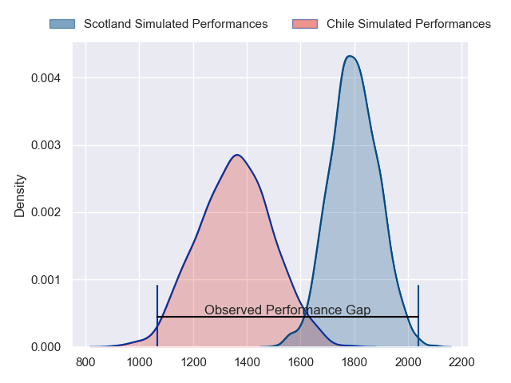
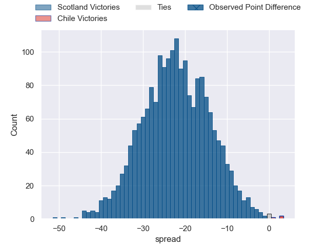
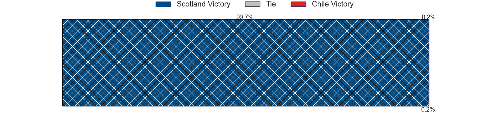
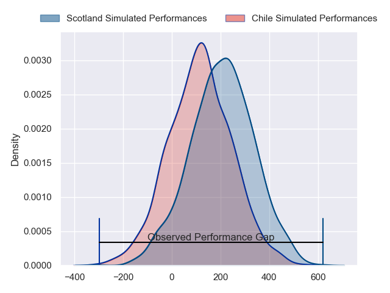
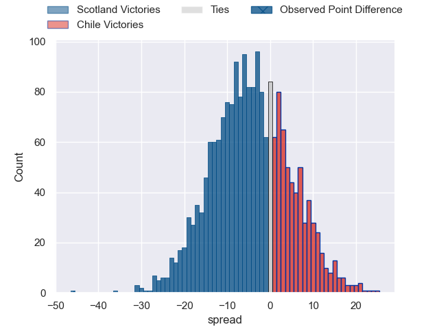

---  
layout: page  
title: Scotland at Chile; 52-6  
date: 2024-07-19 18:00:00 -0500  
categories: "International Test Match 2024" match review  
---
# Scotland at Chile; 52-6

# Club Level Predictions

The first set of predictions treats a club as the smallest object, as the club develops its members, organizes a gameplan, and deploys its players as needed for each match. This club model has a prediction of 0.077, which translates to predicting Scotland to win by 22.5.

Our Over/Under is 64.5 - and combined with the spread above, we have a predicted scoreline of 44 to 21

Each club has a rating and a rating deviation (similar to a Glicko rating), and expected performances can be generated. This allows for simulated matches and spreads like the ones below.
## Projected Performances - Club Model

## Projected Spreads - Club Model

## Projected Results - Club Model

# Player Level Predictions

Treating teams instead as an entity made up of the currently active players, I have ratings for each player in an altogether different system. These can be combined to form team ratings once teamsheets are announced, weighting starters a bit higher than the reserves. After the match is played, players can be weighted by their minutes on the field, allowing for an accurate measure of the team's composition. With these compiled team ratings, we can make predictions, measure inaccuracy, and update the individual player ratings.
## Prediction without Player Minutes: Scotland by 6.0

Scotland by 8.4 on a neutral pitch

## Projected Performances - Player Model

## Projected Spreads - Player Model

## Projected Results - Player Model

|   Away Minutes | Away Player       |   Away Percentile |   Number |   Home Percentile | Home Player                     |   Home Minutes |
|---------------:|:------------------|------------------:|---------:|------------------:|:--------------------------------|---------------:|
|             80 | Nathan McBeth     |             81.95 |        1 |             48.72 | Javier Carrasco                 |             80 |
|             80 | Dylan Richardson  |             82.49 |        2 |              2.15 | Augusto Bohme Alemparte         |             80 |
|             80 | Will Hurd         |             78.93 |        3 |             11.23 | Matias Dittus                   |             80 |
|             80 | Alex Craig        |             55.76 |        4 |              8.75 | Clemente Saavedra Cartajena     |             80 |
|             80 | Ewan Johnson      |             78.97 |        5 |              1.33 | Javier Eissmann                 |             80 |
|             80 | Gregor Brown      |             77.86 |        6 |            nan    | nan                             |            nan |
|            nan | nan               |            nan    |        7 |             23.94 | Raimundo Martinez Amar          |             80 |
|             80 | Josh Bayliss      |             44.33 |        8 |             83.81 | Alfonso Escobar Alvarez         |             80 |
|             80 | Gus Warr          |             69.5  |        9 |             34.83 | Lucas Berti                     |             80 |
|             80 | Ben Healy         |             84.82 |       10 |             54.86 | Tomas Salas Walther             |             80 |
|             80 | Arron Reed        |             94.69 |       11 |             85.62 | Nicolas Garafulic Schar         |             80 |
|            nan | nan               |            nan    |       12 |             33.06 | Santiago Videla Cambiaso        |             80 |
|             80 | Kyle Steyn        |             99.7  |       13 |             42.19 | Domingo Saavedra                |             80 |
|             80 | Jamie Dobie       |             89.38 |       14 |             27.11 | Cristobal Game Jimenez          |             80 |
|             80 | Kyle Rowe         |             80.24 |       15 |             21.36 | Diego Warnken                   |             80 |
|              0 | Paddy Harrison    |            nan    |       16 |            nan    | Diego Escobar Alvarez           |              0 |
|              0 | Pierre Schoeman   |             91.79 |       17 |             45.39 | Salvador Lues Soto              |              0 |
|              0 | Javan Sebastian   |             63.52 |       18 |            nan    | Inaki Gurruchaga Suarez         |              0 |
|              0 | Max Williamson    |             59.09 |       19 |            nan    | Santiago Pedrero Poduje         |              0 |
|              0 | Rory Darge        |             91.67 |       20 |            nan    | Joaquin Milesi                  |              0 |
|              0 | Adam Hastings     |             98.25 |       21 |              3.33 | Marcelo Torrealba               |              0 |
|              0 | Stafford McDowall |             91.18 |       22 |            nan    | Benjamin Videla Cambiaso        |              0 |
|              0 | Matt Currie       |             81.64 |       23 |            nan    | Jose Ignacio Larenas Hitschfeld |              0 |

