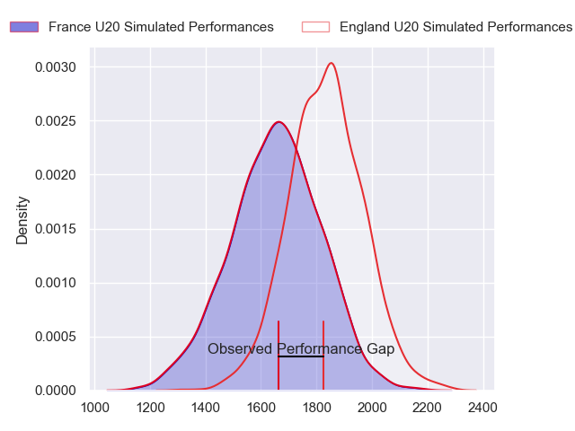
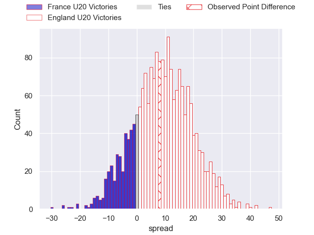
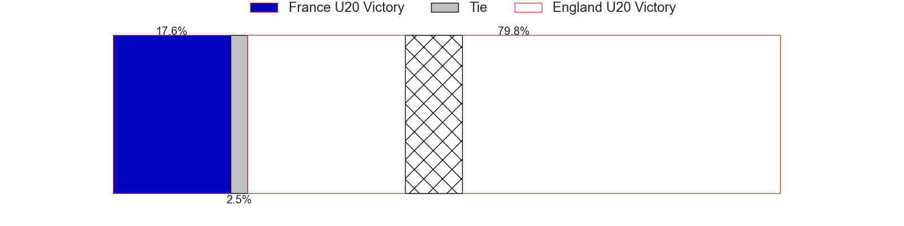
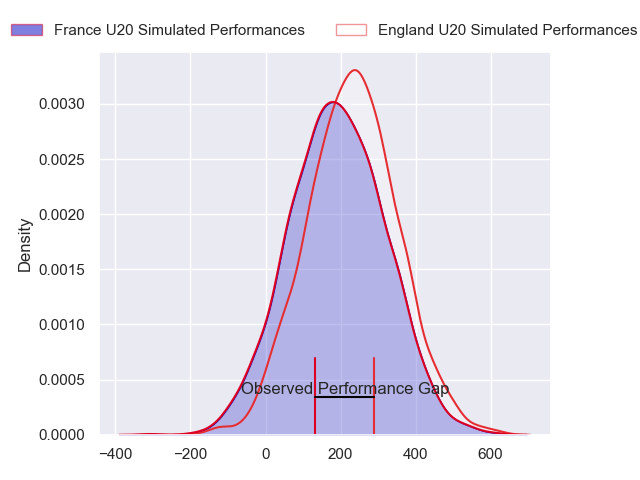
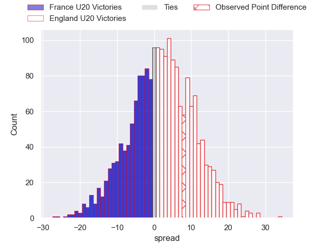
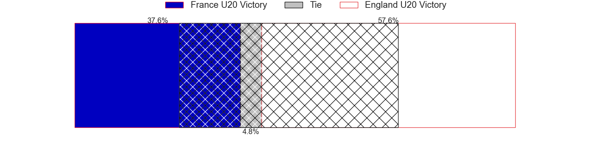

---  
layout: page  
title: France U20 at England U20; 13-21  
date: 2024-07-19 18:00:00 -0500  
categories: "World Rugby U20 Championship 2024" match review  
---
# France U20 at England U20; 13-21

# Club Level Predictions

The first set of predictions treats a club as the smallest object, as the club develops its members, organizes a gameplan, and deploys its players as needed for each match. This club model has a prediction of 0.717, which translates to predicting England U20 to win by 9.1.

Our Over/Under is 53.5 - and combined with the spread above, we have a predicted scoreline of 22 to 31

Each club has a rating and a rating deviation (similar to a Glicko rating), and expected performances can be generated. This allows for simulated matches and spreads like the ones below.
## Projected Performances - Club Model

## Projected Spreads - Club Model

## Projected Results - Club Model

# Player Level Predictions

Treating teams instead as an entity made up of the currently active players, I have ratings for each player in an altogether different system. These can be combined to form team ratings once teamsheets are announced, weighting starters a bit higher than the reserves. After the match is played, players can be weighted by their minutes on the field, allowing for an accurate measure of the team's composition. With these compiled team ratings, we can make predictions, measure inaccuracy, and update the individual player ratings.
## Prediction without Player Minutes: England U20 by 2.2

France U20 by 0.0 on a neutral pitch

## Projected Performances - Player Model

## Projected Spreads - Player Model

## Projected Results - Player Model

|   Away Minutes | Away Player            |   Away Percentile |   Number |   Home Percentile | Home Player          |   Home Minutes |
|---------------:|:-----------------------|------------------:|---------:|------------------:|:---------------------|---------------:|
|             43 | Lino Julien            |             64.91 |        1 |             93.18 | Asher Opoku-Fordjour |             73 |
|             43 | Barnabé Massa          |             86.02 |        2 |             76.96 | Craig Wright         |             76 |
|             70 | Thomas Duchene         |             54.45 |        3 |             70.1  | Afolabi Fasogbon     |             56 |
|             80 | Charly Gambini         |             84.3  |        4 |             69.65 | Joe Bailey           |             60 |
|             59 | Corentin Mezou         |             60.32 |        5 |             78.88 | Junior Kpoku         |             80 |
|             80 | Joe Quere Karaba       |             72.28 |        6 |             92.62 | Finn Carnduff        |             80 |
|              5 | Geoffrey Malaterre     |             68.68 |        7 |             84.39 | Henry Pollock        |             80 |
|             80 | Mathis Castro          |             84.21 |        8 |             66.19 | Kane James           |             40 |
|             65 | Leo Carbonneau         |             73.33 |        9 |             72.5  | Ollie Allan          |             47 |
|             80 | Hugo Reus              |             81.91 |       10 |             72.76 | Benjamin Coen        |             75 |
|             80 | Xan Mousques           |             44.78 |       11 |             94.69 | Arron Reed           |             80 |
|             80 | Robin Taccola          |             76.57 |       12 |             69.07 | Sean Kerr            |             80 |
|             80 | Fabien Brau-Boirie     |             69.68 |       13 |             50.91 | Ben Waghorn          |             80 |
|             73 | Maxence Biasotto       |             63.64 |       14 |             71.43 | Angus Hall           |             76 |
|             80 | Mathis Ferté           |             80.64 |       15 |             72.65 | Ioan Jones           |             80 |
|             49 | Sialevailea Tolofua    |             59.41 |       16 |             46.15 | Arthur Green         |             40 |
|             37 | Thomas Lacombre        |             62.37 |       17 |            nan    | Lucas Friday         |             33 |
|             37 | Samuel Jean-Christophe |             67.39 |       18 |             59.88 | Jimmy Halliwell      |             24 |
|             26 | Charles Kante-Samba    |             62.51 |       19 |             55.66 | Olamide Sodeke       |             20 |
|             21 | Brent Liufau           |             44.13 |       20 |             56.55 | Cameron Miell        |              7 |
|             15 | Axel Desperes          |             82.83 |       21 |             52.33 | Josh Bellamy         |              5 |
|             10 | Thomas Marceline       |            nan    |       22 |             63.37 | Jack Bracken         |              4 |
|              7 | Mathys Belaubre        |             55.78 |       23 |             63.44 | James Isaacs         |              4 |

