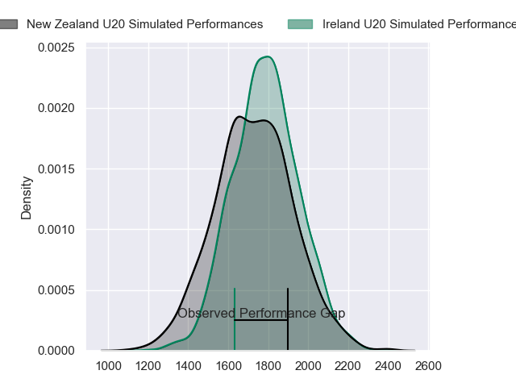
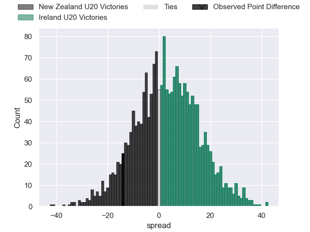
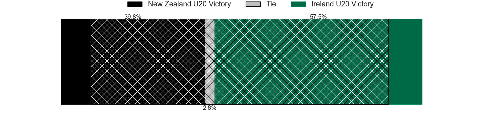
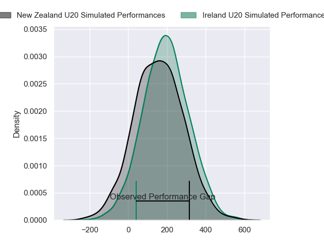
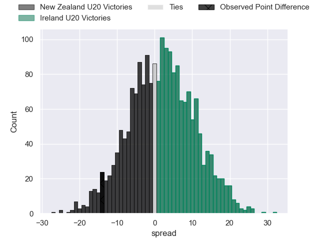
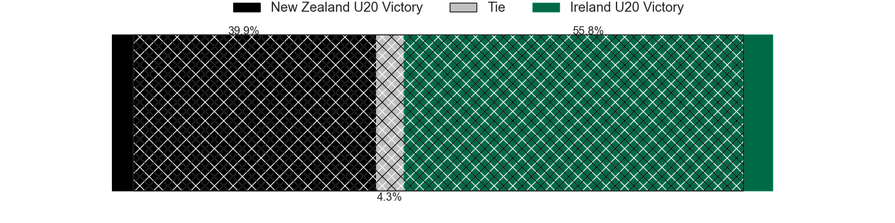

---  
layout: page  
title: New Zealand U20 at Ireland U20; 38-24  
date: 2024-07-19 18:00:00 -0500  
categories: "World Rugby U20 Championship 2024" match review  
---
# New Zealand U20 at Ireland U20; 38-24

# Club Level Predictions

The first set of predictions treats a club as the smallest object, as the club develops its members, organizes a gameplan, and deploys its players as needed for each match. This club model has a prediction of 0.573, which translates to predicting Ireland U20 to win by 3.0.

Our Over/Under is 37.5 - and combined with the spread above, we have a predicted scoreline of 17 to 20

Each club has a rating and a rating deviation (similar to a Glicko rating), and expected performances can be generated. This allows for simulated matches and spreads like the ones below.
## Projected Performances - Club Model

## Projected Spreads - Club Model

## Projected Results - Club Model

# Player Level Predictions

Treating teams instead as an entity made up of the currently active players, I have ratings for each player in an altogether different system. These can be combined to form team ratings once teamsheets are announced, weighting starters a bit higher than the reserves. After the match is played, players can be weighted by their minutes on the field, allowing for an accurate measure of the team's composition. With these compiled team ratings, we can make predictions, measure inaccuracy, and update the individual player ratings.
## Prediction without Player Minutes: Ireland U20 by 2.5

Ireland U20 by 0.3 on a neutral pitch

## Projected Performances - Player Model

## Projected Spreads - Player Model

## Projected Results - Player Model

|   Away Minutes | Away Player           |   Away Percentile |   Number |   Home Percentile | Home Player     |   Home Minutes |
|---------------:|:----------------------|------------------:|---------:|------------------:|:----------------|---------------:|
|             46 | Senio Sanele          |             71.11 |        1 |             37.1  | Emmett Calvey   |             47 |
|             60 | Vernon Bason          |             28.42 |        2 |             35.79 | Stephen Smyth   |             43 |
|             68 | Joshua Smith          |             72.73 |        3 |             30.29 | Alex Mullan     |             49 |
|             80 | Tom Allen             |             78.02 |        4 |             47.76 | Alan Spicer     |             40 |
|             80 | Cameron Christie      |             74.41 |        5 |             36.92 | Luke Murphy     |             80 |
|             80 | Andrew Smith          |             65.56 |        6 |             25.35 | James McKillop  |             80 |
|             51 | Matt Lowe             |             71.71 |        7 |             49.39 | Bryn Ward       |             47 |
|             68 | Johnny Lee            |             58.5  |        8 |             20.65 | Brian Gleeson   |             60 |
|             68 | Dylan Pledger         |             61.67 |        9 |             40.5  | Oliver Coffey   |             69 |
|             42 | Cooper Grant          |             64.4  |       10 |             42.02 | Jack Murphy     |             80 |
|             80 | Frank Vaenuku         |             75.55 |       11 |             42.67 | Hugo McLaughlin |             80 |
|             80 | Mark Tele'a           |             88.44 |       12 |             28.09 | Hugh Gavin      |             80 |
|             61 | Aki Tuivailala        |             71.6  |       13 |             39.86 | Finn Treacy     |             80 |
|             80 | King Maxwell          |             73.08 |       14 |             48.17 | Davy Colbert    |             62 |
|             80 | Sam Coles             |             60.88 |       15 |             22.36 | Ben O'Connor    |             80 |
|             38 | Rico Simpson          |             47.47 |       16 |             52.43 | Billy Corrigan  |             40 |
|             34 | Sika Pole             |            nan    |       17 |            nan    | Mike Yarr       |             37 |
|             29 | Jeremiah Avei-Collins |            nan    |       18 |             43.24 | Max Flynn       |             33 |
|             20 | A-One Lolofie         |             63.75 |       19 |             39.27 | Ben Howard      |             33 |
|             19 | Xavier TIto-Harris    |             70.79 |       20 |             54.3  | Andrew Sparrow  |             31 |
|             12 | Tai Cribb             |             54.02 |       21 |             53.83 | Sean Edogbo     |             20 |
|             12 | Ben O'Donovan         |             61.83 |       22 |            nan    | Ethan Graham    |             18 |
|             12 | Will Martin           |             53.99 |       23 |            nan    | Jake O'Riordan  |             11 |

