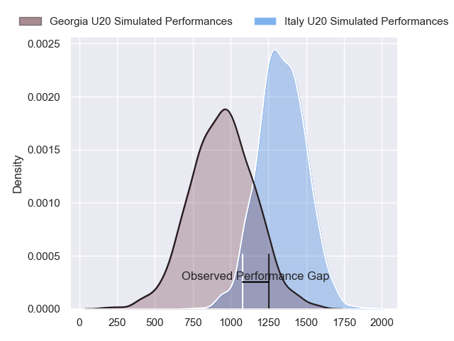
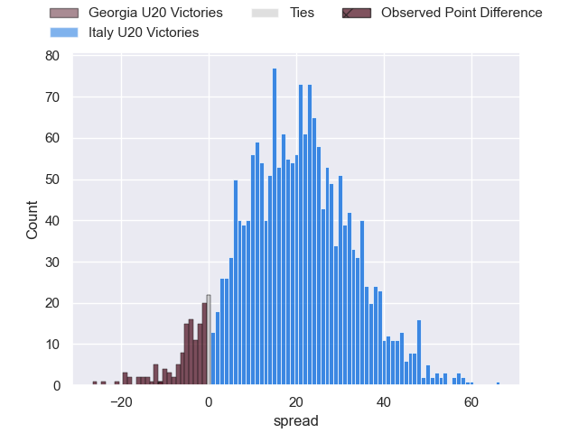
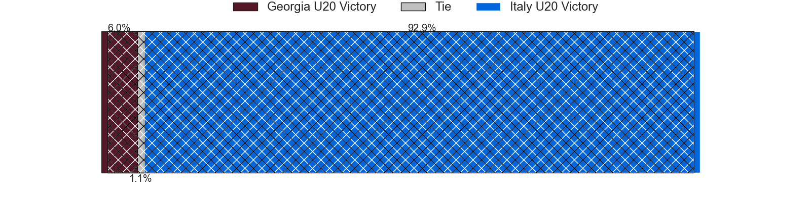
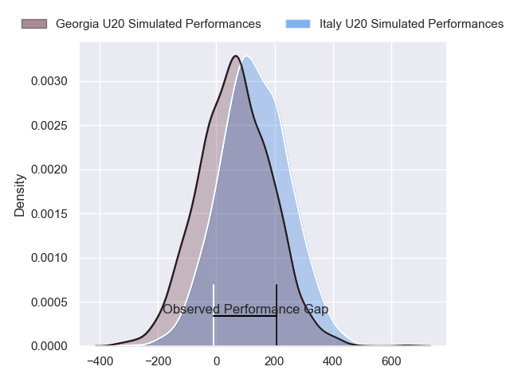
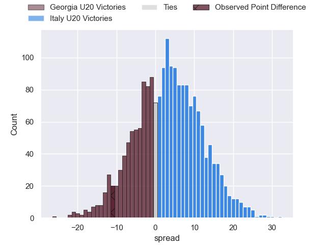

---  
layout: page  
title: Georgia U20 at Italy U20; 24-13  
date: 2024-07-19 18:00:00 -0500  
categories: "World Rugby U20 Championship 2024" match review  
---
# Georgia U20 at Italy U20; 24-13

# Club Level Predictions

The first set of predictions treats a club as the smallest object, as the club develops its members, organizes a gameplan, and deploys its players as needed for each match. This club model has a prediction of 0.865, which translates to predicting Italy U20 to win by 19.3.

Our Over/Under is 60.5 - and combined with the spread above, we have a predicted scoreline of 21 to 40

Each club has a rating and a rating deviation (similar to a Glicko rating), and expected performances can be generated. This allows for simulated matches and spreads like the ones below.
## Projected Performances - Club Model

## Projected Spreads - Club Model

## Projected Results - Club Model

# Player Level Predictions

Treating teams instead as an entity made up of the currently active players, I have ratings for each player in an altogether different system. These can be combined to form team ratings once teamsheets are announced, weighting starters a bit higher than the reserves. After the match is played, players can be weighted by their minutes on the field, allowing for an accurate measure of the team's composition. With these compiled team ratings, we can make predictions, measure inaccuracy, and update the individual player ratings.
## Prediction without Player Minutes: Italy U20 by 3.5

Italy U20 by 1.3 on a neutral pitch

## Projected Performances - Player Model

## Projected Spreads - Player Model

## Projected Results - Player Model

|   Away Minutes | Away Player            |   Away Percentile |   Number |   Home Percentile | Home Player          |   Home Minutes |
|---------------:|:-----------------------|------------------:|---------:|------------------:|:---------------------|---------------:|
|             55 | Luka Ungiadze          |             51.86 |        1 |             17.62 | Federico Pisani      |             62 |
|             80 | Tamaz Tchamiashvili    |             52.63 |        2 |             33.98 | Vittorio Padoan      |             51 |
|             60 | Davit Mchedlidze       |             42.9  |        3 |             39.1  | Nicola Bolognini     |             20 |
|             80 | Temur Tsulukidze       |             62.48 |        4 |             17.88 | Tommaso Redondi      |             43 |
|             43 | Davit Lagvilava        |             33.71 |        5 |             21.14 | Piero Gritti         |             80 |
|             66 | Giorgi Gergedava       |             59.32 |        6 |             34.5  | Cesare Zucconi       |             80 |
|             80 | Andro Dvali            |             39.21 |        7 |             23.62 | Luca Bellucci        |             51 |
|             68 | Nika Lomidze           |             44.14 |        8 |             19.28 | Jacopo Botturi       |             80 |
|             66 | Giorgi Spanderashvili  |             45.99 |        9 |             30.44 | Giulio Sari          |             62 |
|             31 | Gela Kheladze          |             48.96 |       10 |             19.73 | Martino Pucciariello |             80 |
|             66 | Otar Metreveli         |             38.14 |       11 |             43.64 | Francesco Imberti    |             54 |
|             80 | Giorgi Khaindvrava     |             38.58 |       12 |             20.08 | Nicola Bozzo         |             62 |
|             80 | Nugzar Kevkhishvili    |             55    |       13 |             14.05 | Federico Zanandrea   |             80 |
|             80 | Luka Keshelava         |             63.3  |       14 |             28.04 | Luca Belloni         |             80 |
|             80 | Luka Tsirekidze        |             48.02 |       15 |             15.81 | Mirko Belloni        |             80 |
|             31 | Shota Kheladze         |            nan    |       16 |             35.79 | Valerio Siciliano    |             29 |
|             25 | Bachuki Baratashvili   |            nan    |       17 |            nan    | Francesco Gentile    |             26 |
|             20 | Davit Mchedlishvili    |            nan    |       18 |             54.82 | Davide Ascari        |             60 |
|             37 | Tornike Ghaniashvili   |            nan    |       19 |             63.5  | Mattia Midena        |             29 |
|             14 | Luka Suluashvili       |             21.22 |       20 |             23.84 | Giacomo Milano       |             37 |
|             14 | Mikheil Kavchalashvili |            nan    |       21 |             52.54 | Mattia Jimenez       |             18 |
|             14 | Luka Kobauri           |             25.12 |       22 |            nan    | Francesco Bini       |             18 |
|             30 | Luka Takaishvili       |            nan    |       23 |            nan    | Patrick De Villiers  |             18 |

