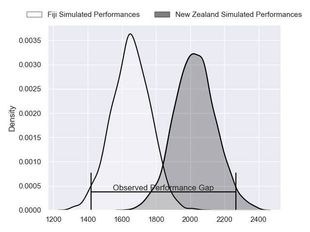
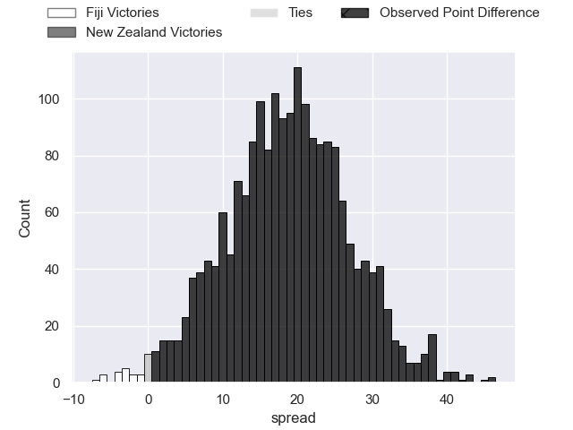
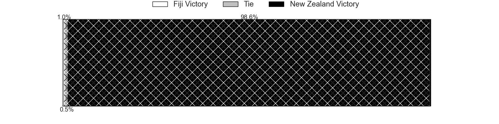
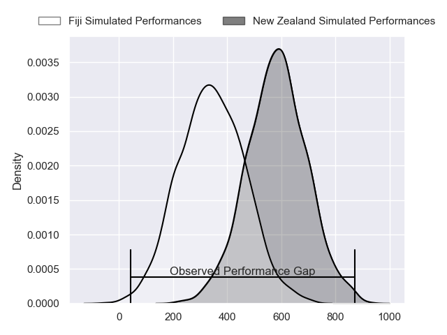
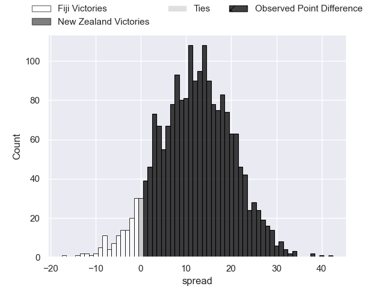
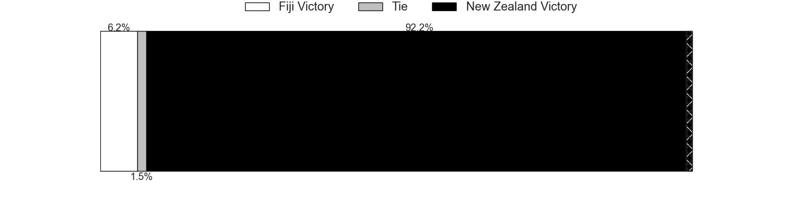

---  
layout: page  
title: Fiji at New Zealand; 5-47  
date: 2024-07-19 18:00:00 -0500  
categories: "Tests Matchs 2023" match review  
---
# Fiji at New Zealand; 5-47

# Club Level Predictions

The first set of predictions treats a club as the smallest object, as the club develops its members, organizes a gameplan, and deploys its players as needed for each match. This club model has a prediction of 0.882, which translates to predicting New Zealand to win by 18.5.

Our Over/Under is 63.5 - and combined with the spread above, we have a predicted scoreline of 23 to 41

Each club has a rating and a rating deviation (similar to a Glicko rating), and expected performances can be generated. This allows for simulated matches and spreads like the ones below.
## Projected Performances - Club Model

## Projected Spreads - Club Model

## Projected Results - Club Model

# Player Level Predictions

Treating teams instead as an entity made up of the currently active players, I have ratings for each player in an altogether different system. These can be combined to form team ratings once teamsheets are announced, weighting starters a bit higher than the reserves. After the match is played, players can be weighted by their minutes on the field, allowing for an accurate measure of the team's composition. With these compiled team ratings, we can make predictions, measure inaccuracy, and update the individual player ratings.
## Prediction without Player Minutes: New Zealand by 18.6

New Zealand by 15.1 on a neutral pitch

## Projected Performances - Player Model

## Projected Spreads - Player Model

## Projected Results - Player Model

|   Away Minutes | Away Player                    |   Away Percentile |   Number |   Home Percentile | Home Player         |   Home Minutes |
|---------------:|:-------------------------------|------------------:|---------:|------------------:|:--------------------|---------------:|
|             40 | Eroni Mawi                     |             81.18 |        1 |             90.24 | Tamaiti Williams    |        50      |
|             66 | Tevita Ikanivere               |             90.48 |        2 |             96.16 | Asafo Aumua         |        55      |
|             40 | Mesake Doge                    |             43.07 |        3 |              1.55 | Fletcher Newell     |        55      |
|             80 | Isoa Nasilasila                |             73.55 |        4 |             94.58 | Scott Barrett       |        26.6667 |
|             80 | Temo Mayanavanua               |             91.34 |        5 |             95.34 | Tupou Vaa'i         |        80      |
|             80 | Lekima Tagitagivalu            |             73.42 |        6 |             96.78 | Luke Jacobson       |        80      |
|             52 | Kitione Salawa                 |             11.35 |        7 |             99.15 | Ethan Blackadder    |        80      |
|             59 | Viliame Mata                   |             72.27 |        8 |             99.8  | Ardie Savea         |        55      |
|             26 | Frank Lomani                   |             82.5  |        9 |             83    | Cortez Ratima       |        35      |
|             59 | Isaiah Armstrong-Ravula        |             25.29 |       10 |             98.83 | Damian McKenzie     |        80      |
|             80 | Semi Radradra                  |             99.45 |       11 |             86.08 | Caleb Clarke        |        80      |
|             47 | Inia Tabuavou                  |             63.29 |       12 |             96.96 | Anton Lienert-Brown |        80      |
|             80 | Waisea Nayacalevu Vuidravuwalu |             96.65 |       13 |             96.75 | Billy Proctor       |        80      |
|             80 | Jiuta Wainiqolo                |             92.67 |       14 |             82.6  | Sevu Reece          |        59      |
|             80 | Vilimoni Botitu                |             62.48 |       15 |            100    | Beauden Barrett     |        26.6667 |
|             14 | Zuriel Togiatama               |             31.03 |       16 |              9.83 | George Bell         |        25      |
|             40 | Haereiti Hetet                 |             94.35 |       17 |             63.05 | Ethan de Groot      |        30      |
|             40 | Samu Tawake                    |             45.24 |       18 |             51.12 | Pasilio Tosi        |        25      |
|             21 | Albert Tuisue                  |             89.69 |       19 |             64.22 | Sam Darry           |        21      |
|             28 | Elia Canakaivata               |             72.87 |       20 |             66.6  | Wallace Sititi      |        25      |
|             54 | Simione Kuruvoli               |             11.5  |       21 |             76.67 | Noah Hotham         |        45      |
|             21 | Caleb Muntz                    |             70.43 |       22 |             96.04 | Jordie Barrett      |        26.6667 |
|             33 | Sireli Maqala                  |             61.87 |       23 |             94.32 | Emoni Narawa        |        21      |

