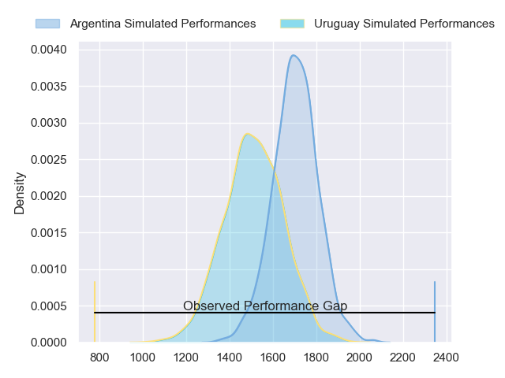
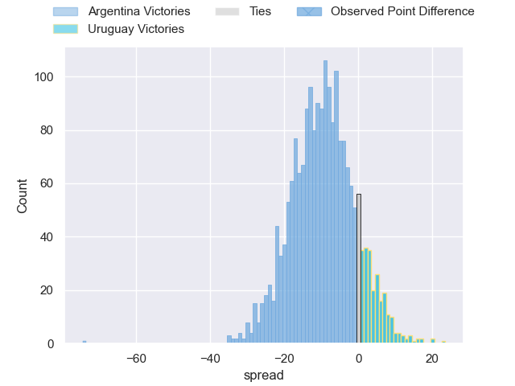
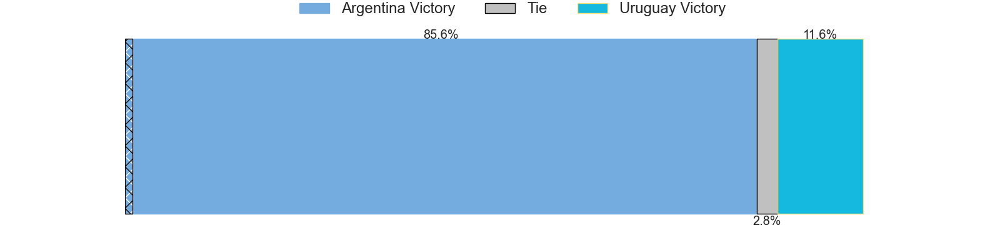
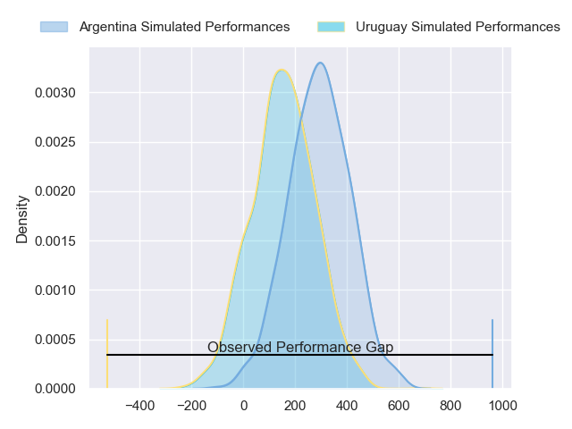
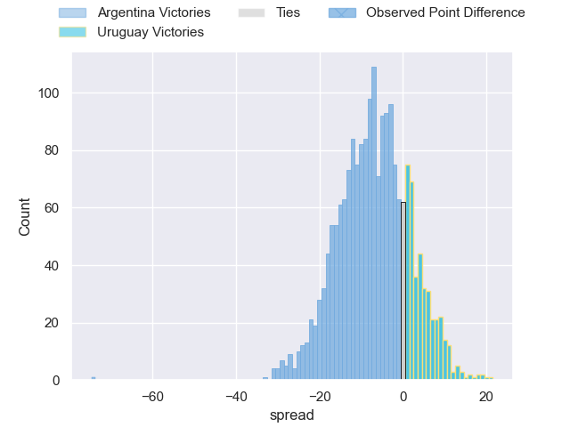
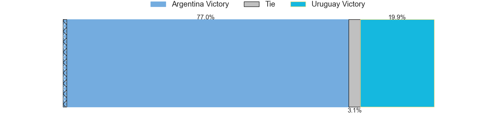

---  
layout: page  
title: Argentina at Uruguay; 79-5  
date: 2024-07-19 18:00:00 -0500  
categories: "International Test Match 2024" match review  
---
# Argentina at Uruguay; 79-5

# Club Level Predictions

The first set of predictions treats a club as the smallest object, as the club develops its members, organizes a gameplan, and deploys its players as needed for each match. This club model has a prediction of 0.264, which translates to predicting Argentina to win by 9.4.

Our Over/Under is 56.5 - and combined with the spread above, we have a predicted scoreline of 33 to 23

Each club has a rating and a rating deviation (similar to a Glicko rating), and expected performances can be generated. This allows for simulated matches and spreads like the ones below.
## Projected Performances - Club Model

## Projected Spreads - Club Model

## Projected Results - Club Model

# Player Level Predictions

Treating teams instead as an entity made up of the currently active players, I have ratings for each player in an altogether different system. These can be combined to form team ratings once teamsheets are announced, weighting starters a bit higher than the reserves. After the match is played, players can be weighted by their minutes on the field, allowing for an accurate measure of the team's composition. With these compiled team ratings, we can make predictions, measure inaccuracy, and update the individual player ratings.
## Prediction without Player Minutes: Argentina by 8.0

Argentina by 10.4 on a neutral pitch

## Projected Performances - Player Model

## Projected Spreads - Player Model

## Projected Results - Player Model

|   Away Minutes | Away Player           |   Away Percentile |   Number |   Home Percentile | Home Player                    |   Home Minutes |
|---------------:|:----------------------|------------------:|---------:|------------------:|:-------------------------------|---------------:|
|             47 | Thomas Gallo          |             90.94 |        1 |              6.51 | Mateo Sanguinetti              |             44 |
|             61 | Ignacio Ruiz          |             90.32 |        2 |             15.36 | German Kessler                 |             44 |
|             47 | Eduardo Bello         |              0.39 |        3 |             20.06 | Reinaldo Piussi Mendoza        |             80 |
|             61 | Franco Molina         |             49.29 |        4 |             66.6  | Felipe Aliaga                  |             68 |
|             80 | Pedro Rubiolo         |             18.65 |        5 |              1.9  | Manuel Leindekar               |             80 |
|             80 | Joaquin Moro          |             60.45 |        6 |             81.36 | Manuel Ardao                   |             80 |
|             51 | Marcos Kremer         |             87.51 |        7 |             13.53 | Santiago Civetta Ponce de Leon |             80 |
|             80 | Joaquin Oviedo        |             82.59 |        8 |             27.13 | Manuel Diana                   |             44 |
|             51 | Gonzalo Bertranou     |             66.83 |        9 |             33.33 | Santiago Alvarez               |             56 |
|             80 | Tomas Albornoz        |             87.16 |       10 |             59.73 | Felipe Etcheverry              |             80 |
|             65 | Mateo Carreras        |             36.17 |       11 |              3.94 | Nicolas Freitas                |             80 |
|             80 | Jeronimo de la Fuente |             99.59 |       12 |              7.3  | Andres Vilaseca                |             36 |
|             40 | Santiago Chocobares   |             47.57 |       13 |             16.43 | Tomas Inciarte                 |             80 |
|             80 | Ignacio Mendy         |             45.97 |       14 |             28.85 | Juan Manuel Alonso             |             80 |
|             80 | Santiago Cordero      |             96.61 |       15 |             23.55 | Ignacio Alvarez                |             80 |
|             19 | Ignacio Calles        |            nan    |       16 |             93.39 | Guillermo Pujadas              |             36 |
|             33 | Mayco Vivas           |              5.65 |       17 |             91.01 | Ignacio Peculo                 |             36 |
|             33 | Francisco Coria       |            nan    |       18 |             69.09 | Diego Arbelo                   |             36 |
|             19 | Matias Alemanno       |             75.36 |       19 |              0.2  | Diego Magno                    |             12 |
|             29 | Pablo Matera          |             98.86 |       20 |             70.03 | Lucas Bianchi                  |             36 |
|             29 | Gonzalo Garcia        |             22.5  |       21 |             69.63 | Carlos Deus                    |             24 |
|             15 | Santiago Carreras     |             81.32 |       22 |            nan    | Joaquin Suarez                 |             24 |
|             40 | Matias Orlando        |             19.68 |       23 |            nan    | Juan Bautista Hontou           |             44 |

