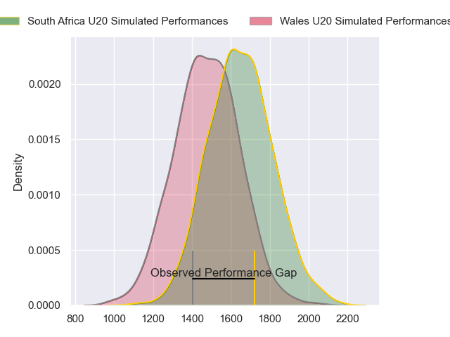
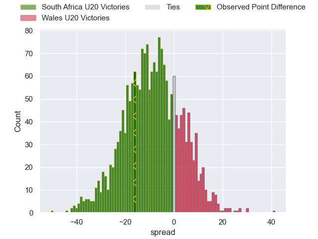
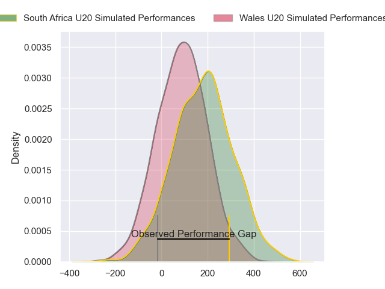
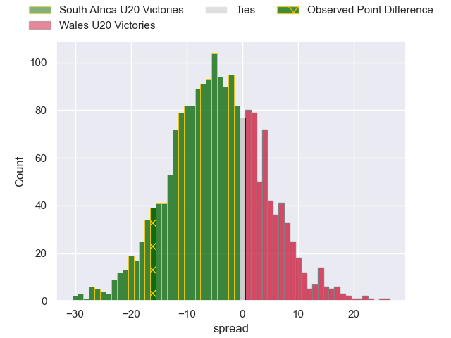
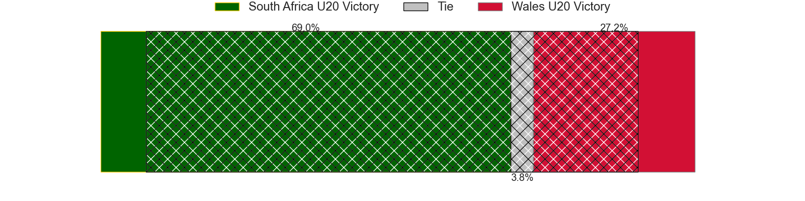

---  
layout: page  
title: South Africa U20 at Wales U20; 47-31  
date: 2024-07-19 18:00:00 -0500  
categories: "World Rugby U20 Championship 2024" match review  
---
# South Africa U20 at Wales U20; 47-31

# Club Level Predictions

The first set of predictions treats a club as the smallest object, as the club develops its members, organizes a gameplan, and deploys its players as needed for each match. This club model has a prediction of 0.294, which translates to predicting South Africa U20 to win by 8.6.

Our Over/Under is 49.5 - and combined with the spread above, we have a predicted scoreline of 29 to 21

Each club has a rating and a rating deviation (similar to a Glicko rating), and expected performances can be generated. This allows for simulated matches and spreads like the ones below.
## Projected Performances - Club Model

## Projected Spreads - Club Model

## Projected Results - Club Model

# Player Level Predictions

Treating teams instead as an entity made up of the currently active players, I have ratings for each player in an altogether different system. These can be combined to form team ratings once teamsheets are announced, weighting starters a bit higher than the reserves. After the match is played, players can be weighted by their minutes on the field, allowing for an accurate measure of the team's composition. With these compiled team ratings, we can make predictions, measure inaccuracy, and update the individual player ratings.
## Prediction without Player Minutes: South Africa U20 by 3.5

South Africa U20 by 5.7 on a neutral pitch

## Projected Performances - Player Model

## Projected Spreads - Player Model

## Projected Results - Player Model

|   Away Minutes | Away Player               |   Away Percentile |   Number |   Home Percentile | Home Player     |   Home Minutes |
|---------------:|:--------------------------|------------------:|---------:|------------------:|:----------------|---------------:|
|           73   | Casper Badenhorst         |             65.76 |        1 |             38.72 | Josh Morse      |           21.5 |
|            3   | Luca Bakkes               |             61.95 |        2 |             38.65 | Isaac Young     |           28   |
|           69   | Zachary Porthen           |             77.9  |        3 |             21.87 | Kian Hire       |           46   |
|           64   | Jaco Grobbelaar           |             57.08 |        4 |             17.13 | Jonny Green     |           80   |
|           80   | JF van Heerden            |             39.11 |        5 |             37.24 | Gethyn Cannon   |           54   |
|           80   | Keanu Coetsee             |             63.47 |        6 |             21.31 | Ryan Woodman    |           80   |
|           80   | Batho Hlekani             |             70.3  |        7 |              9.78 | Lucas De La Rua |           68   |
|           69   | Sibabalwe Mahashe         |             71.77 |        8 |             55.67 | Morgan Morse    |           21.5 |
|           71   | Asad Moos                 |             73    |        9 |             34.53 | Rhodri Lewis    |           31   |
|           56   | Tylor Sefoor              |             61.67 |       10 |             17.08 | Harri Ford      |           59   |
|           80   | Ezekiel Ngobeni           |             60.69 |       11 |             16.77 | Aidan Boshoff   |           56   |
|           50   | Joshua Boulle             |             66.07 |       12 |             15.92 | Louie Hennessey |           80   |
|           80   | Jurenzo Julius            |             70.52 |       13 |             18.79 | Macs Page       |           80   |
|           80   | Joel Leotlela             |             74.3  |       14 |             11.72 | Walker Price    |           80   |
|           80   | Bruce Sherwood            |             54.74 |       15 |             46.44 | Matty Young     |           28   |
|            4.5 | Ethan Bester              |             45.26 |       16 |             31.58 | Harry Thomas    |            6   |
|           38.5 | Ethan Bester              |             45.26 |       16 |             31.58 | Harry Thomas    |            6   |
|           38.5 | Ethan Bester              |             45.26 |       16 |             31.58 | Harry Thomas    |           12   |
|            4.5 | Ethan Bester              |             45.26 |       16 |             31.58 | Harry Thomas    |           12   |
|           11   | Liyema Ntshanga           |            nan    |       17 |            nan    | Ioan Emanuel    |           18.5 |
|           11   | Liyema Ntshanga           |            nan    |       17 |            nan    | Ioan Emanuel    |           12   |
|            7   | Herman Lubbe              |            nan    |       18 |             25.13 | Sam Scott       |           34   |
|           11   | Wandile Mlaba             |            nan    |       19 |             26.82 | Nick Thomas     |           12   |
|           11   | Wandile Mlaba             |            nan    |       19 |             26.82 | Nick Thomas     |            6   |
|           16   | Divan Fuller              |             42.25 |       20 |            nan    | Owen Conquer    |           26   |
|           24   | Liam Koen                 |             56.17 |       21 |            nan    | Lucca Setaro    |           49   |
|           30   | Philip-Albert Van Niekerk |             41.94 |       22 |             29.6  | Harri Wilde     |           21   |
|            4.5 | Litelihle Bester          |             66.73 |       23 |            nan    | Steffan Emanuel |           18.5 |
|           38.5 | Litelihle Bester          |             66.73 |       23 |            nan    | Steffan Emanuel |           18.5 |
|            4.5 | Litelihle Bester          |             66.73 |       23 |            nan    | Steffan Emanuel |           12   |
|           38.5 | Litelihle Bester          |             66.73 |       23 |            nan    | Steffan Emanuel |           12   |

