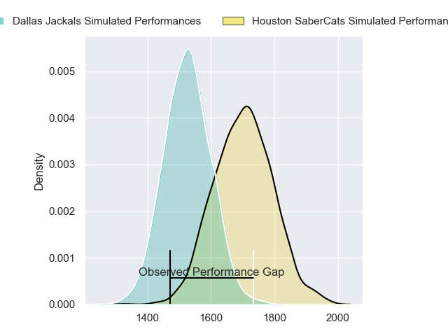
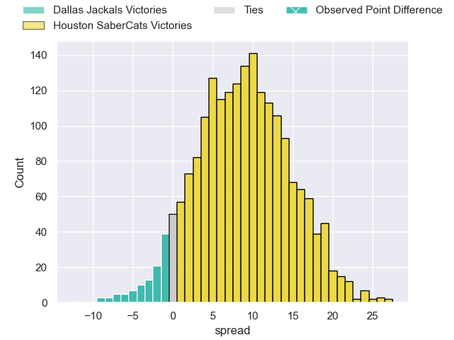
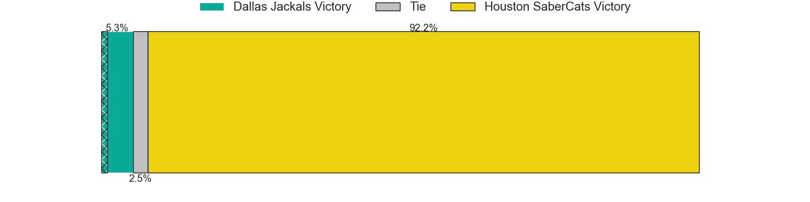
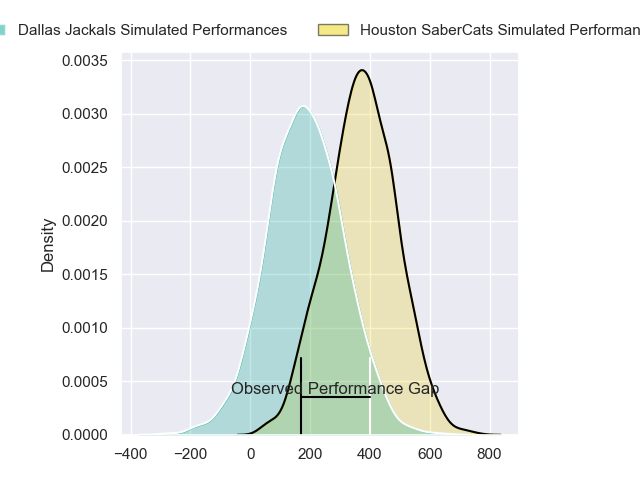
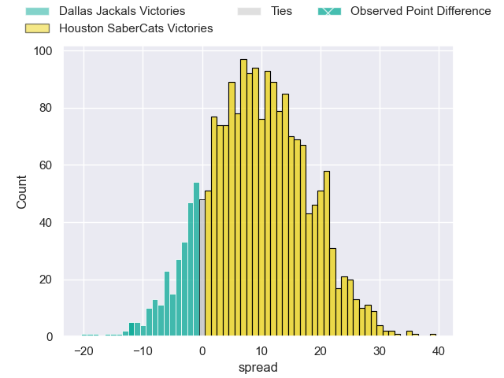
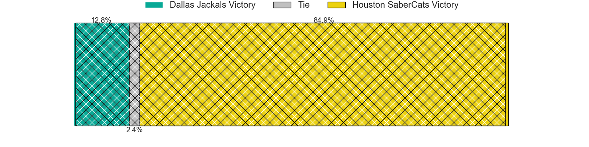

---  
layout: page  
title: Dallas Jackals at Houston SaberCats; 34-22  
date: 2024-07-21 18:00:00 -0500  
categories: "Major League Rugby 2024" match review  
---
# Dallas Jackals at Houston SaberCats; 34-22

# Club Level Predictions

The first set of predictions treats a club as the smallest object, as the club develops its members, organizes a gameplan, and deploys its players as needed for each match. This club model has a prediction of 0.728, which translates to predicting Houston SaberCats to win by 8.8.

Our Over/Under is 58.5 - and combined with the spread above, we have a predicted scoreline of 25 to 34

Each club has a rating and a rating deviation (similar to a Glicko rating), and expected performances can be generated. This allows for simulated matches and spreads like the ones below.
## Projected Performances - Club Model

## Projected Spreads - Club Model

## Projected Results - Club Model

# Player Level Predictions

Treating teams instead as an entity made up of the currently active players, I have ratings for each player in an altogether different system. These can be combined to form team ratings once teamsheets are announced, weighting starters a bit higher than the reserves. After the match is played, players can be weighted by their minutes on the field, allowing for an accurate measure of the team's composition. With these compiled team ratings, we can make predictions, measure inaccuracy, and update the individual player ratings.
## Prediction without Player Minutes: Houston SaberCats by 10.3

Houston SaberCats by 7.5 on a neutral pitch

## Projected Performances - Player Model

## Projected Spreads - Player Model

## Projected Results - Player Model

|   Away Minutes | Away Player           |   Away Percentile |   Number |   Home Percentile | Home Player            |   Home Minutes |
|---------------:|:----------------------|------------------:|---------:|------------------:|:-----------------------|---------------:|
|             71 | Joaquin Horcada       |             87.68 |        1 |             72.5  | Rob Cobb               |             57 |
|             67 | Dewald Kotze          |             69.43 |        2 |             93.24 | Pita Anae Ah-Sue       |             68 |
|             67 | Juan Pablo Zeiss      |             54.07 |        3 |             78.54 | Pono Davis             |             68 |
|             79 | Jeronimo Gomez Vara   |             25.69 |        4 |             66.41 | Siaosi Mahoni          |             40 |
|             67 | Javon Camp-Villalovos |             14.18 |        5 |             54.33 | Nathan Den Hoedt       |             80 |
|             80 | Ronan Foley           |             68.21 |        6 |             92.72 | Marno Redelinghuys     |             80 |
|             49 | Makeen Alikhan        |             73.7  |        7 |             67.55 | Keni Nasoqeqe          |             49 |
|             80 | Sam Tuifua            |             80.36 |        8 |             81.17 | Ronan Murphy           |             80 |
|             79 | Juan-Dee Oliver       |             75.5  |        9 |             70.67 | Andre Warner           |             68 |
|             80 | Martin Elias          |             96.89 |       10 |             73.74 | AJ Alatimu             |             80 |
|             80 | Nic Benn              |             84.62 |       11 |              3.48 | Seimou Smith           |             80 |
|             80 | Connor Winchester     |             79.82 |       12 |             53.96 | Louritz van der Schyff |             40 |
|             80 | Tomas Cubilla         |             78.4  |       13 |             61.97 | Tautalatasi Tasi       |             67 |
|             71 | Jason Tidwell         |             72.44 |       14 |             90.93 | Christian Dyer         |             80 |
|             80 | Tomas Malanos         |             83.63 |       15 |             62.87 | David Coetzer          |             80 |
|              9 | Connor Grindal        |            nan    |       16 |            nan    | LaRome White           |             23 |
|             13 | Tomas Bekerman        |            nan    |       17 |              3.23 | Tiaan Erasmus          |             12 |
|             13 | Kyle Steeves          |             49.42 |       18 |            nan    | Val Lee-Lo             |             12 |
|              1 | Kyle Breytenbach      |            nan    |       19 |             79.75 | Emmanuel Albert        |             40 |
|             13 | Daemon Torres         |             62.61 |       20 |             92.02 | Maks van Dyk           |             31 |
|             31 | Marques Fuala'au      |             47.3  |       21 |             87.42 | Dominic Akina          |             40 |
|              1 | Evan Conlon           |            nan    |       22 |              0.83 | Devereaux Ferris       |             12 |
|              9 | Joeli Tikoisuva       |             59.8  |       23 |            nan    | Max Schumacher         |             13 |

