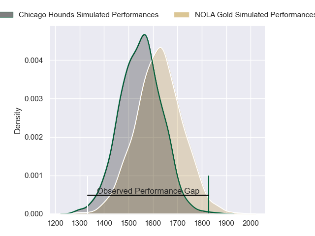
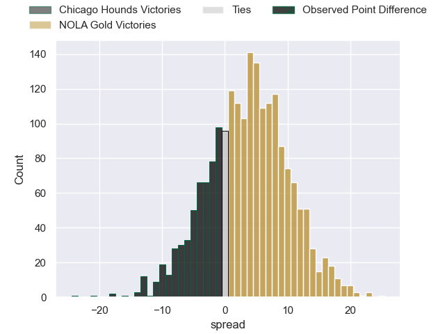
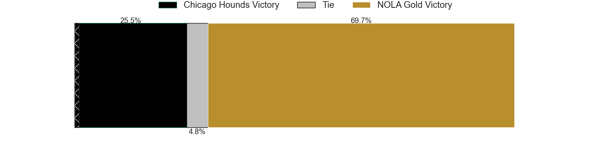
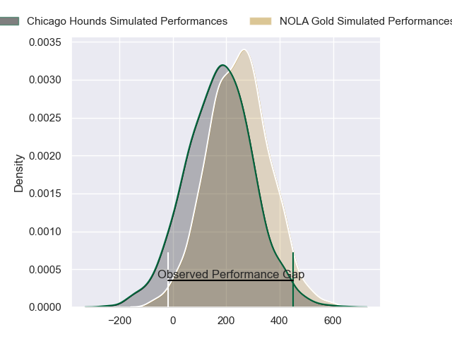
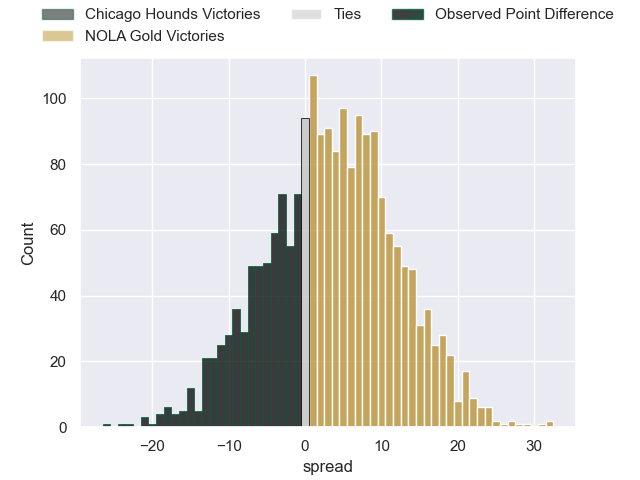
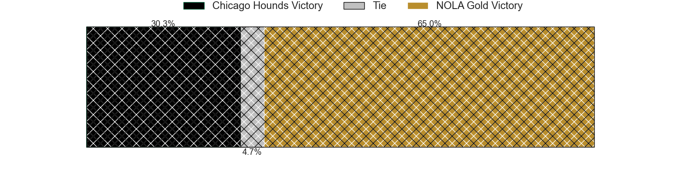

---  
layout: page  
title: Chicago Hounds at NOLA Gold; 45-21  
date: 2024-07-22 18:00:00 -0500  
categories: "Major League Rugby 2024" match review  
---
# Chicago Hounds at NOLA Gold; 45-21

# Club Level Predictions

The first set of predictions treats a club as the smallest object, as the club develops its members, organizes a gameplan, and deploys its players as needed for each match. This club model has a prediction of 0.606, which translates to predicting NOLA Gold to win by 3.9.

Our Over/Under is 53.5 - and combined with the spread above, we have a predicted scoreline of 25 to 29

Each club has a rating and a rating deviation (similar to a Glicko rating), and expected performances can be generated. This allows for simulated matches and spreads like the ones below.
## Projected Performances - Club Model

## Projected Spreads - Club Model

## Projected Results - Club Model

# Player Level Predictions

Treating teams instead as an entity made up of the currently active players, I have ratings for each player in an altogether different system. These can be combined to form team ratings once teamsheets are announced, weighting starters a bit higher than the reserves. After the match is played, players can be weighted by their minutes on the field, allowing for an accurate measure of the team's composition. With these compiled team ratings, we can make predictions, measure inaccuracy, and update the individual player ratings.
## Prediction without Player Minutes: NOLA Gold by 4.9

NOLA Gold by 2.1 on a neutral pitch

## Projected Performances - Player Model

## Projected Spreads - Player Model

## Projected Results - Player Model

|   Away Minutes | Away Player             |   Away Percentile |   Number |   Home Percentile | Home Player         |   Home Minutes |
|---------------:|:------------------------|------------------:|---------:|------------------:|:--------------------|---------------:|
|             71 | Nicolas Revol           |             63.38 |        1 |             89.14 | Jarred Adams        |             51 |
|             68 | Dylan Fawsitt           |             98.57 |        2 |              8.11 | Pat O'Toole         |             60 |
|             54 | Paddy Ryan              |             36.7  |        3 |             64.78 | Isaac Salmon        |             63 |
|             52 | George Merrick          |             16.91 |        4 |             60.35 | Malcolm May         |             51 |
|             80 | James Scott             |             78.72 |        5 |             60.06 | Cam Dolan           |             80 |
|             60 | Mason Flesch            |              6.67 |        6 |             67.61 | Jonah Mau'u         |             80 |
|             80 | Maclean Jones           |             12.86 |        7 |              4.13 | Moni Tonga'uiha     |             63 |
|             80 | Conall Boomer           |             76.62 |        8 |            nan    | OJ Noa              |             66 |
|             65 | Nick McCarthy           |             84.81 |        9 |              9.52 | Luke Campbell       |             80 |
|             80 | Luke Carty              |             42.05 |       10 |             35.81 | Rod Iona            |             80 |
|             60 | Julian Dominguez Widmer |             96.96 |       11 |             62.58 | Julian Roberts      |             40 |
|             74 | Bill Meakes             |             93.92 |       12 |             84.35 | Jordan Jackson-Hope |             80 |
|             80 | Bryce Campbell          |             71.68 |       13 |              0.41 | JP Du Plessis       |             80 |
|             80 | Nate Augspurger         |             99.17 |       14 |             84.79 | Taniela Filimone    |             80 |
|             80 | Adriaan John Carelse    |              0.61 |       15 |             89.86 | Dougie Fife         |             55 |
|              9 | Fred Fatumanu Apulu     |             33.2  |       16 |             22.96 | Matthew Harmon      |             29 |
|             12 | Janus Venter            |            nan    |       17 |            nan    | Alex Lopeti         |             20 |
|             26 | Charles Abel            |             11.79 |       18 |             66.8  | Doc Irey            |             17 |
|             28 | Brad Tucker             |            nan    |       19 |             56.17 | Callum Botchar      |             29 |
|             20 | Lucas Rumball           |              1.88 |       20 |            nan    | Maciu Koroi         |             17 |
|             15 | Jason Higgins           |             50.75 |       21 |            nan    | Fintan Coleman      |             14 |
|             20 | Noah Brown              |             80.74 |       22 |              5.77 | Ross Depperschmidt  |             40 |
|              6 | Mark O'Keeffe           |              7.31 |       23 |             77.87 | Reece Botha         |             25 |

