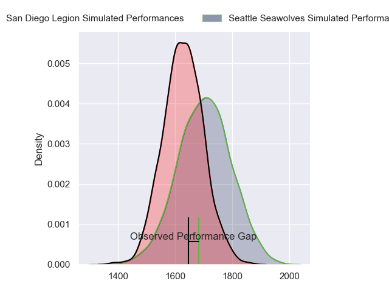
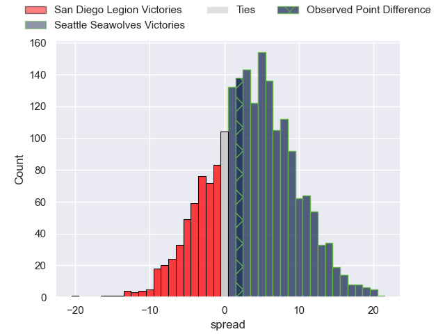
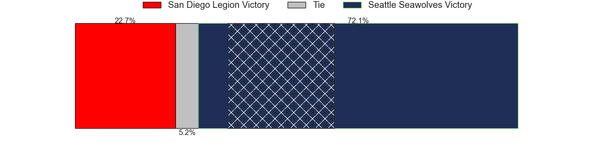
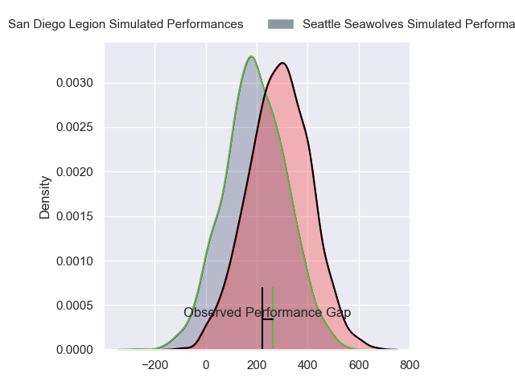
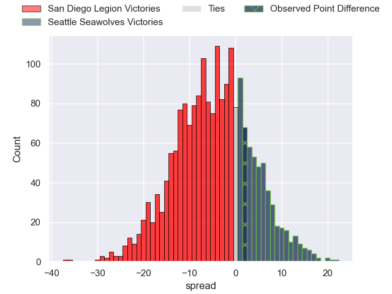
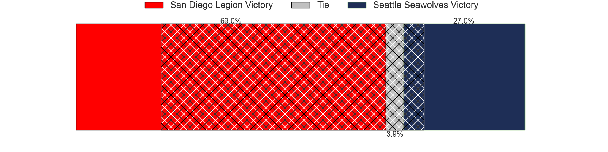

---  
layout: page  
title: San Diego Legion at Seattle Seawolves; 28-30  
date: 2024-07-22 18:00:00 -0500  
categories: "Major League Rugby 2024" match review  
---
# San Diego Legion at Seattle Seawolves; 28-30

# Club Level Predictions

The first set of predictions treats a club as the smallest object, as the club develops its members, organizes a gameplan, and deploys its players as needed for each match. This club model has a prediction of 0.605, which translates to predicting Seattle Seawolves to win by 3.8.

Our Over/Under is 54.5 - and combined with the spread above, we have a predicted scoreline of 25 to 29

Each club has a rating and a rating deviation (similar to a Glicko rating), and expected performances can be generated. This allows for simulated matches and spreads like the ones below.
## Projected Performances - Club Model

## Projected Spreads - Club Model

## Projected Results - Club Model

# Player Level Predictions

Treating teams instead as an entity made up of the currently active players, I have ratings for each player in an altogether different system. These can be combined to form team ratings once teamsheets are announced, weighting starters a bit higher than the reserves. After the match is played, players can be weighted by their minutes on the field, allowing for an accurate measure of the team's composition. With these compiled team ratings, we can make predictions, measure inaccuracy, and update the individual player ratings.
## Prediction without Player Minutes: San Diego Legion by 4.8

San Diego Legion by 7.6 on a neutral pitch

## Projected Performances - Player Model

## Projected Spreads - Player Model

## Projected Results - Player Model

|   Away Minutes | Away Player           |   Away Percentile |   Number |   Home Percentile | Home Player       |   Home Minutes |
|---------------:|:----------------------|------------------:|---------:|------------------:|:------------------|---------------:|
|             60 | Payton Telea-Ilalio   |             19.78 |        1 |             38.09 | Cameron Orr       |             74 |
|             34 | Hugh Roach            |             63.28 |        2 |             69.32 | Joe Taufete'e     |             74 |
|             47 | Luke Green            |             79.36 |        3 |             93.25 | Samuel Matenga    |             72 |
|             49 | Brandon Harvey        |             41.59 |        4 |             87.46 | Rhyno Herbst      |             80 |
|             80 | Greg Peterson         |              8.65 |        5 |              5.83 | Mahroni Ngakuru   |             77 |
|             80 | Vili Helu             |             85.73 |        6 |             46.01 | Jean Droste       |             80 |
|             54 | Blair Cowan           |             83.66 |        7 |             20.85 | Devin Short       |             59 |
|             34 | Tevita David Tameilau |             58.46 |        8 |              1.04 | Huw Taylor        |             80 |
|             80 | Connor Tupai          |             27.88 |        9 |             48.58 | Juan Philip Smith |             80 |
|             64 | Matt Giteau           |             99.6  |       10 |             55.13 | Mack Mason        |             74 |
|             80 | Filimona Waqainabete  |             58.99 |       11 |             94.56 | Toni Pulu         |             74 |
|             54 | Ma'a Nonu             |             80.43 |       12 |             35.12 | Dan Kriel         |             80 |
|             80 | Tiaan Loots           |             74.15 |       13 |             16.84 | Divan Rossouw     |             80 |
|             80 | Tomas Aoake           |             53.73 |       14 |             62.21 | Lauina Futi       |             80 |
|             80 | Marcel Brache         |             88.44 |       15 |             93.71 | Duncan Matthews   |             44 |
|             20 | Djustice Sears-Duru   |              1.47 |       16 |             91.78 | Chance Wenglewski |              6 |
|             46 | Cyrille Cama          |             29.25 |       17 |            nan    | Koby Baker        |              8 |
|             33 | Darcy Breen           |             39.57 |       18 |             34.02 | Jackson Zabierek  |              6 |
|             31 | Paddy Ryan            |             92.58 |       19 |             75.02 | Taylor Krumrei    |              3 |
|             26 | Christian Poidevin    |             75.87 |       20 |             32.78 | Pago Haini        |             21 |
|             46 | Tupou Ma'afu-Afungia  |             50.1  |       21 |              1.01 | Sam Windsor       |              6 |
|             16 | Lincoln McClutchie    |             82.09 |       22 |             31.22 | Ryan Rees         |              6 |
|             26 | Mike Te'o             |             86.41 |       23 |             82.08 | Tavite Lopeti     |             36 |

