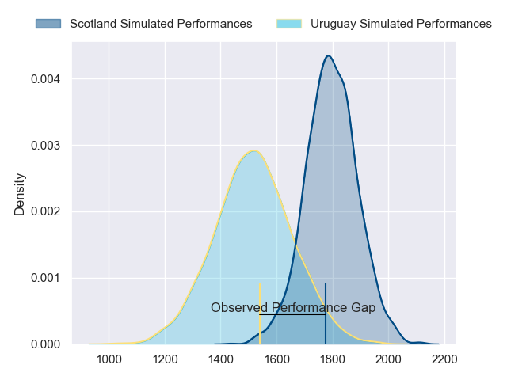
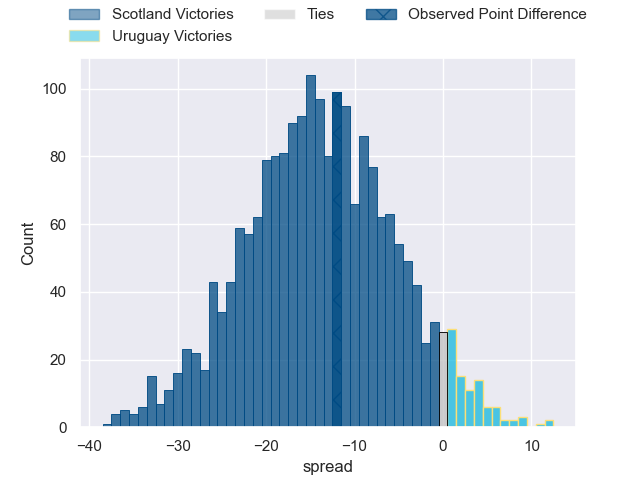
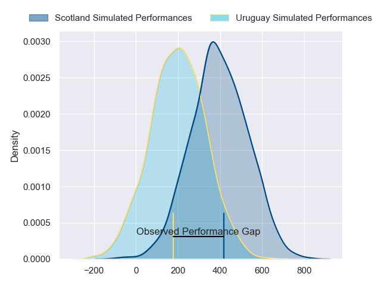
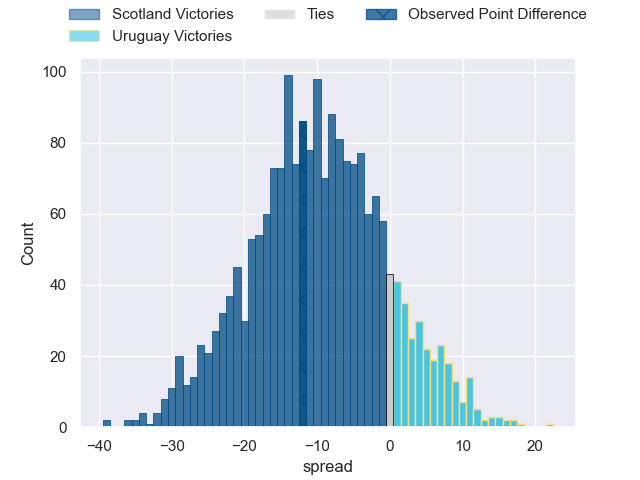

---  
layout: page  
title: Scotland at Uruguay; 31-19  
date: 2024-07-26 18:00:00 -0500  
categories: "International Test Match 2024" match review  
---
# Scotland at Uruguay; 31-19

# Club Level Predictions

The first set of predictions treats a club as the smallest object, as the club develops its members, organizes a gameplan, and deploys its players as needed for each match. This club model has a prediction of 0.173, which translates to predicting Scotland to win by 14.2.

Our Over/Under is 61.5 - and combined with the spread above, we have a predicted scoreline of 38 to 24

Each club has a rating and a rating deviation (similar to a Glicko rating), and expected performances can be generated. This allows for simulated matches and spreads like the ones below.
## Projected Performances - Club Model

## Projected Spreads - Club Model

## Projected Results - Club Model

# Player Level Predictions

Treating teams instead as an entity made up of the currently active players, I have ratings for each player in an altogether different system. These can be combined to form team ratings once teamsheets are announced, weighting starters a bit higher than the reserves. After the match is played, players can be weighted by their minutes on the field, allowing for an accurate measure of the team's composition. With these compiled team ratings, we can make predictions, measure inaccuracy, and update the individual player ratings.
## Prediction without Player Minutes: Scotland by 11.6

Scotland by 14.1 on a neutral pitch

## Projected Performances - Player Model

## Projected Spreads - Player Model

## Projected Results - Player Model

|   Away Minutes | Away Player         |   Away Percentile |   Number |   Home Percentile | Home Player          |   Home Minutes |
|---------------:|:--------------------|------------------:|---------:|------------------:|:---------------------|---------------:|
|             80 | Rory Sutherland     |             44.22 |        1 |             84.41 | Ignacio Peculo       |             80 |
|             80 | Ewan Ashman         |             85.21 |        2 |             91.26 | Guillermo Pujadas    |             80 |
|             80 | Javan Sebastian     |             62.53 |        3 |             38.79 | Diego Arbelo         |             80 |
|             80 | Max Williamson      |             69.39 |        4 |             66.38 | Felipe Aliaga        |             80 |
|             80 | Gregor Brown        |             84.26 |        5 |              1.94 | Manuel Leindekar     |             80 |
|             80 | Luke Crosbie        |             95.4  |        6 |             80.66 | Manuel Ardao         |             80 |
|             80 | Rory Darge          |             92.86 |        7 |             54.84 | Lucas Bianchi        |             80 |
|             80 | Matt Fagerson       |             98.33 |        8 |             58.04 | Carlos Deus          |             80 |
|             80 | George Horne        |            100    |        9 |             30.88 | Santiago Alvarez     |             80 |
|             80 | Ben Healy           |             81.29 |       10 |             48.89 | Felipe Etcheverry    |             80 |
|             80 | Duhan van der Merwe |             85.81 |       11 |              4.33 | Nicolas Freitas      |             80 |
|             80 | Stafford McDowall   |             93.41 |       12 |             10.4  | Tomas Inciarte       |             80 |
|             80 | Huw Jones           |             80.02 |       13 |             26.98 | Juan Manuel Alonso   |             80 |
|             80 | Kyle Rowe           |             82.76 |       14 |             34.1  | Juan Bautista Hontou |             80 |
|             80 | Harry Paterson      |             70.39 |       15 |             21.5  | Ignacio Alvarez      |             80 |
|              0 | Patrick Harrison    |            nan    |       16 |            nan    | Joaquin Myszka       |              0 |
|              0 | Pierre Schoeman     |             91.7  |       17 |              5.9  | Mateo Sanguinetti    |              0 |
|              0 | Murphy Walker       |             48.02 |       18 |            nan    | Reinaldo Piussi      |              0 |
|              0 | Ewan Johnson        |             75.9  |       19 |              0.21 | Diego Magno          |              0 |
|              0 | Jamie Ritchie       |            100    |       20 |             38.97 | Santiago Civetta     |              0 |
|              0 | Jamie Dobie         |             87.93 |       21 |             29.65 | Manuel Diana         |              0 |
|              0 | Adam Hastings       |             98.39 |       22 |            nan    | Santiago Gini        |              0 |
|              0 | Kyle Steyn          |             99.69 |       23 |            nan    | Joaquin Suarez       |              0 |

