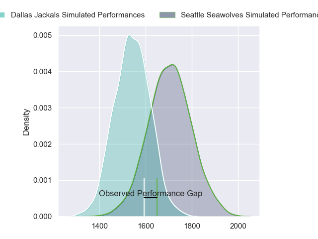
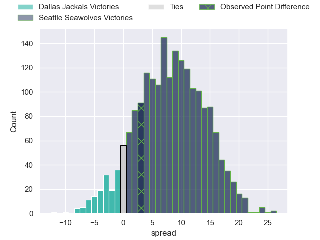
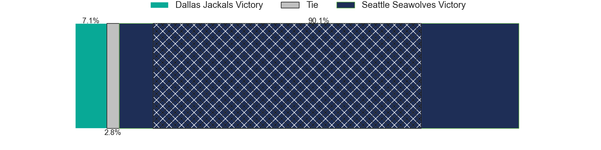
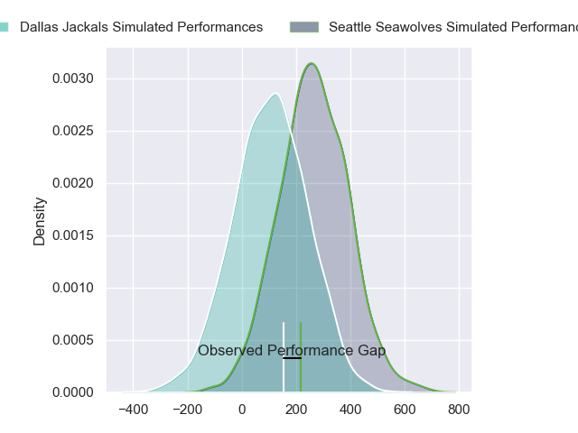
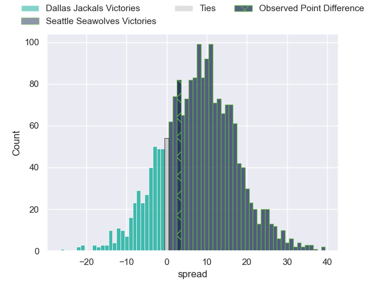
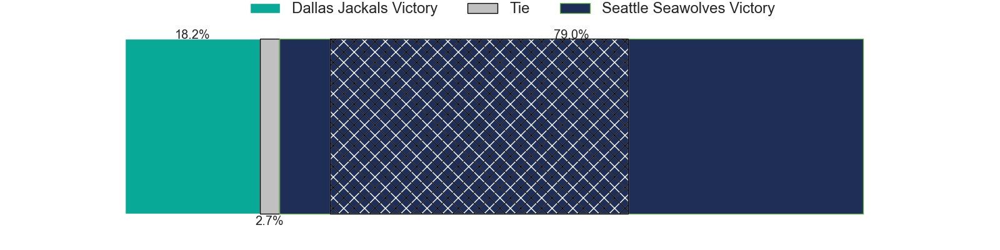

---  
layout: page  
title: Dallas Jackals at Seattle Seawolves; 25-28  
date: 2024-07-28 18:00:00 -0500  
categories: "Major League Rugby 2024" match review  
---
# Dallas Jackals at Seattle Seawolves; 25-28

# Club Level Predictions

The first set of predictions treats a club as the smallest object, as the club develops its members, organizes a gameplan, and deploys its players as needed for each match. This club model has a prediction of 0.716, which translates to predicting Seattle Seawolves to win by 8.3.

Our Over/Under is 51.5 - and combined with the spread above, we have a predicted scoreline of 22 to 30

Each club has a rating and a rating deviation (similar to a Glicko rating), and expected performances can be generated. This allows for simulated matches and spreads like the ones below.
## Projected Performances - Club Model

## Projected Spreads - Club Model

## Projected Results - Club Model

# Player Level Predictions

Treating teams instead as an entity made up of the currently active players, I have ratings for each player in an altogether different system. These can be combined to form team ratings once teamsheets are announced, weighting starters a bit higher than the reserves. After the match is played, players can be weighted by their minutes on the field, allowing for an accurate measure of the team's composition. With these compiled team ratings, we can make predictions, measure inaccuracy, and update the individual player ratings.
## Prediction without Player Minutes: Seattle Seawolves by 7.7

Seattle Seawolves by 4.9 on a neutral pitch

## Projected Performances - Player Model

## Projected Spreads - Player Model

## Projected Results - Player Model

|   Away Minutes | Away Player           |   Away Percentile |   Number |   Home Percentile | Home Player       |   Home Minutes |
|---------------:|:----------------------|------------------:|---------:|------------------:|:------------------|---------------:|
|             80 | Liam Murray           |              0.08 |        1 |             72.42 | Cameron Orr       |             80 |
|             80 | Dewald Kotze          |             76.95 |        2 |             65.98 | Joe Taufete'E     |             80 |
|             80 | Juan Pablo Zeiss      |             76.03 |        3 |             72.42 | Sam Matenga       |             80 |
|             80 | Jero Gomez Vara       |             76.97 |        4 |             74.34 | Rhyno Herbst      |             80 |
|             80 | Lucas Bur             |             68.22 |        5 |             34.21 | Mahonri Ngakuru   |             80 |
|             80 | Makeen Alikhan        |             77.75 |        6 |             72.39 | Jean Droste       |             80 |
|             80 | Ben Fry               |             51.08 |        7 |             36.62 | Pago Haini        |             80 |
|             80 |                       |             49.06 |        8 |             63.47 | Huw Taylor        |             80 |
|             80 | Juan-Dee Oliver       |             76.13 |        9 |             48.58 | Juan Philip Smith |             80 |
|             80 | Martin Elias          |             71.43 |       10 |             62.37 | Mack Mason        |             80 |
|             80 | Nic Benn              |             75.02 |       11 |             63.41 | Jade Stighling    |             80 |
|             80 | Connor Winchester     |             67.25 |       12 |             67.15 | Dan Kriel         |             80 |
|             80 | Tomás Cubilla         |             56.02 |       13 |             82.08 | Tavite Lopeti     |             80 |
|             80 | Jason Tidwell         |             77.14 |       14 |             43.41 | Conner Mooneyham  |             80 |
|             80 | Tomy Malanos          |             69.98 |       15 |             16.84 | Divan Rossouw     |             80 |
|              0 | Connor Grindal        |             40.73 |       16 |             62.32 | Jackson Zabierek  |              0 |
|              0 | Tomás Bekerman        |             51.03 |       17 |            nan    | Chance Wenglewski |              0 |
|              0 | Kyle Steeves          |            nan    |       18 |            nan    | Koby Baker        |              0 |
|              0 | Javon Camp-Villalovos |             64.04 |       19 |             36.35 | Isaia Lotawa      |              0 |
|              0 | Daemon Torres         |            nan    |       20 |            nan    | Reid Davis        |              0 |
|              0 | Brock Gallagher       |            nan    |       21 |             35.06 | Ryan Rees         |              0 |
|              0 | Marques Fuala'Au      |             48.02 |       22 |            nan    | Sam Windsor       |              0 |
|              0 | Joeli Tikoisuva       |            nan    |       23 |             36.22 | Jeremiah Sio      |              0 |
|              0 | Joaquín Horcada       |             80.06 |       24 |             49.06 |                   |              0 |

