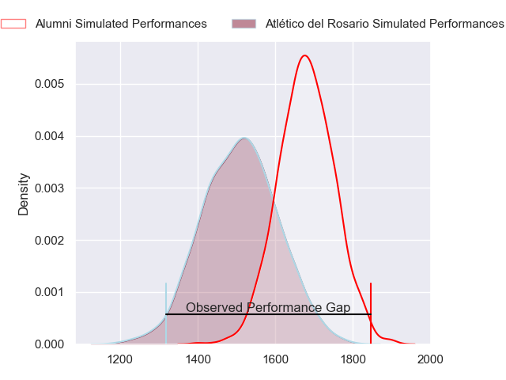
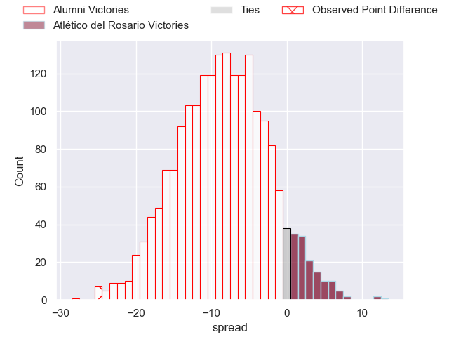
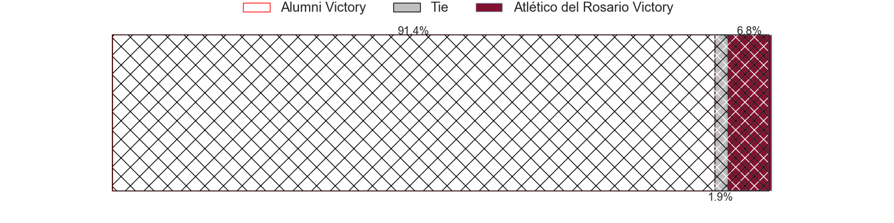
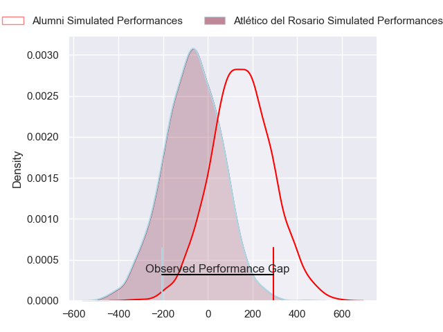
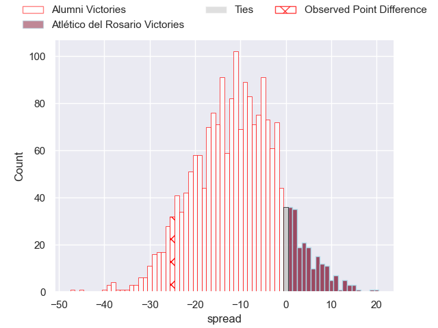
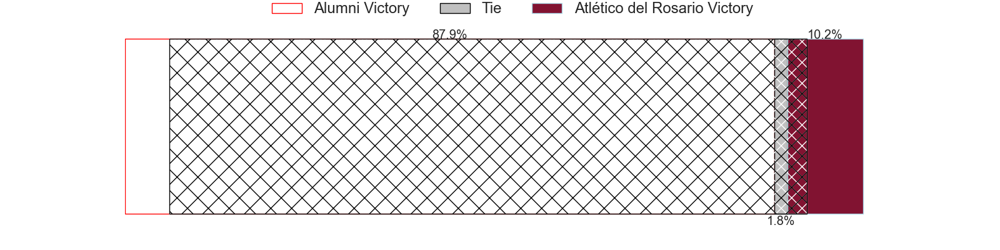

---  
layout: page  
title: Alumni at Atletico del Rosario; 51-26  
date: 2024-08-03 18:00:00 -0500  
categories: "URBA Top 13 2024" match review  
---
# Alumni at Atletico del Rosario; 51-26

# Club Level Predictions

The first set of predictions treats a club as the smallest object, as the club develops its members, organizes a gameplan, and deploys its players as needed for each match. This club model has a prediction of 0.279, which translates to predicting Alumni to win by 8.5.

Our Over/Under is 53.5 - and combined with the spread above, we have a predicted scoreline of 31 to 23

Each club has a rating and a rating deviation (similar to a Glicko rating), and expected performances can be generated. This allows for simulated matches and spreads like the ones below.
## Projected Performances - Club Model

## Projected Spreads - Club Model

## Projected Results - Club Model

# Player Level Predictions

Treating teams instead as an entity made up of the currently active players, I have ratings for each player in an altogether different system. These can be combined to form team ratings once teamsheets are announced, weighting starters a bit higher than the reserves. After the match is played, players can be weighted by their minutes on the field, allowing for an accurate measure of the team's composition. With these compiled team ratings, we can make predictions, measure inaccuracy, and update the individual player ratings.
## Prediction without Player Minutes: Alumni by 10.8

Alumni by 14.6 on a neutral pitch

## Projected Performances - Player Model

## Projected Spreads - Player Model

## Projected Results - Player Model

|   Away Minutes | Away Player                |   Away Percentile |   Number |   Home Percentile | Home Player                 |   Home Minutes |
|---------------:|:---------------------------|------------------:|---------:|------------------:|:----------------------------|---------------:|
|             80 | Federico Lucca             |             66.1  |        1 |              8.42 | Ezequiel Reyes              |             80 |
|             80 | Tomas Bivort               |             71.66 |        2 |             34.71 | Ramiro Rubio                |             80 |
|             80 | Bautista Vidal             |             81.37 |        3 |              1.17 | Agustin Fernandez           |             80 |
|             80 | Manuel Mora                |             78.35 |        4 |              3.79 | Matias Kremer               |             80 |
|             80 | Santiago Alduncin          |             67.96 |        5 |              3.5  | Octavio Capella             |             80 |
|             80 | Ignacio Cubilla            |             63.25 |        6 |              1.6  | Lucas Malanos               |             80 |
|             80 | Juan Anderson              |             78.01 |        7 |              9.49 | Jose Ignacio Ferrer         |             80 |
|             80 | Santiago Montagner         |             57.11 |        8 |             14.44 | Jose Caseres                |             80 |
|             80 | Tomas Passerotti           |             64.5  |        9 |             11.83 | Felipe Nogues               |             80 |
|             80 | Joaquin Luzzi              |             80.08 |       10 |             16.7  | Manuel Nogues               |             80 |
|             80 | Ramon Fuentes              |             68.02 |       11 |              4.52 | Facundo Gerosa              |             80 |
|             80 | Franco Battezzati          |             59.84 |       12 |             34.91 | Juan Pablo Estelles         |             80 |
|             80 | Alejo Chavez               |             61.07 |       13 |              1.85 | Pedro de Aro                |             80 |
|             80 | Franco Sabato              |             45.71 |       14 |             17.7  | Nicolas Casals              |             80 |
|             80 | Santiago Pernas            |             53.27 |       15 |              2.45 | Pedro Bisio                 |             80 |
|              0 | Maximo Lamelas             |             38.38 |       16 |             13.69 | Matias Malanos              |              0 |
|              0 | Maximo Castillo            |            nan    |       17 |            nan    | Jose Carro                  |              0 |
|              0 | Ezequiel Oliva             |             22.6  |       18 |             28.22 | Bruno Montenegro            |              0 |
|              0 | Federico Canovas           |             27.77 |       19 |            nan    | Ignacio Sapino              |              0 |
|              0 | Nicolas Promanzio          |             44.85 |       20 |              5.9  | Maximiliano Nicoli Fiscella |              0 |
|              0 | Santiago Ambroa            |            nan    |       21 |             29.33 | Martin Del Pazo             |              0 |
|              0 | Santiago Gonzalez Iglesias |             36.94 |       22 |            nan    | Ignacio De Haro             |              0 |
|              0 | Filipo Testoni             |            nan    |       23 |             41.73 | Federico Mayol              |              0 |

