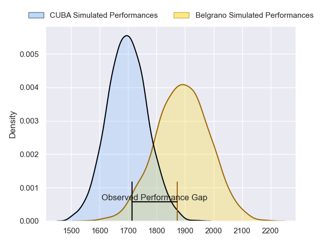
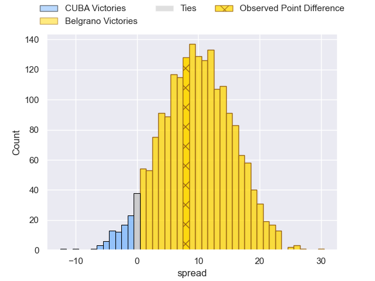
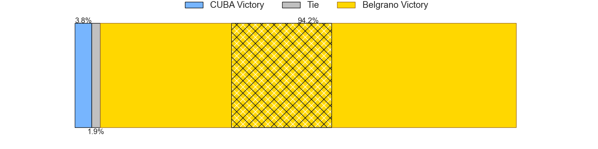
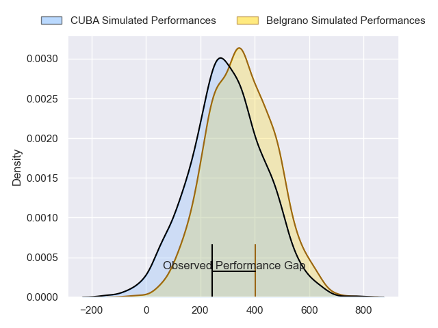
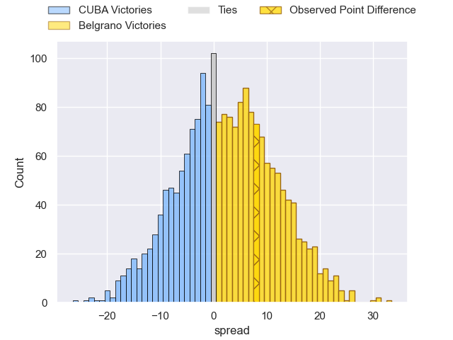
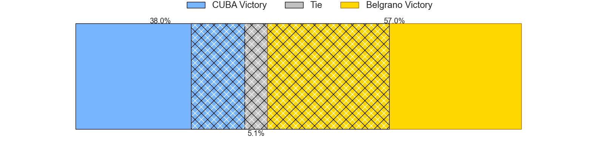

---  
layout: page  
title: CUBA at Belgrano; 22-30  
date: 2024-08-03 18:00:00 -0500  
categories: "URBA Top 13 2024" match review  
---
# CUBA at Belgrano; 22-30

# Club Level Predictions

The first set of predictions treats a club as the smallest object, as the club develops its members, organizes a gameplan, and deploys its players as needed for each match. This club model has a prediction of 0.747, which translates to predicting Belgrano to win by 9.7.

Our Over/Under is 56.5 - and combined with the spread above, we have a predicted scoreline of 23 to 33

Each club has a rating and a rating deviation (similar to a Glicko rating), and expected performances can be generated. This allows for simulated matches and spreads like the ones below.
## Projected Performances - Club Model

## Projected Spreads - Club Model

## Projected Results - Club Model

# Player Level Predictions

Treating teams instead as an entity made up of the currently active players, I have ratings for each player in an altogether different system. These can be combined to form team ratings once teamsheets are announced, weighting starters a bit higher than the reserves. After the match is played, players can be weighted by their minutes on the field, allowing for an accurate measure of the team's composition. With these compiled team ratings, we can make predictions, measure inaccuracy, and update the individual player ratings.
## Prediction without Player Minutes: Belgrano by 4.1

Belgrano by 0.1 on a neutral pitch

## Projected Performances - Player Model

## Projected Spreads - Player Model

## Projected Results - Player Model

|   Away Minutes | Away Player           |   Away Percentile |   Number |   Home Percentile | Home Player            |   Home Minutes |
|---------------:|:----------------------|------------------:|---------:|------------------:|:-----------------------|---------------:|
|             80 | Facundo Aguirre       |             87.69 |        1 |             90.11 | Francisco Ferronato    |             80 |
|             80 | Tomas Anderlic        |             26.51 |        2 |             90.79 | Francisco Lusarreta    |             80 |
|             80 | Estanislao Carullo    |             82.94 |        3 |             84.66 | Lisandro Garcia Dragui |             80 |
|             80 | Santiago Uriarte      |             85.92 |        4 |             90.87 | Luciano Tecca          |             80 |
|             80 | Santiago Landau       |             85.53 |        5 |             72.91 | Ramon Duggan           |             80 |
|             80 | Lucas Campion         |             48.03 |        6 |             88.53 | Joaquin de la Serna    |             80 |
|             80 | Segundo Pisani        |             83.27 |        7 |             82.33 | Augusto Vaccarino      |             80 |
|             80 | Benito Ortiz de Rozas |             80.75 |        8 |             60.46 | Joaquin Moro           |             80 |
|             80 | Rafael Iriarte        |             77.83 |        9 |             80.83 | Ignacio Marino         |             80 |
|             80 | Valentin Mastroizi    |             85.34 |       10 |             73.69 | Juan Aparicio          |             80 |
|             80 | Pedro Mesones         |             40.37 |       11 |             86.27 | Ignacio Diaz           |             80 |
|             80 | Felipe Perdomo        |             76.42 |       12 |             46.96 | Juan Brescia           |             80 |
|             80 | Marcos Elicagaray     |             62.62 |       13 |             83.63 | Tomas Etchepare        |             80 |
|             80 | Bautista Casaurang    |             89.77 |       14 |             60.83 | Pedro Arana            |             80 |
|             80 | Simon Benitez Cruz    |             43.58 |       15 |             82.28 | Juan Lando             |             80 |
|              0 | Francisco Patrono     |             83.5  |       16 |            nan    | Valentin Chiodi        |              0 |
|              0 | Esteban Iribarne      |            nan    |       17 |            nan    | Eliseo Marchetti       |              0 |
|              0 | Joaquin Yakiche       |            nan    |       18 |            nan    | Santiago Garcia Botta  |              0 |
|              0 | Felipe Casuarang      |            nan    |       19 |             63.59 | Mikael Quesada         |              0 |
|              0 | Felipe Mendonca       |            nan    |       20 |             83.26 | Franco Vega            |              0 |
|              0 | Felipe de la Vega     |             73.94 |       21 |             81.84 | Tobias Bernabe         |              0 |
|              0 | Marcos Moroni         |             86.36 |       22 |             29.83 | Tomas Cubelli          |              0 |
|              0 | Enrique Devoto        |             90.95 |       23 |            nan    | Martin Arana           |              0 |

