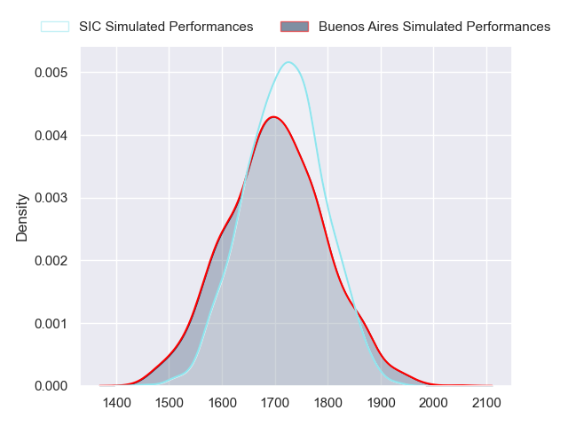
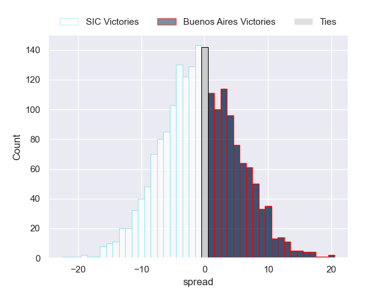
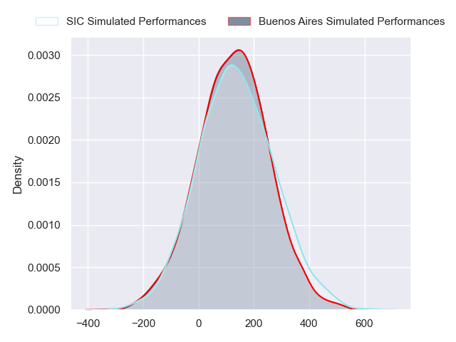
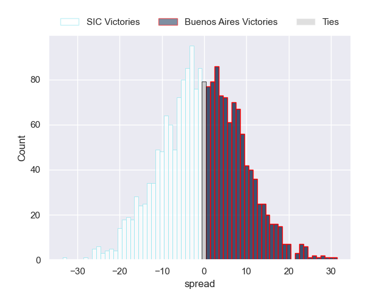

---  
layout: page  
title: SIC at Buenos Aires; 20-20  
date: 2024-08-03 18:00:00 -0500  
categories: "URBA Top 13 2024" match review  
---
# SIC at Buenos Aires; 20-20

# Club Level Predictions

The first set of predictions treats a club as the smallest object, as the club develops its members, organizes a gameplan, and deploys its players as needed for each match. This club model has a prediction of 0.474, which translates to predicting SIC to win by 0.9.

Our Over/Under is 47.5 - and combined with the spread above, we have a predicted scoreline of 24 to 24

Each club has a rating and a rating deviation (similar to a Glicko rating), and expected performances can be generated. This allows for simulated matches and spreads like the ones below.
## Projected Performances - Club Model

## Projected Spreads - Club Model

## Projected Results - Club Model

# Player Level Predictions

Treating teams instead as an entity made up of the currently active players, I have ratings for each player in an altogether different system. These can be combined to form team ratings once teamsheets are announced, weighting starters a bit higher than the reserves. After the match is played, players can be weighted by their minutes on the field, allowing for an accurate measure of the team's composition. With these compiled team ratings, we can make predictions, measure inaccuracy, and update the individual player ratings.
## Prediction without Player Minutes: SIC by 0.3

SIC by 3.2 on a neutral pitch

## Projected Performances - Player Model

## Projected Spreads - Player Model

## Projected Results - Player Model

|   Away Minutes | Away Player             |   Away Percentile |   Number |   Home Percentile | Home Player            |   Home Minutes |
|---------------:|:------------------------|------------------:|---------:|------------------:|:-----------------------|---------------:|
|             80 | Francisco Calandra      |             44.39 |        1 |             76.64 | Pablo Gaston Vaca      |             80 |
|             80 | Ignacio Bottazzini      |             60.48 |        2 |             45.4  | Valentino Minoyetti    |             80 |
|             80 | Benjamin Chiappe        |             55.37 |        3 |             32.17 | Tomas Gallo            |             80 |
|             80 | Tomas Borghi            |             73.4  |        4 |             47.28 | Tomas Alvarez Bayon    |             80 |
|             80 | Bautista Viero          |             68.16 |        5 |             46.89 | Athos Touzet           |             80 |
|             80 | Tomas Legarre           |             43.23 |        6 |             50.75 | Jordi Dieguez          |             80 |
|             80 | Franco Delger           |             76.13 |        7 |             39.1  | Matias Espina          |             80 |
|             80 | Alejo Daireaux          |             35.15 |        8 |             18.83 | Tomas Etcheverry       |             80 |
|             80 | Felipe Sascaro          |             68.17 |        9 |             25    | Mateo Freire           |             80 |
|             80 | Santiago Pavlovsky      |             60.64 |       10 |             26.31 | Tomas Bunge            |             80 |
|             80 | Nicanor Acosta          |             49.49 |       11 |             46.73 | Manuel Traverso        |             80 |
|             80 | Santos Rubio            |             62    |       12 |             41.81 | Agustin Lamensa Sanudo |             80 |
|             80 | Carlos Piran            |             48.82 |       13 |             37.08 | Ramiro Costa           |             80 |
|             80 | Justo Piccardo          |             45.99 |       14 |             62.4  | Alfonso Latorre        |             80 |
|             80 | Bernabe Lopez Fleming   |             36.25 |       15 |             38.9  | Julian Quetglas Bojar  |             80 |
|              0 | Franco Presta           |            nan    |       16 |             46.03 | Tomas Rosasco          |              0 |
|              0 | Juan Pedro Olcese       |             50.47 |       17 |             12.93 | Tomas Herrador         |              0 |
|              0 | Pedro Georgalo          |             50.84 |       18 |             55.22 | Blas Armando Coria     |              0 |
|              0 | Jaime Gilligan          |            nan    |       19 |            nan    | Maximo Batistelo       |              0 |
|              0 | Andrea Panzarini        |             57.52 |       20 |             53.76 | Valentin Arauz         |              0 |
|              0 | Ramon Martinez Tomietto |            nan    |       21 |             64.33 | Juan Monasterio        |              0 |
|              0 | Lucas Albanese          |             25.25 |       22 |             19.83 | Simon Mimessi          |              0 |
|              0 | Agustin Sascaro         |            nan    |       23 |             61.59 | Tobias Diaz Borda      |              0 |

