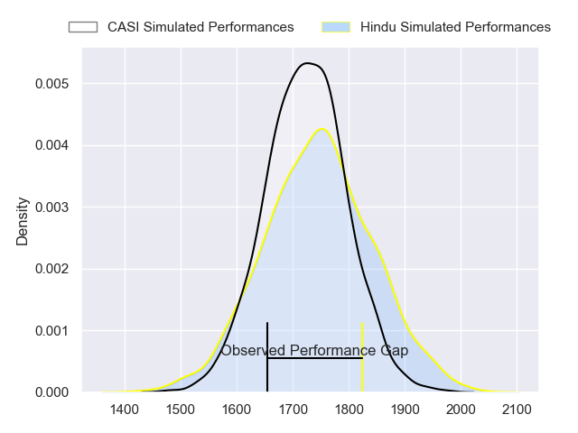
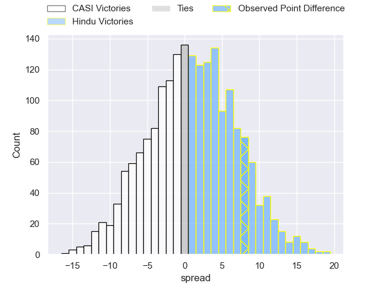
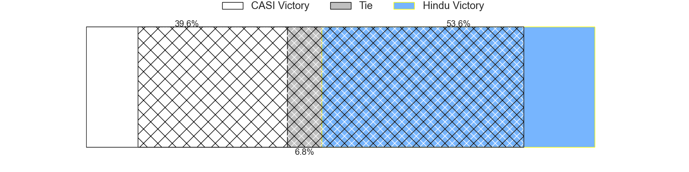
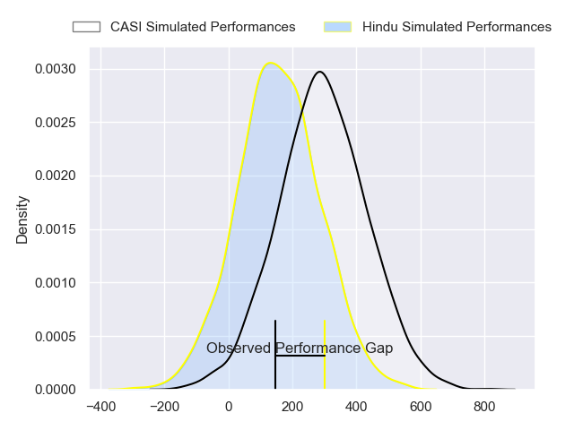
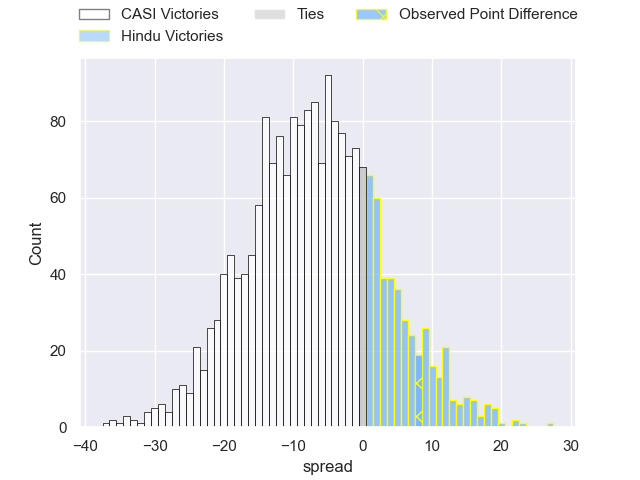
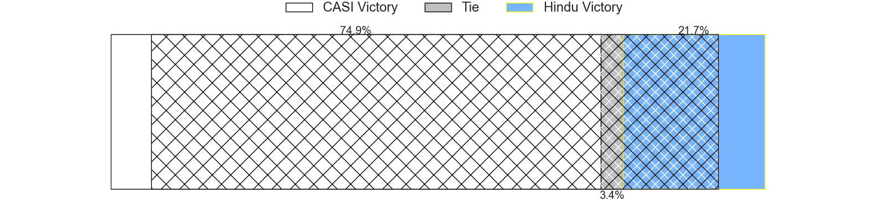

---  
layout: page  
title: CASI at Hindu; 18-26  
date: 2024-08-03 18:00:00 -0500  
categories: "URBA Top 13 2024" match review  
---
# CASI at Hindu; 18-26

# Club Level Predictions

The first set of predictions treats a club as the smallest object, as the club develops its members, organizes a gameplan, and deploys its players as needed for each match. This club model has a prediction of 0.529, which translates to predicting Hindu to win by 1.0.

Our Over/Under is 57.5 - and combined with the spread above, we have a predicted scoreline of 28 to 29

Each club has a rating and a rating deviation (similar to a Glicko rating), and expected performances can be generated. This allows for simulated matches and spreads like the ones below.
## Projected Performances - Club Model

## Projected Spreads - Club Model

## Projected Results - Club Model

# Player Level Predictions

Treating teams instead as an entity made up of the currently active players, I have ratings for each player in an altogether different system. These can be combined to form team ratings once teamsheets are announced, weighting starters a bit higher than the reserves. After the match is played, players can be weighted by their minutes on the field, allowing for an accurate measure of the team's composition. With these compiled team ratings, we can make predictions, measure inaccuracy, and update the individual player ratings.
## Prediction without Player Minutes: CASI by 6.1

CASI by 10.1 on a neutral pitch

## Projected Performances - Player Model

## Projected Spreads - Player Model

## Projected Results - Player Model

|   Away Minutes | Away Player                |   Away Percentile |   Number |   Home Percentile | Home Player                |   Home Minutes |
|---------------:|:---------------------------|------------------:|---------:|------------------:|:---------------------------|---------------:|
|             80 | Joaquin Britto             |             77.26 |        1 |             58.72 | Juan Ignacio Martinez Sosa |             80 |
|             80 | Juan Torres Obeid          |             80.16 |        2 |             27.46 | Agustin Capurro            |             80 |
|             80 | Juan Ignacio Nieto Sanchez |             80.84 |        3 |             64.49 | Mariano Leiva              |             80 |
|             80 | Salvador Ochoa             |             67.57 |        4 |             61.26 | Carlos Repetto             |             80 |
|             80 | Leo Mazzini                |             60.78 |        5 |             36.31 | Juan Ignacio Comolli       |             80 |
|             80 | Eugenio Sartori            |             83.93 |        6 |             61.04 | Nicolas D'Amorim           |             80 |
|             80 | Joaquin Saenz de Miera     |             78.76 |        7 |             61.04 | Lautaro Bavaro             |             80 |
|             80 | Luis Briatore              |             56.9  |        8 |             51.88 | Nicolas Amaya              |             80 |
|             80 | Luca Canzani               |             75.83 |        9 |             54.83 | Lucas Fernandez Miranda    |             80 |
|             80 | Felipe Hileman             |             67.07 |       10 |             96.99 | Santiago Fernandez         |             80 |
|             80 | Jeronimo Tumbarello        |             58.53 |       11 |             69.68 | Federico Graglia           |             80 |
|             80 | Tomas Phelan               |             27.39 |       12 |             27.19 | Bautista Farise            |             80 |
|             80 | Jeronimo Solveyra          |             71.88 |       13 |             56.75 | Juan Fernandez Miranda     |             80 |
|             80 | Santiago David             |             76.13 |       14 |             19.17 | Tomas Amher                |             80 |
|             80 | Juan Akemeier              |             68.02 |       15 |             14.26 | Lisandro Rodriguez         |             80 |
|              0 | Facundo Andreotti          |            nan    |       16 |            nan    | Benjamin Silveyra          |              0 |
|              0 | Facundo Scaiano            |             55.92 |       17 |             14.95 | Franco Diviesti            |              0 |
|              0 | Ignacio Larrague           |            nan    |       18 |             12.62 | Nicolas Leiva              |              0 |
|              0 | Hugo Garcia                |            nan    |       19 |             21.52 | Tomas Scallan              |              0 |
|              0 | Tobias Casaurang           |             43.33 |       20 |              7.8  | Santino Amayav             |              0 |
|              0 | Benjamin Rocca Rivarola    |             36.84 |       21 |            nan    | Felipe Ezcurra             |              0 |
|              0 | Ignacio Torrado            |             47.57 |       22 |             49.31 | Alfredo Mayol              |              0 |
|              0 | Benjamin Belaga            |             65.5  |       23 |             86.91 | Belisario Agulla           |              0 |

