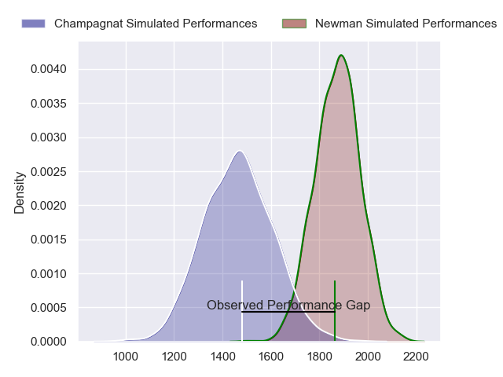
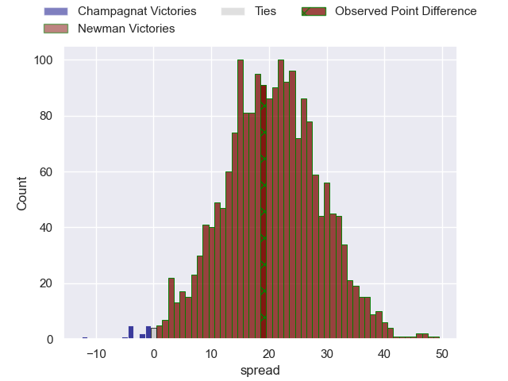
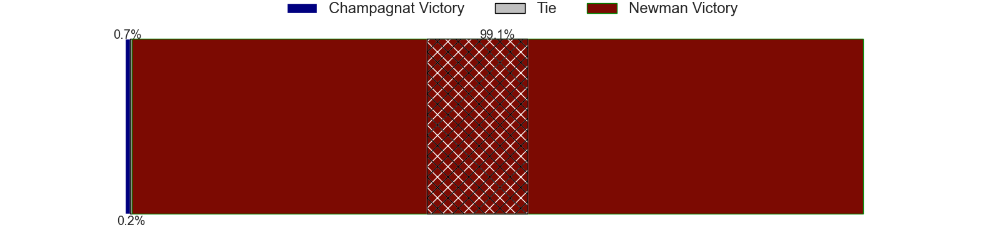
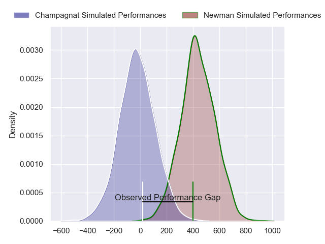
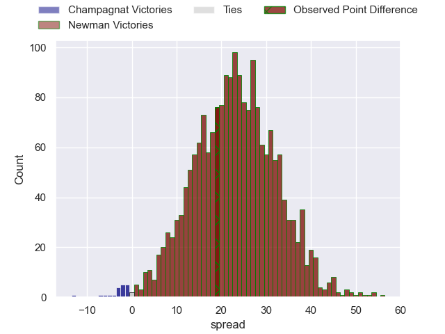

---  
layout: page  
title: Champagnat at Newman; 20-39  
date: 2024-08-03 18:00:00 -0500  
categories: "URBA Top 13 2024" match review  
---
# Champagnat at Newman; 20-39

# Club Level Predictions

The first set of predictions treats a club as the smallest object, as the club develops its members, organizes a gameplan, and deploys its players as needed for each match. This club model has a prediction of 0.897, which translates to predicting Newman to win by 20.7.

Our Over/Under is 50.5 - and combined with the spread above, we have a predicted scoreline of 15 to 35

Each club has a rating and a rating deviation (similar to a Glicko rating), and expected performances can be generated. This allows for simulated matches and spreads like the ones below.
## Projected Performances - Club Model

## Projected Spreads - Club Model

## Projected Results - Club Model

# Player Level Predictions

Treating teams instead as an entity made up of the currently active players, I have ratings for each player in an altogether different system. These can be combined to form team ratings once teamsheets are announced, weighting starters a bit higher than the reserves. After the match is played, players can be weighted by their minutes on the field, allowing for an accurate measure of the team's composition. With these compiled team ratings, we can make predictions, measure inaccuracy, and update the individual player ratings.
## Prediction without Player Minutes: Newman by 23.2

Newman by 19.0 on a neutral pitch

## Projected Performances - Player Model

## Projected Spreads - Player Model

## Projected Results - Player Model

|   Away Minutes | Away Player                   |   Away Percentile |   Number |   Home Percentile | Home Player               |   Home Minutes |
|---------------:|:------------------------------|------------------:|---------:|------------------:|:--------------------------|---------------:|
|             80 | Tomas Distel                  |             39.13 |        1 |             91.97 | Miguel Prince             |             80 |
|             80 | Joaquin Guerra                |             26.43 |        2 |             56.85 | Rodrigo Pueyrredon        |             80 |
|             80 | Marcos Magaro                 |             32.19 |        3 |             95.56 | Bautista Bosch            |             80 |
|             80 | Inaki Ustariz                 |             16.31 |        4 |             92.33 | Jeronimo Ureta            |             80 |
|             80 | Tobias Rivas Orozco           |             37.67 |        5 |             82.91 | Alejandro Urtubey         |             80 |
|             80 | Matias Alonso Boto            |             18.14 |        6 |             88.25 | Joaquin de la Vega        |             80 |
|             80 | Lucas Moresco                 |             31.39 |        7 |             85.24 | Mateo Montoya             |             80 |
|             80 | Matias Muniagurria            |             17.99 |        8 |             92.89 | Rodrigo Diaz de Vivar     |             80 |
|             80 | Martin Graciarena             |             15    |        9 |             93.83 | Lucas Marguery            |             80 |
|             80 | Santos Panela                 |             20.93 |       10 |             89.54 | Gonzalo Guiterrez Taboada |             80 |
|             80 | Tomas Baca Castex             |             18.25 |       11 |             55.39 | Jeronimo Ulloa            |             80 |
|             80 | Tobias Imbrosciano            |             17.3  |       12 |             90.32 | Tomas Keena               |             80 |
|             80 | Tomas Cotter                  |             24    |       13 |             68.38 | Benjamin Lanfranco        |             80 |
|             80 | Facundo Rufino                |             28.02 |       14 |             44.79 | Marcos Zirolli            |             80 |
|             80 | Gonzalo Costaguta             |             50.2  |       15 |             30.2  | Francisco Pasman          |             80 |
|              0 | Manuel Mauvecin               |             24.71 |       16 |            nan    | Belisario Granato         |              0 |
|              0 | Alberto Adissi                |             20.11 |       17 |            nan    | Isidro Bosch              |              0 |
|              0 | Santiago Escuti               |             28.93 |       18 |             43.34 | Manuel Lozano             |              0 |
|              0 | Tomas Alonso Boto             |             34.49 |       19 |             93.5  | Pablo Cardinal            |              0 |
|              0 | Pedro Del Piano               |            nan    |       20 |             55.45 | Faustino Santarelli       |              0 |
|              0 | Marcos Lafuente               |             32.44 |       21 |            nan    | Tomas Gonzalo Valls       |              0 |
|              0 | Felipe Rojo Bas               |            nan    |       22 |            nan    | Carlos Mendez Beherty     |              0 |
|              0 | Fernando Rodriguez Pascarella |             22.29 |       23 |            nan    | Juan Lanza                |              0 |

