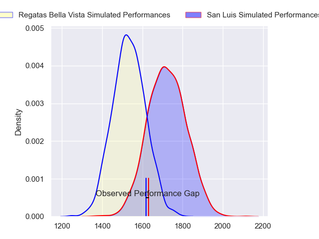
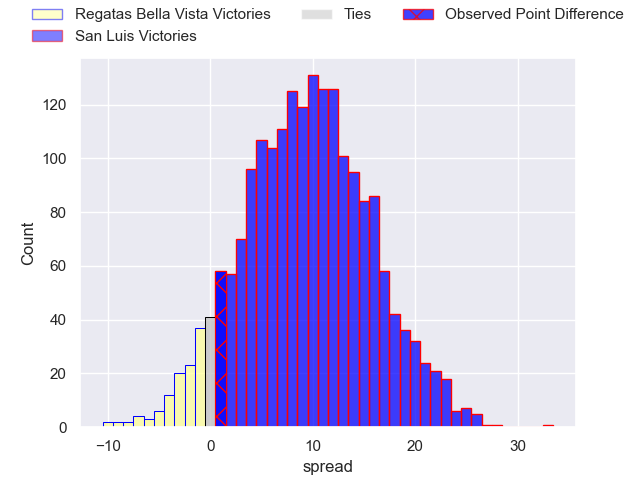
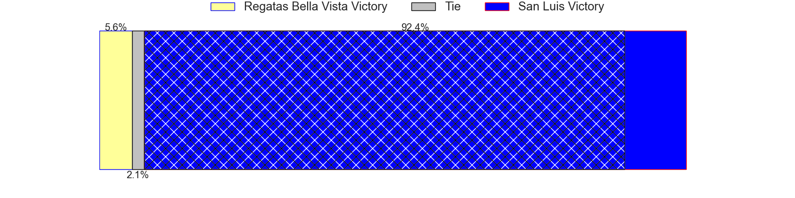
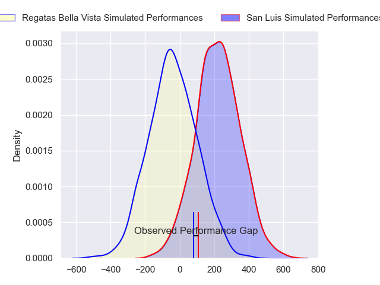
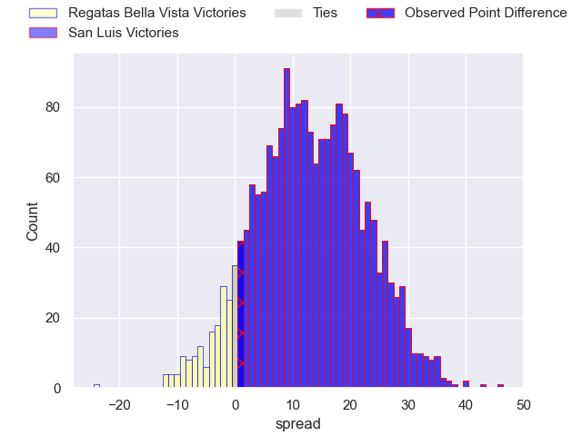
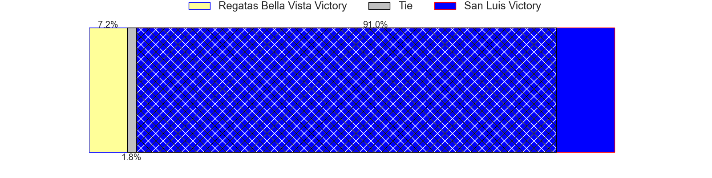

---  
layout: page  
title: Regatas Bella Vista at San Luis; 18-19  
date: 2024-08-03 18:00:00 -0500  
categories: "URBA Top 13 2024" match review  
---
# Regatas Bella Vista at San Luis; 18-19

# Club Level Predictions

The first set of predictions treats a club as the smallest object, as the club develops its members, organizes a gameplan, and deploys its players as needed for each match. This club model has a prediction of 0.744, which translates to predicting San Luis to win by 9.6.

Our Over/Under is 43.5 - and combined with the spread above, we have a predicted scoreline of 17 to 26

Each club has a rating and a rating deviation (similar to a Glicko rating), and expected performances can be generated. This allows for simulated matches and spreads like the ones below.
## Projected Performances - Club Model

## Projected Spreads - Club Model

## Projected Results - Club Model

# Player Level Predictions

Treating teams instead as an entity made up of the currently active players, I have ratings for each player in an altogether different system. These can be combined to form team ratings once teamsheets are announced, weighting starters a bit higher than the reserves. After the match is played, players can be weighted by their minutes on the field, allowing for an accurate measure of the team's composition. With these compiled team ratings, we can make predictions, measure inaccuracy, and update the individual player ratings.
## Prediction without Player Minutes: San Luis by 12.4

San Luis by 8.0 on a neutral pitch

## Projected Performances - Player Model

## Projected Spreads - Player Model

## Projected Results - Player Model

|   Away Minutes | Away Player          |   Away Percentile |   Number |   Home Percentile | Home Player                |   Home Minutes |
|---------------:|:---------------------|------------------:|---------:|------------------:|:---------------------------|---------------:|
|             80 | Tomas Barbaccia      |             19.7  |        1 |             37.54 | Santiago Bonavento         |             80 |
|             80 | Marcos Camerlinckx   |             60.32 |        2 |             34.92 | Agustin Fitzsimons Herrera |             80 |
|             80 | Juan Gobet           |             23.99 |        3 |             75    | Alexis Uvieda              |             80 |
|             80 | Tomas Sanguinetti    |             30.97 |        4 |             46.8  | Ramiro Bruni               |             80 |
|             80 | Bautista Lopez Manan |             59.61 |        5 |             48.45 | Santiago Canal             |             80 |
|             80 | Marcos Ferro         |             47.84 |        6 |             54.79 | Franco Gnecco              |             80 |
|             80 | Lucas Gobet          |             13.82 |        7 |             32.05 | Facundo Alvarez Amado      |             80 |
|             80 | Felipe Camerlinckx   |             26.36 |        8 |             41.84 | Agustin Torello            |             80 |
|             80 | Marcos Joseph        |             22    |        9 |             66.5  | Juan Vaca                  |             80 |
|             80 | Mateo Camerlinckx    |             23.9  |       10 |             50    | Felipe Campodonico         |             80 |
|             80 | Enrique Camerlinckx  |             23.87 |       11 |             49.95 | Wilmer Ramirez             |             80 |
|             80 | Juan Corso           |             48.92 |       12 |             58.19 | Segundo Fresco             |             80 |
|             80 | Alejo Barrera        |             23.38 |       13 |             43.15 | Benjamin Marban            |             80 |
|             80 | Rafael Santana       |             34.19 |       14 |             34.75 | Eduardo Ruesta             |             80 |
|             80 | Cruz Camerlinckx     |             32.79 |       15 |             27.29 | Valentino Quattrocchi      |             80 |
|              0 | Pedro Vega           |             24.25 |       16 |            nan    | Mateo Caffaro              |              0 |
|              0 | Diego Aguero         |            nan    |       17 |             29.21 | Alejo Garcia               |              0 |
|              0 | Mateo Trimarco       |             52.26 |       18 |             35.51 | Mateo Calistro             |              0 |
|              0 | Francisco Ploder     |             49.81 |       19 |            nan    | Martin Etchanchu           |              0 |
|              0 | Beltran Landivar     |             34.76 |       20 |             69.86 | Felipe Crispo              |              0 |
|              0 | Gonzalo Deluca       |            nan    |       21 |             25.5  | Martin Aereboe             |              0 |
|              0 | Justo Camerlinckx    |             37.55 |       22 |             65.98 | Manuel Gnecco              |              0 |
|              0 | Felipe Rugolo        |             42.97 |       23 |             35.54 | Isidro Lazzarini           |              0 |

