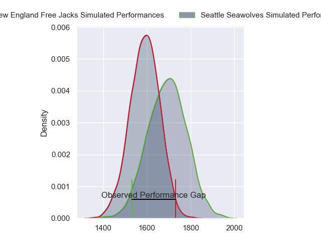
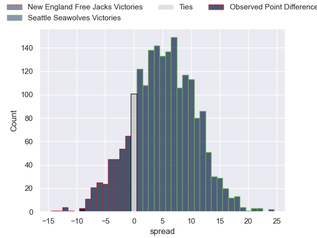
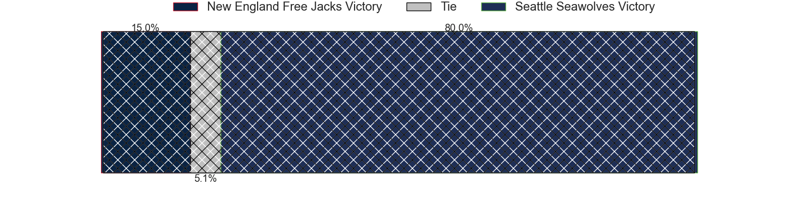
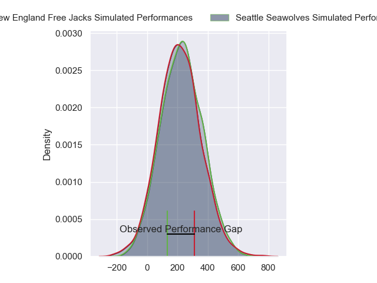
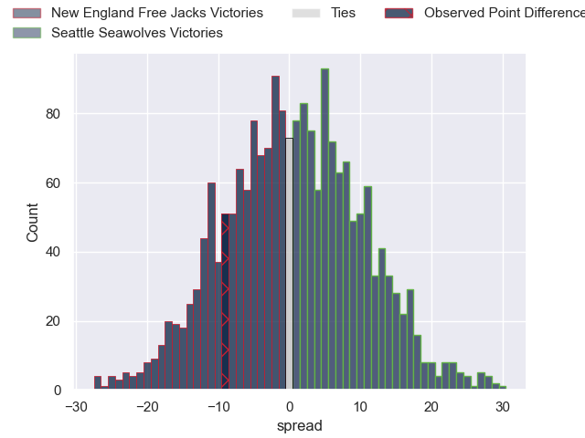

---  
layout: page  
title: New England Free Jacks at Seattle Seawolves; 20-11  
date: 2024-08-04 18:00:00 -0500  
categories: "Major League Rugby 2024" match review  
---
# New England Free Jacks at Seattle Seawolves; 20-11

# Club Level Predictions

The first set of predictions treats a club as the smallest object, as the club develops its members, organizes a gameplan, and deploys its players as needed for each match. This club model has a prediction of 0.641, which translates to predicting Seattle Seawolves to win by 5.1.

Our Over/Under is 59.5 - and combined with the spread above, we have a predicted scoreline of 27 to 32

Each club has a rating and a rating deviation (similar to a Glicko rating), and expected performances can be generated. This allows for simulated matches and spreads like the ones below.
## Projected Performances - Club Model

## Projected Spreads - Club Model

## Projected Results - Club Model

# Player Level Predictions

Treating teams instead as an entity made up of the currently active players, I have ratings for each player in an altogether different system. These can be combined to form team ratings once teamsheets are announced, weighting starters a bit higher than the reserves. After the match is played, players can be weighted by their minutes on the field, allowing for an accurate measure of the team's composition. With these compiled team ratings, we can make predictions, measure inaccuracy, and update the individual player ratings.
## Prediction without Player Minutes: Seattle Seawolves by 0.8

New England Free Jacks by 2.0 on a neutral pitch

## Projected Performances - Player Model

## Projected Spreads - Player Model

## Projected Results - Player Model

|   Away Minutes | Away Player         |   Away Percentile |   Number |   Home Percentile | Home Player       |   Home Minutes |
|---------------:|:--------------------|------------------:|---------:|------------------:|:------------------|---------------:|
|             80 | Malakai Hala        |             70.17 |        1 |             61.8  | Cameron Orr       |             80 |
|             80 | Andrew Quattrin     |             73.97 |        2 |             54.44 | Joe Taufete'E     |             80 |
|             80 | Cole Keith          |             67.37 |        3 |             61.8  | Sam Matenga       |             80 |
|             80 | Kyle Baillie        |             73.11 |        4 |             68.54 | Rhyno Herbst      |             80 |
|             80 | Conor Keys          |             87.86 |        5 |             24.66 | Mahonri Ngakuru   |             80 |
|             80 | Piers Von Dadelszen |             78.85 |        6 |             63.91 | Jean Droste       |             80 |
|             80 | Jed Melvin          |             75.66 |        7 |             62.69 | Devin Short       |             80 |
|             80 | Seta Baker          |             73.01 |        8 |             55.23 | Huw Taylor        |             80 |
|             80 | Oscar Lennon        |             37.83 |        9 |             43    | Juan Philip Smith |             80 |
|             80 | Jayson Potroz       |             75.7  |       10 |             42.37 | Lauina Futi       |             80 |
|             80 | Paula Balekana      |             78.43 |       11 |             56.96 | Toni Pulu         |             80 |
|             80 | Le Roux Malan       |             92.79 |       12 |             79.51 | Tavite Lopeti     |             80 |
|             80 | Wayne Van Der Bank  |             74.36 |       13 |             18.54 | Divan Rossouw     |             80 |
|             80 | Toby Fricker        |             69.22 |       14 |             52.9  | Jade Stighling    |             80 |
|             80 | Reece Macdonald     |             66.6  |       15 |             33.6  | Duncan Matthews   |             80 |
|              0 | Foster Dewitt       |             42.54 |       16 |             62.38 | Jackson Zabierek  |              0 |
|              0 | Tevita Sole         |             24.84 |       17 |            nan    | Chance Wenglewski |              0 |
|              0 | Kaleb Geiger        |             74.92 |       18 |            nan    | Koby Baker        |              0 |
|              0 | Josh Larsen         |            nan    |       19 |            nan    | Taylor Krumrei    |              0 |
|              0 | Ethan Fryer         |             43.61 |       20 |             36.47 | Pago Haini        |              0 |
|              0 | Holden Yungert      |             47.33 |       21 |             34.5  | Ryan Rees         |              0 |
|              0 | Ben LeSage          |             75.9  |       22 |            nan    | Sam Windsor       |              0 |
|              0 | Mitch Wilson        |             94.7  |       23 |             41.94 | Conner Mooneyham  |              0 |

