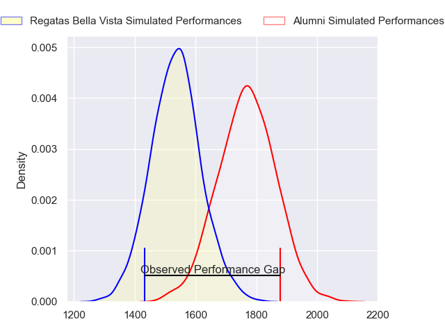
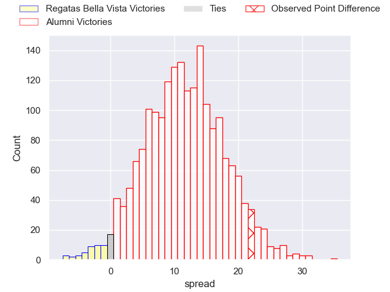
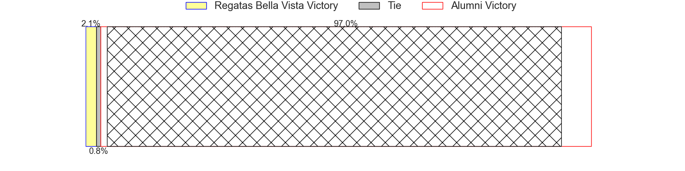
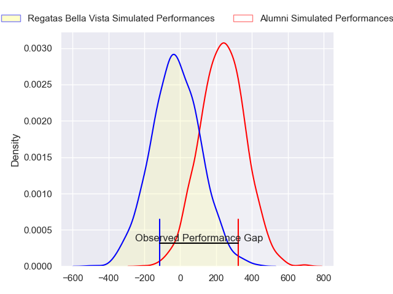
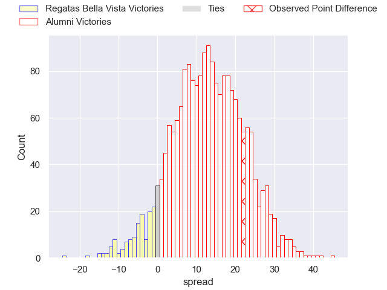
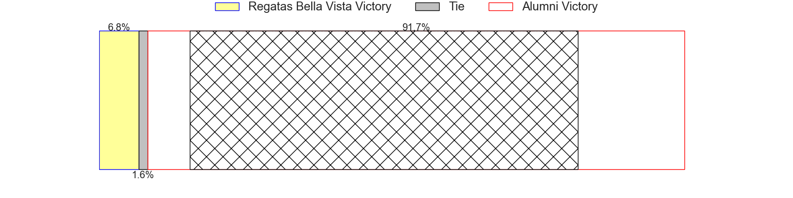

---  
layout: page  
title: Regatas Bella Vista at Alumni; 10-32  
date: 2024-08-10 18:00:00 -0500  
categories: "URBA Top 13 2024" match review  
---
# Regatas Bella Vista at Alumni; 10-32

# Club Level Predictions

The first set of predictions treats a club as the smallest object, as the club develops its members, organizes a gameplan, and deploys its players as needed for each match. This club model has a prediction of 0.79, which translates to predicting Alumni to win by 11.9.

Our Over/Under is 49.5 - and combined with the spread above, we have a predicted scoreline of 19 to 31

Each club has a rating and a rating deviation (similar to a Glicko rating), and expected performances can be generated. This allows for simulated matches and spreads like the ones below.
## Projected Performances - Club Model

## Projected Spreads - Club Model

## Projected Results - Club Model

# Player Level Predictions

Treating teams instead as an entity made up of the currently active players, I have ratings for each player in an altogether different system. These can be combined to form team ratings once teamsheets are announced, weighting starters a bit higher than the reserves. After the match is played, players can be weighted by their minutes on the field, allowing for an accurate measure of the team's composition. With these compiled team ratings, we can make predictions, measure inaccuracy, and update the individual player ratings.
## Prediction without Player Minutes: Alumni by 12.4

Alumni by 8.2 on a neutral pitch

## Projected Performances - Player Model

## Projected Spreads - Player Model

## Projected Results - Player Model

|   Away Minutes | Away Player          |   Away Percentile |   Number |   Home Percentile | Home Player                |   Home Minutes |
|---------------:|:---------------------|------------------:|---------:|------------------:|:---------------------------|---------------:|
|             80 | Tomas Barbaccia      |             15.54 |        1 |             74.13 | Federico Lucca             |             80 |
|             80 | Marcos Camerlinckx   |             53.5  |        2 |             77.24 | Tomas Bivort               |             80 |
|             80 | Juan Gobet           |             19.64 |        3 |             84.23 | Bautista Vidal             |             80 |
|             80 | Tomas Sanguinetti    |             25.98 |        4 |             82.38 | Manuel Mora                |             80 |
|             80 | Francisco Ploder     |             38.58 |        5 |             74.11 | Santiago Alduncin          |             80 |
|             80 | Pedro Vega           |             19.71 |        6 |             70.1  | Ignacio Cubilla            |             80 |
|             80 | Lucas Gobet          |             12.12 |        7 |             81.54 | Juan Anderson              |             80 |
|             80 | Felipe Camerlinckx   |             23.32 |        8 |             63.66 | Santiago Montagner         |             80 |
|             80 | Marcos Joseph        |             18.85 |        9 |             69.78 | Tomas Passerotti           |             80 |
|             80 | Justo Camerlinckx    |             33.74 |       10 |             81.19 | Joaquin Luzzi              |             80 |
|             80 | Enrique Camerlinckx  |             19.76 |       11 |             73.41 | Ramon Fuentes              |             80 |
|             80 | Juan Corso           |             44.13 |       12 |             63.42 | Franco Battezzati          |             80 |
|             80 | Alejo Barrera        |             19.29 |       13 |             64.68 | Alejo Chavez               |             80 |
|             80 | Rafael Santana       |             29.12 |       14 |             51.12 | Filipo Testoni             |             80 |
|             80 | Cruz Camerlinckx     |             27.57 |       15 |             60.08 | Santiago Pernas            |             80 |
|              0 | Away Team 16         |            nan    |       16 |             38.86 | Maximo Lamelas             |              0 |
|              0 | Matias Medrano       |            nan    |       17 |            nan    | Maximo Castillo            |              0 |
|              0 | Mateo Trimarco       |             52.13 |       18 |            nan    | Tomas Rapetti              |              0 |
|              0 | Bautista Lopez Manan |             59.94 |       19 |             44.78 | Nicolas Promanzio          |              0 |
|              0 | Beltran Landivar     |             35.45 |       20 |             27.26 | Federico Canovas           |              0 |
|              0 | Gonzalo Deluca       |            nan    |       21 |            nan    | Agustin Sanchez            |              0 |
|              0 | Mateo Camerlinckx    |             23.72 |       22 |            nan    | Tomas Cubilla              |              0 |
|              0 | Felipe Rugolo        |             43.21 |       23 |             37.24 | Santiago Gonzalez Iglesias |              0 |

