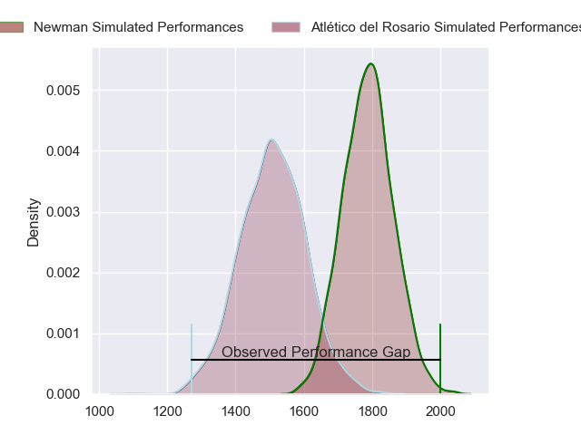
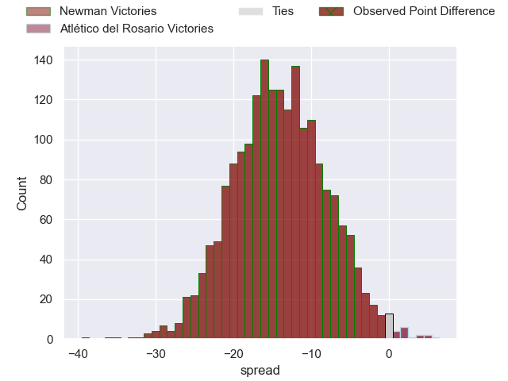
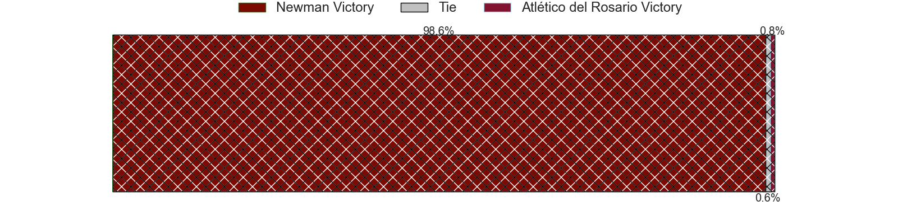
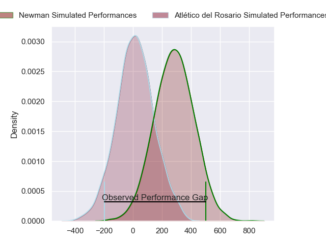
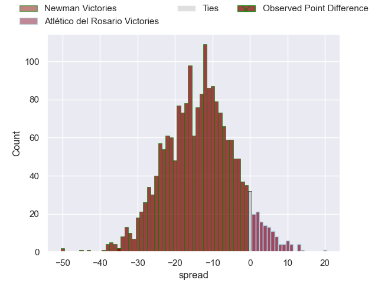
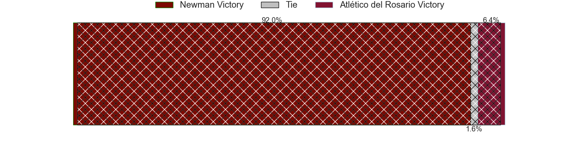

---  
layout: page  
title: Newman at Atletico del Rosario; 56-21  
date: 2024-08-10 18:00:00 -0500  
categories: "URBA Top 13 2024" match review  
---
# Newman at Atletico del Rosario; 56-21

# Club Level Predictions

The first set of predictions treats a club as the smallest object, as the club develops its members, organizes a gameplan, and deploys its players as needed for each match. This club model has a prediction of 0.176, which translates to predicting Newman to win by 13.8.

Our Over/Under is 65.5 - and combined with the spread above, we have a predicted scoreline of 39 to 26

Each club has a rating and a rating deviation (similar to a Glicko rating), and expected performances can be generated. This allows for simulated matches and spreads like the ones below.
## Projected Performances - Club Model

## Projected Spreads - Club Model

## Projected Results - Club Model

# Player Level Predictions

Treating teams instead as an entity made up of the currently active players, I have ratings for each player in an altogether different system. These can be combined to form team ratings once teamsheets are announced, weighting starters a bit higher than the reserves. After the match is played, players can be weighted by their minutes on the field, allowing for an accurate measure of the team's composition. With these compiled team ratings, we can make predictions, measure inaccuracy, and update the individual player ratings.
## Prediction without Player Minutes: Newman by 14.0

Newman by 17.8 on a neutral pitch

## Projected Performances - Player Model

## Projected Spreads - Player Model

## Projected Results - Player Model

|   Away Minutes | Away Player               |   Away Percentile |   Number |   Home Percentile | Home Player                 |   Home Minutes |
|---------------:|:--------------------------|------------------:|---------:|------------------:|:----------------------------|---------------:|
|             80 | Miguel Prince             |             94.09 |        1 |              5.84 | Ezequiel Reyes              |             80 |
|             80 | Rodrigo Pueyrredon        |             66.67 |        2 |             11.22 | Matias Malanos              |             80 |
|             80 | Manuel Lozano             |             54.81 |        3 |              0.79 | Agustin Fernandez           |             80 |
|             80 | Jeronimo Ureta            |             93.21 |        4 |              3.35 | Matias Kremer               |             80 |
|             80 | Pablo Cardinal            |             94.59 |        5 |             36.91 | Ignacio Sapino              |             80 |
|             80 | Mateo Montoya             |             87.69 |        6 |              9.71 | Jose Caseres                |             80 |
|             80 | Faustino Santarelli       |             65.1  |        7 |              1.44 | Octavio Capella             |             80 |
|             80 | Rodrigo Diaz de Vivar     |             93.91 |        8 |              1.47 | Lucas Malanos               |             80 |
|             80 | Felix Branca              |             40.07 |        9 |              9.17 | Felipe Nogues               |             80 |
|             80 | Gonzalo Guiterrez Taboada |             91    |       10 |             11.66 | Manuel Nogues               |             80 |
|             80 | Jeronimo Ulloa            |             64.23 |       11 |             12.27 | Nicolas Casals              |             80 |
|             80 | Mateo Delia               |             49.37 |       12 |             35.12 | Ignacio De Haro             |             80 |
|             80 | Benjamin Lanfranco        |             73.9  |       13 |             95.49 | Juan Pablo Estelles         |             80 |
|             80 | Marcos Zirolli            |             52.53 |       14 |              3.46 | Facundo Gerosa              |             80 |
|             80 | Francisco Pasman          |             40.33 |       15 |              3.91 | Maximiliano Nicoli Fiscella |             80 |
|              0 | James Wright              |            nan    |       16 |             32.81 | Federico Martin             |              0 |
|              0 | Isidro Bosch              |            nan    |       17 |            nan    | Roberto Almeira             |              0 |
|              0 | Bautista Bosch            |             95.58 |       18 |             33.66 | Ramiro Rubio                |              0 |
|              0 | Alejandro Urtubey         |             83.27 |       19 |             42.21 | Federico Mayol              |              0 |
|              0 | Joaquin de la Vega        |             88.85 |       20 |            nan    | Home Team 20                |              0 |
|              0 | Tomas Gonzalo Valls       |            nan    |       21 |             15.75 | Ramiro Musio                |              0 |
|              0 | Carlos Menendez           |            nan    |       22 |              7.98 | Matias Savatierra           |              0 |
|              0 | Santiago Marolda          |             90.33 |       23 |             28.23 | Bruno Montenegro            |              0 |

