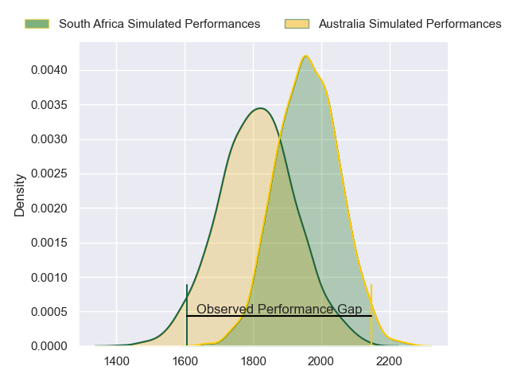
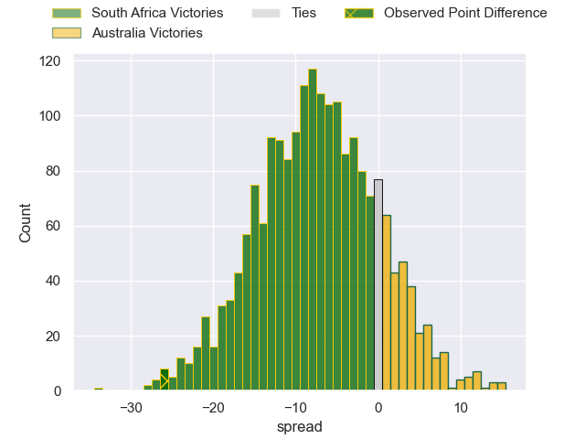
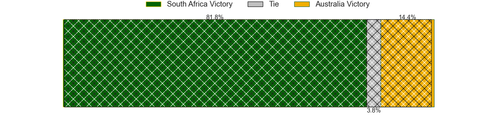
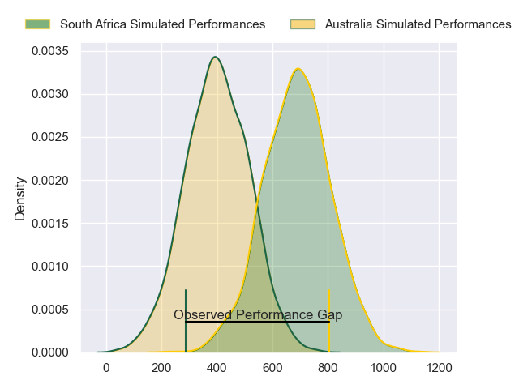
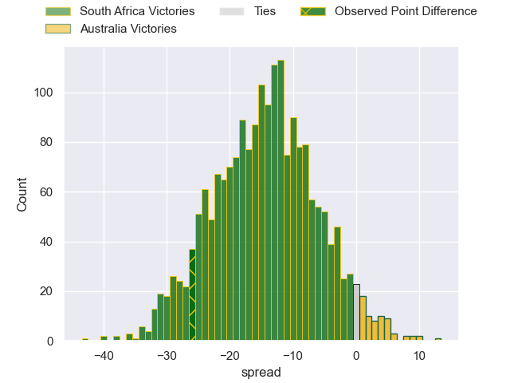
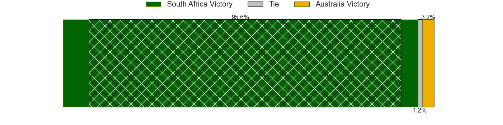

---  
layout: page  
title: South Africa at Australia; 33-7  
date: 2024-08-10 18:00:00 -0500  
categories: "Rugby Championship 2024" match review  
---
# South Africa at Australia; 33-7

# Club Level Predictions

The first set of predictions treats a club as the smallest object, as the club develops its members, organizes a gameplan, and deploys its players as needed for each match. This club model has a prediction of 0.306, which translates to predicting South Africa to win by 7.4.

Our Over/Under is 50.5 - and combined with the spread above, we have a predicted scoreline of 29 to 21

Each club has a rating and a rating deviation (similar to a Glicko rating), and expected performances can be generated. This allows for simulated matches and spreads like the ones below.
## Projected Performances - Club Model

## Projected Spreads - Club Model

## Projected Results - Club Model

# Player Level Predictions

Treating teams instead as an entity made up of the currently active players, I have ratings for each player in an altogether different system. These can be combined to form team ratings once teamsheets are announced, weighting starters a bit higher than the reserves. After the match is played, players can be weighted by their minutes on the field, allowing for an accurate measure of the team's composition. With these compiled team ratings, we can make predictions, measure inaccuracy, and update the individual player ratings.
## Prediction without Player Minutes: South Africa by 12.2

South Africa by 16.1 on a neutral pitch

## Projected Performances - Player Model

## Projected Spreads - Player Model

## Projected Results - Player Model

|   Away Minutes | Away Player               |   Away Percentile |   Number |   Home Percentile | Home Player          |   Home Minutes |
|---------------:|:--------------------------|------------------:|---------:|------------------:|:---------------------|---------------:|
|             54 | Ox Nche                   |             99.76 |        1 |             48.15 | Isaac Kailea         |             41 |
|             33 | Bongi Mbonambi            |             98.06 |        2 |             84.17 | Matt Faessler        |             41 |
|             54 | Frans Malherbe            |             87.25 |        3 |             98.19 | Allan Alaalatoa      |             59 |
|             54 | Eben Etzebeth             |             99.22 |        4 |             66.5  | Nick Frost           |             58 |
|             80 | Pieter-Steph du Toit      |             95.1  |        5 |             11.75 | Lukhan Salakaia-Loto |             78 |
|             57 | Siya Kolisi               |             89.33 |        6 |             98.38 | Rob Valetini         |             80 |
|             80 | Ben-Jason Dixon           |             78.95 |        7 |              8.19 | Carlo Tizzano        |             75 |
|             57 | Elrigh Louw               |             89.77 |        8 |             70.77 | Harry Wilson         |             80 |
|             52 | Cobus Reinach             |             93.96 |        9 |             82.72 | Jake Gordon          |             59 |
|             75 | Sacha Feinberg-Mngomezulu |             69.31 |       10 |             89.43 | Noah Lolesio         |             63 |
|             80 | Kurt-Lee Arendse          |             97.86 |       11 |             96.46 | Filipo Daugunu       |             26 |
|             65 | Damian de Allende         |             99.58 |       12 |             83.42 | Hunter Paisami       |             80 |
|             80 | Jesse Kriel               |             98.44 |       13 |             79.35 | Len Ikitau           |             80 |
|             80 | Cheslin Kolbe             |             99.81 |       14 |             68.16 | Andrew Kellaway      |             80 |
|             80 | Willie le Roux            |             97.76 |       15 |             88.16 | Tom Wright           |             80 |
|             52 | Malcolm Marx              |            100    |       16 |             78.19 | Josh Nasser          |             39 |
|             26 | Gerhard Steenekamp        |             92.37 |       17 |             96.54 | James Slipper        |             39 |
|             26 | Vincent Koch              |             68.61 |       18 |             80.02 | Zane Nonggorr        |             21 |
|             26 | Salmaan Moerat            |             79.04 |       19 |             25.95 | Jeremy Williams      |             12 |
|             23 | Marco van Staden          |             90.86 |       20 |             57.05 | Luke Reimer          |             17 |
|             23 | Kwagga Smith              |             85.18 |       21 |             84.56 | Tate McDermott       |             21 |
|             28 | Grant Williams            |             70.13 |       22 |             83.13 | Tom Lynagh           |             17 |
|             15 | Handre Pollard            |             87.4  |       23 |             76.63 | Dylan Pietsch        |             54 |

