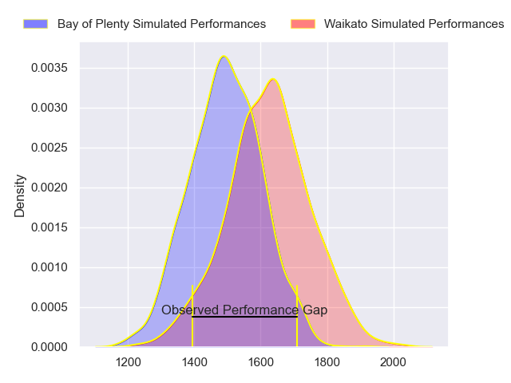
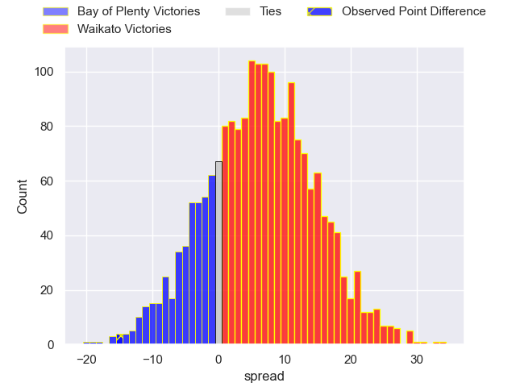
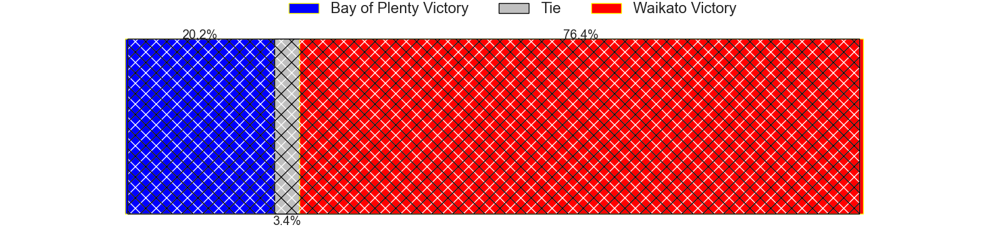
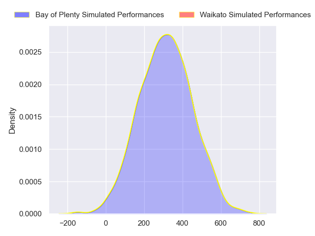
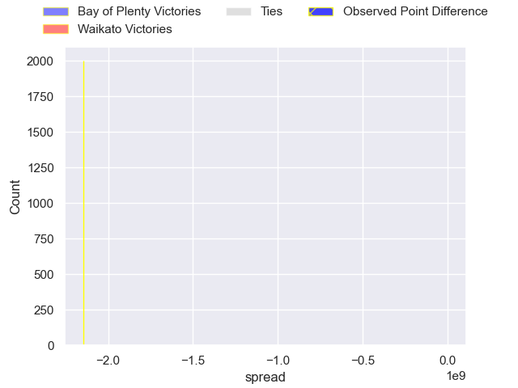

---  
layout: page  
title: Bay of Plenty at Waikato; 36-21  
date: 2024-08-10 18:00:00 -0500  
categories: "Bunnings NPC 2024" match review  
---
# Bay of Plenty at Waikato; 36-21

# Club Level Predictions

The first set of predictions treats a club as the smallest object, as the club develops its members, organizes a gameplan, and deploys its players as needed for each match. This club model has a prediction of 0.672, which translates to predicting Waikato to win by 6.6.

Our Over/Under is 60.5 - and combined with the spread above, we have a predicted scoreline of 27 to 34

Each club has a rating and a rating deviation (similar to a Glicko rating), and expected performances can be generated. This allows for simulated matches and spreads like the ones below.
## Projected Performances - Club Model

## Projected Spreads - Club Model

## Projected Results - Club Model

# Player Level Predictions

Treating teams instead as an entity made up of the currently active players, I have ratings for each player in an altogether different system. These can be combined to form team ratings once teamsheets are announced, weighting starters a bit higher than the reserves. After the match is played, players can be weighted by their minutes on the field, allowing for an accurate measure of the team's composition. With these compiled team ratings, we can make predictions, measure inaccuracy, and update the individual player ratings.
## Prediction without Player Minutes: Waikato by 2.5

Bay of Plenty by 0.7 on a neutral pitch

## Projected Performances - Player Model

## Projected Spreads - Player Model

## Projected Results - Player Model

|   Away Minutes | Away Player            |   Away Percentile |   Number |   Home Percentile | Home Player            |   Home Minutes |
|---------------:|:-----------------------|------------------:|---------:|------------------:|:-----------------------|---------------:|
|             80 | Haereiti Hetet         |            nan    |        1 |             84.5  | Ollie Norris           |             80 |
|             80 | Kurt Eklund            |            nan    |        2 |             23.1  | Manaaki Boyle-Tiatia   |             80 |
|             80 | Benet Kumeroa          |            nan    |        3 |             82.93 | George Dyer            |             80 |
|             80 | Naitoa Ah Kuoi         |            nan    |        4 |             89.13 | James Tucker           |             80 |
|             80 | Justin Sangster        |            nan    |        5 |             96.38 | Laghlan McWhannell     |             80 |
|             80 | Jacob Norris           |            nan    |        6 |             31.9  | Malachi Wrampling-Alec |             80 |
|             80 | Joe Johnston           |            nan    |        7 |             23.05 | Oli Mathis             |             80 |
|             80 | Nikora Broughton       |            nan    |        8 |             31.94 | Patrick McCurran       |             80 |
|             80 | Te Toiroa Tahuriorangi |            nan    |        9 |             34.4  | Xavier Roe             |             80 |
|             80 | Kaleb Trask            |            nan    |       10 |            nan    | D'Angelo Leuila        |             80 |
|             80 | Codemeru Vai           |            nan    |       11 |             63.31 | Gideon Wrampling       |             80 |
|             80 | Seamus Bardoul         |            nan    |       12 |             89.47 | Quinn Tupaea           |             80 |
|             80 | Uilisi Halaholo        |            nan    |       13 |             19.19 | Bailyn Sullivan        |             80 |
|             80 | Emoni Narawa           |            nan    |       14 |             27.28 | Newton Tudreu          |             80 |
|             80 | Cole Forbes            |            nan    |       15 |             75.51 | Joshua Moorby          |             80 |
|              0 | Taine Kolose           |            nan    |       16 |            nan    | Pita Anae Ah-Sue       |              0 |
|              0 | Josh Bartlett          |             28.95 |       17 |             95.99 | Ayden Johnstone        |              0 |
|              0 | Filipe Vakasiuola      |            nan    |       18 |             69.08 | Solomone Tukuafu       |              0 |
|              0 | Aisake Vakasiuola      |            nan    |       19 |            nan    | Tai Cribb              |              0 |
|              0 | Kalin Felise           |            nan    |       20 |              7.64 | Andrew Smith           |              0 |
|              0 | Flynn Henderson        |            nan    |       21 |            nan    | Quintony Ngatai        |              0 |
|              0 | Taine Craig-Ranga      |            nan    |       22 |             10.98 | Taha Kemara            |              0 |
|              0 | Frank Vaenuku          |            nan    |       23 |            nan    | Austin Anderson        |              0 |

