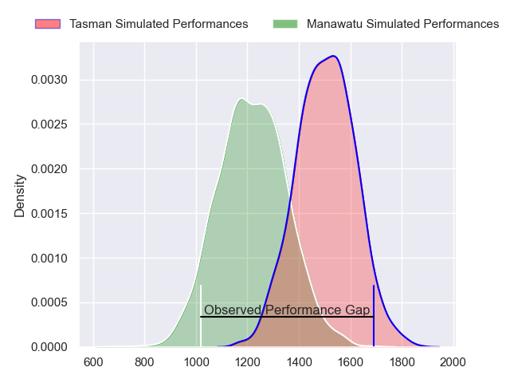
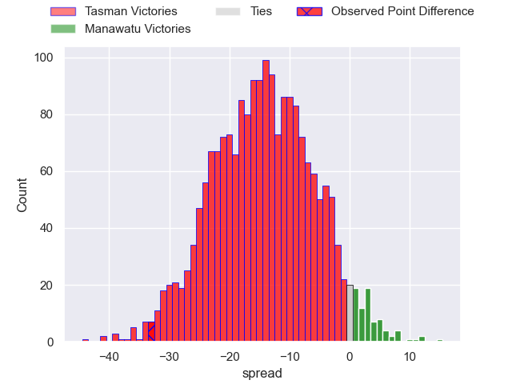
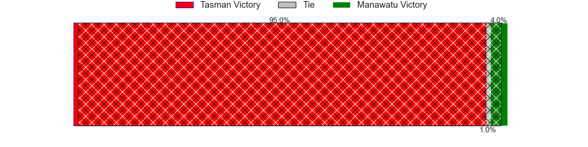
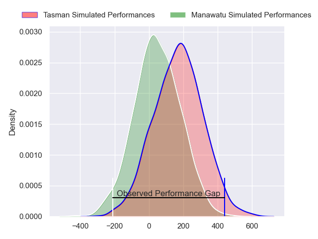
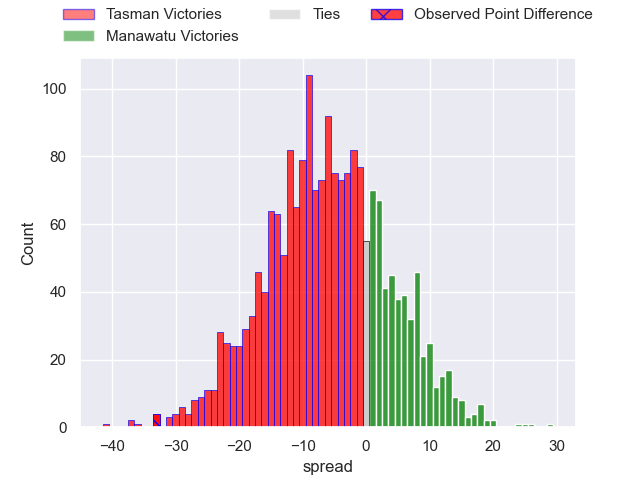
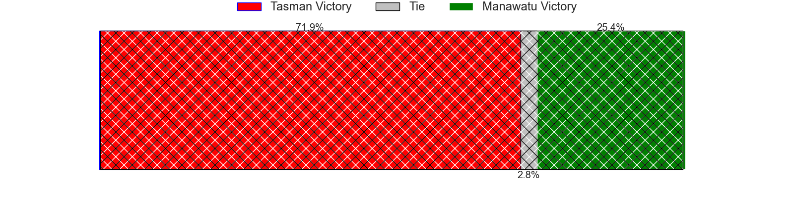

---  
layout: page  
title: Tasman at Manawatu; 54-21  
date: 2024-08-11 18:00:00 -0500  
categories: "Bunnings NPC 2024" match review  
---
# Tasman at Manawatu; 54-21

# Club Level Predictions

The first set of predictions treats a club as the smallest object, as the club develops its members, organizes a gameplan, and deploys its players as needed for each match. This club model has a prediction of 0.171, which translates to predicting Tasman to win by 14.5.

Our Over/Under is 65.5 - and combined with the spread above, we have a predicted scoreline of 40 to 25

Each club has a rating and a rating deviation (similar to a Glicko rating), and expected performances can be generated. This allows for simulated matches and spreads like the ones below.
## Projected Performances - Club Model

## Projected Spreads - Club Model

## Projected Results - Club Model

# Player Level Predictions

Treating teams instead as an entity made up of the currently active players, I have ratings for each player in an altogether different system. These can be combined to form team ratings once teamsheets are announced, weighting starters a bit higher than the reserves. After the match is played, players can be weighted by their minutes on the field, allowing for an accurate measure of the team's composition. With these compiled team ratings, we can make predictions, measure inaccuracy, and update the individual player ratings.
## Prediction without Player Minutes: Tasman by 6.3

Tasman by 9.3 on a neutral pitch

## Projected Performances - Player Model

## Projected Spreads - Player Model

## Projected Results - Player Model

|   Away Minutes | Away Player             |   Away Percentile |   Number |   Home Percentile | Home Player             |   Home Minutes |
|---------------:|:------------------------|------------------:|---------:|------------------:|:------------------------|---------------:|
|             80 | Ryan Coxon              |             26.36 |        1 |             18.17 | Joe Gavigan             |             80 |
|             80 | Samiuela Moli           |              5.33 |        2 |             15.35 | Raymond Tuputupu        |             80 |
|             80 | Kershawl Sykes-Martin   |             79.94 |        3 |             26.51 | Misinale Epenisa        |             80 |
|             80 | Quinten Strange         |             95.2  |        4 |             31.44 | Lachlan Shaw            |             80 |
|             80 | Te Ahiwaru Cirikidaveta |             70.42 |        5 |             24.49 | Stan van den Hoven      |             80 |
|             80 | Max Hicks               |             36.95 |        6 |              0.19 | TK Howden               |             80 |
|             80 | Sione Havili Talitui    |             82.86 |        7 |             18.76 | Johan Momsen            |             80 |
|             80 | Fletcher Anderson       |             77.45 |        8 |              0.84 | Brayden Iose            |             80 |
|             80 | Finlay Christie         |             83.22 |        9 |             15.94 | Jordi Viljoen           |             80 |
|             80 | William Havili          |             28.86 |       10 |              6.91 | Brett Cameron           |             80 |
|             80 | Jack Gray               |             59.4  |       11 |             22.35 | Kyle Brown              |             80 |
|             80 | David Havili            |             96.87 |       12 |             23.67 | Jason Emery             |             80 |
|             80 | William Butler          |             54.74 |       13 |             20.86 | Drew Wild               |             80 |
|             80 | Timoci Tavatavanawai    |             44.6  |       14 |             30.73 | Pena Va'a               |             80 |
|             80 | Macca Springer          |             34.29 |       15 |             23.67 | Sam Coles               |             80 |
|              0 | Quentin MacDonald       |             95.96 |       16 |            nan    | Vernon Bason            |              0 |
|              0 | Lavengamonu Moli        |            nan    |       17 |            nan    | George Blake            |              0 |
|              0 | Isaac Salmon            |            nan    |       18 |            nan    | Flyn Yates              |              0 |
|              0 | Hunter Leppien          |            nan    |       19 |            nan    | Josh Taula              |              0 |
|              0 | Braden Stewart          |            nan    |       20 |            nan    | Tyler Laubscher         |              0 |
|              0 | Louie Chapman           |            nan    |       21 |            nan    | Logan Love              |              0 |
|              0 | Campbell Parata         |            nan    |       22 |             24.8  | Isaiah Armstrong-Ravula |              0 |
|              0 | Levi Aumua              |             67.88 |       23 |            nan    | James Tofa              |              0 |

