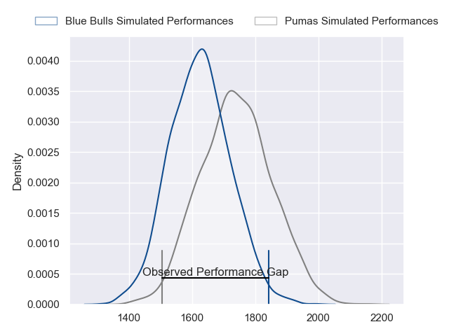
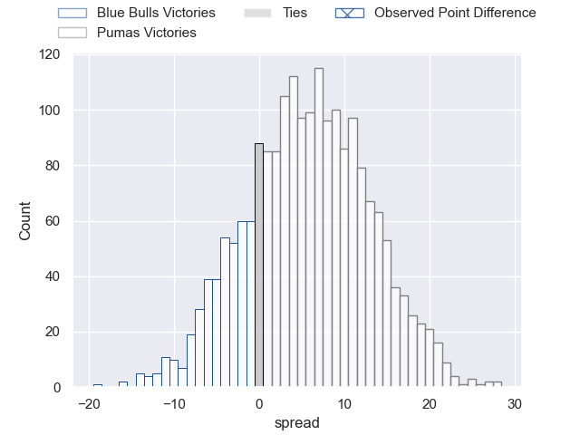
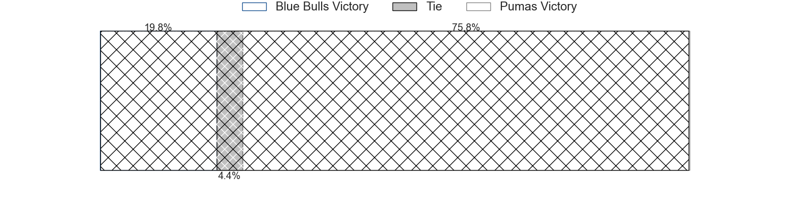
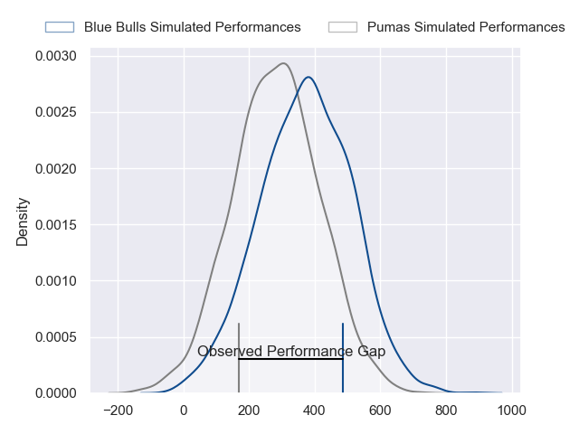
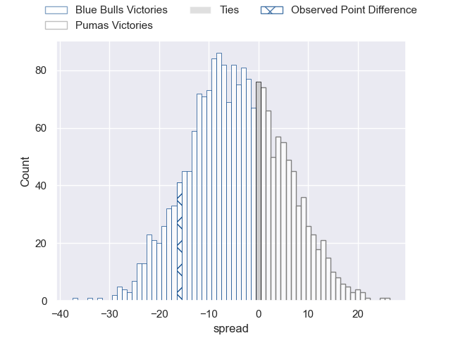
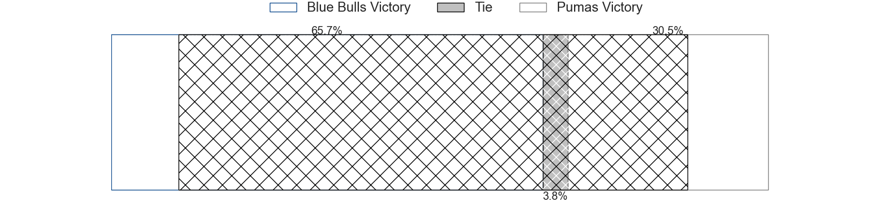

---  
layout: page  
title: Blue Bulls at Pumas; 40-24  
date: 2024-08-16 18:00:00 -0500  
categories: "Currie Cup 2024" match review  
---
# Blue Bulls at Pumas; 40-24

# Club Level Predictions

The first set of predictions treats a club as the smallest object, as the club develops its members, organizes a gameplan, and deploys its players as needed for each match. This club model has a prediction of 0.656, which translates to predicting Pumas to win by 5.9.

Our Over/Under is 53.5 - and combined with the spread above, we have a predicted scoreline of 24 to 30

Each club has a rating and a rating deviation (similar to a Glicko rating), and expected performances can be generated. This allows for simulated matches and spreads like the ones below.
## Projected Performances - Club Model

## Projected Spreads - Club Model

## Projected Results - Club Model

# Player Level Predictions

Treating teams instead as an entity made up of the currently active players, I have ratings for each player in an altogether different system. These can be combined to form team ratings once teamsheets are announced, weighting starters a bit higher than the reserves. After the match is played, players can be weighted by their minutes on the field, allowing for an accurate measure of the team's composition. With these compiled team ratings, we can make predictions, measure inaccuracy, and update the individual player ratings.
## Prediction without Player Minutes: Blue Bulls by 2.8

Blue Bulls by 6.2 on a neutral pitch

## Projected Performances - Player Model

## Projected Spreads - Player Model

## Projected Results - Player Model

|   Away Minutes | Away Player             |   Away Percentile |   Number |   Home Percentile | Home Player              |   Home Minutes |
|---------------:|:------------------------|------------------:|---------:|------------------:|:-------------------------|---------------:|
|             80 | Dylan Smith             |             95.82 |        1 |             62.19 | Etienne Janeke           |             80 |
|             80 | Joe van Zyl             |             84.81 |        2 |             69.95 | Eduan Swart              |             80 |
|             80 | Mornay Smith            |             85.08 |        3 |             52.25 | Sampie Swiegers          |             80 |
|             80 | Sintu Manjezi           |             92.8  |        4 |             31.56 | Malembe Mpofu            |             80 |
|             80 | Jannes Kirsten          |             97.14 |        5 |             84.42 | Shane Monro Kirkwood     |             80 |
|             80 | Nama Xaba               |              7.49 |        6 |             48.7  | Ntsinka Fisanti          |             80 |
|             80 | Merwe Olivier           |             77.91 |        7 |              0.29 | Anele Lungisa            |             80 |
|             80 | Nizaam Carr             |             96.47 |        8 |             76.72 | Kwanda Dimaza            |             80 |
|             80 | Keagan Johannes         |             22.58 |        9 |             24.28 | Ross Braude              |             80 |
|             80 | Boeta Chamberlain       |             76.73 |       10 |             21.63 | Clinton Swart            |             80 |
|             80 | Sibongile Vukile Novuka |             76.02 |       11 |             32.53 | Darren Adonis            |             80 |
|             80 | Chris Smit              |             85.31 |       12 |             21.04 | Wian van Niekerk         |             80 |
|             80 | Cornel Smit             |             49.9  |       13 |             76.35 | David Benjamin Brits     |             80 |
|             80 | Canan Moodie            |             99.63 |       14 |             34.29 | Stefan Coetzee           |             80 |
|             80 | Devon Williams          |             94.19 |       15 |             26.97 | Tino Swanepoel           |             80 |
|              0 | Juann Else              |             51.37 |       16 |            nan    | Darnell Osowagu          |              0 |
|              0 | Jacques van Rooyen      |            nan    |       17 |            nan    | Dewald Maritz            |              0 |
|              0 | Ntuthuko Mchunu         |             54.7  |       18 |            nan    | Nash Mhere               |              0 |
|              0 | Cyle Brink              |              8.45 |       19 |             30.37 | Jeandré Leonard          |              0 |
|              0 | Celimpilo Gumede        |             78.17 |       20 |            nan    | Andre Fouché             |              0 |
|              0 | Bernard van der Linde   |             61.46 |       21 |            nan    | Godlen Masimla           |              0 |
|              0 | Jaco van der Walt       |             87.96 |       22 |             70.2  | Danrich Zynodene Visagie |              0 |
|              0 | Katlego Letebele        |            nan    |       23 |             38.01 | Phiko Sobahle            |              0 |

