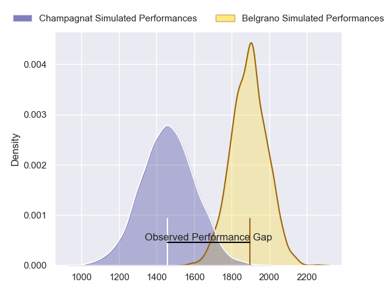
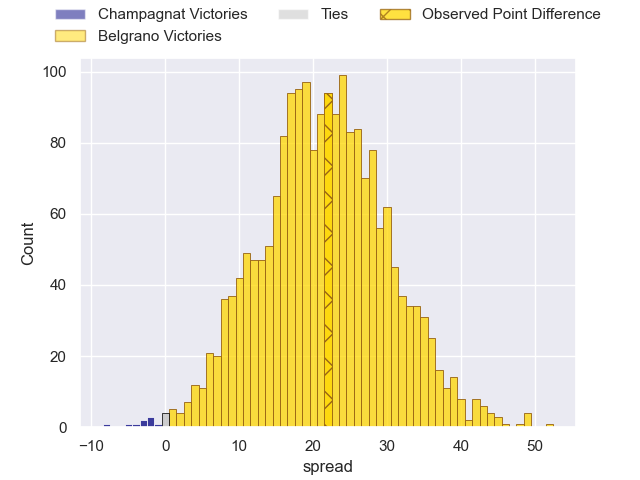
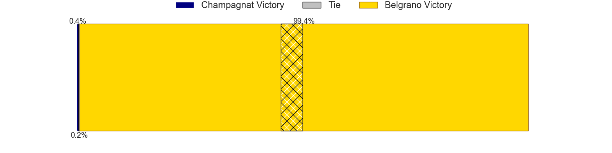
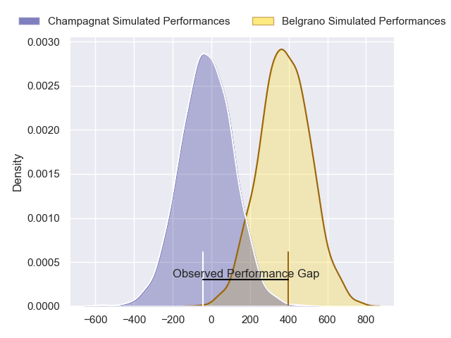
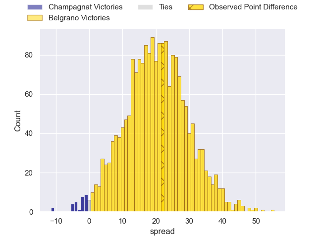
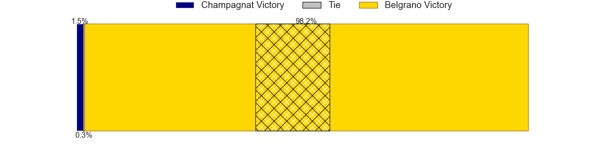

---  
layout: page  
title: Champagnat at Belgrano; 25-47  
date: 2024-08-17 18:00:00 -0500  
categories: "URBA Top 13 2024" match review  
---
# Champagnat at Belgrano; 25-47

# Club Level Predictions

The first set of predictions treats a club as the smallest object, as the club develops its members, organizes a gameplan, and deploys its players as needed for each match. This club model has a prediction of 0.905, which translates to predicting Belgrano to win by 21.5.

Our Over/Under is 62.5 - and combined with the spread above, we have a predicted scoreline of 21 to 42

Each club has a rating and a rating deviation (similar to a Glicko rating), and expected performances can be generated. This allows for simulated matches and spreads like the ones below.
## Projected Performances - Club Model

## Projected Spreads - Club Model

## Projected Results - Club Model

# Player Level Predictions

Treating teams instead as an entity made up of the currently active players, I have ratings for each player in an altogether different system. These can be combined to form team ratings once teamsheets are announced, weighting starters a bit higher than the reserves. After the match is played, players can be weighted by their minutes on the field, allowing for an accurate measure of the team's composition. With these compiled team ratings, we can make predictions, measure inaccuracy, and update the individual player ratings.
## Prediction without Player Minutes: Belgrano by 20.4

Belgrano by 16.4 on a neutral pitch

## Projected Performances - Player Model

## Projected Spreads - Player Model

## Projected Results - Player Model

|   Away Minutes | Away Player                   |   Away Percentile |   Number |   Home Percentile | Home Player            |   Home Minutes |
|---------------:|:------------------------------|------------------:|---------:|------------------:|:-----------------------|---------------:|
|             80 | Tomas Distel                  |             31.91 |        1 |             98.5  | Santiago Garcia Botta  |             80 |
|             80 | Joaquin Guerra                |             21.16 |        2 |             89.82 | Francisco Lusarreta    |             80 |
|             80 | Marcos Magaro                 |             25.51 |        3 |             83.18 | Lisandro Garcia Dragui |             80 |
|             80 | Inaki Ustariz                 |             13.51 |        4 |             89.25 | Luciano Tecca          |             80 |
|             80 | Santiago Escuti               |             23.67 |        5 |             66.17 | Mikael Quesada         |             80 |
|             80 | Matias Alonso Boto            |             15.75 |        6 |             87.22 | Joaquin de la Serna    |             80 |
|             80 | Lucas Moresco                 |             26.03 |        7 |             44.86 | Mauro Rebussone        |             80 |
|             80 | Matias Muniagurria            |             14.35 |        8 |             81.5  | Franco Vega            |             80 |
|             80 | Martin Graciarena             |             12.39 |        9 |             22.24 | Tomas Cubelli          |             80 |
|             80 | Santos Panela                 |             16.19 |       10 |             69.06 | Juan Aparicio          |             80 |
|             80 | Tomas Podingo                 |             44.05 |       11 |             54.83 | Pedro Arana            |             80 |
|             80 | Tobias Imbrosciano            |             13.97 |       12 |             79.46 | Ramon Arana            |             80 |
|             80 | Tomas Cotter                  |             19.71 |       13 |             82.9  | Tomas Etchepare        |             80 |
|             80 | Geronimo Tomasella            |             13.75 |       14 |             85.41 | Ignacio Diaz           |             80 |
|             80 | Gonzalo Costaguta             |             46.06 |       15 |             80.91 | Juan Lando             |             80 |
|              0 | Fernando Rodriguez Pascarella |             22.94 |       16 |             88.78 | Francisco Ferronato    |              0 |
|              0 | Alberto Adissi                |             19.91 |       17 |            nan    | Eliseo Marchetti       |              0 |
|              0 | Manuel Mauvecin               |             24.57 |       18 |             79.54 | Augusto Vaccarino      |              0 |
|              0 | Nicolas Rojo                  |            nan    |       19 |             67.16 | Ramon Duggan           |              0 |
|              0 | Tomas Alonso Boto             |             35.06 |       20 |            nan    | Santiago Villegas      |              0 |
|              0 | Pedro Del Piano               |            nan    |       21 |             46.4  | Juan Brescia           |              0 |
|              0 | Marcos Lafuente               |             32.43 |       22 |             78.27 | Ignacio Marino         |              0 |
|              0 | Tadeo Ustariz                 |            nan    |       23 |            nan    | Home Team 23           |              0 |

