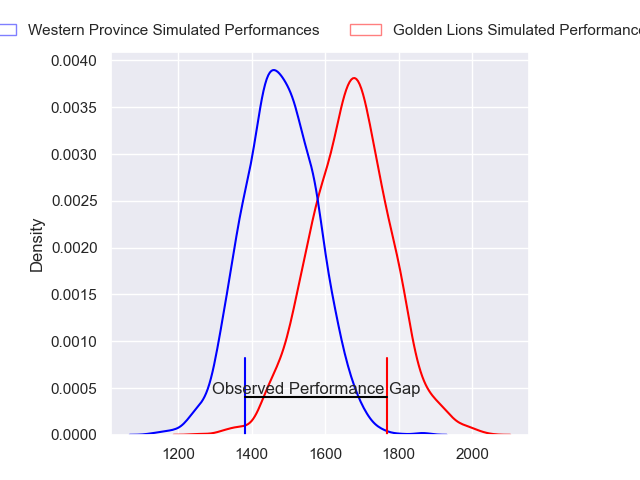
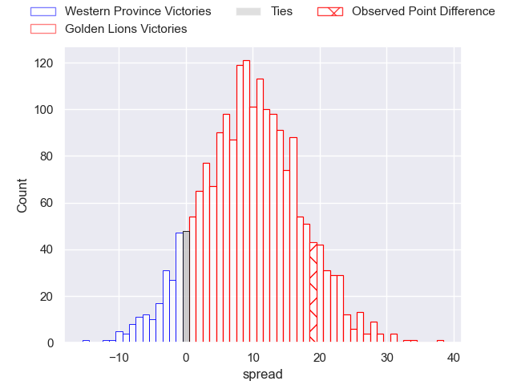
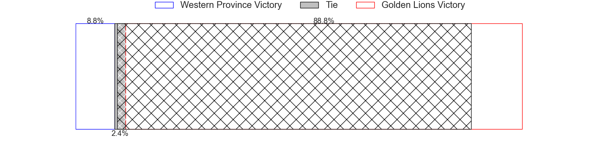

---  
layout: page  
title: Western Province at Golden Lions; 22-41  
date: 2024-08-17 18:00:00 -0500  
categories: "Currie Cup 2024" match review  
---
# Western Province at Golden Lions; 22-41

# Club Level Predictions

The first set of predictions treats a club as the smallest object, as the club develops its members, organizes a gameplan, and deploys its players as needed for each match. This club model has a prediction of 0.737, which translates to predicting Golden Lions to win by 9.4.

Our Over/Under is 72.5 - and combined with the spread above, we have a predicted scoreline of 31 to 41

Each club has a rating and a rating deviation (similar to a Glicko rating), and expected performances can be generated. This allows for simulated matches and spreads like the ones below.
## Projected Performances - Club Model

## Projected Spreads - Club Model

## Projected Results - Club Model

