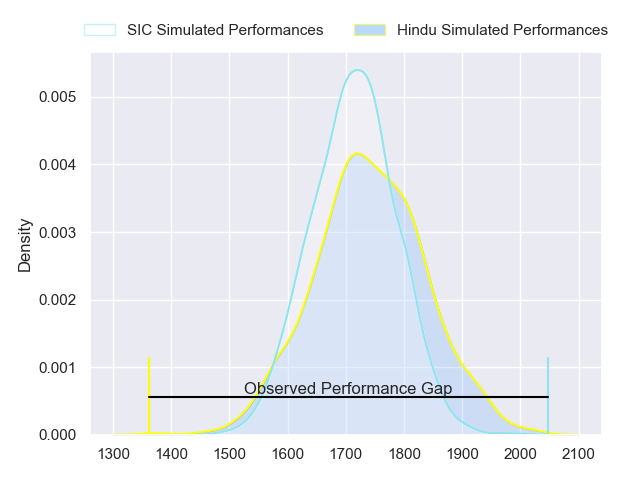
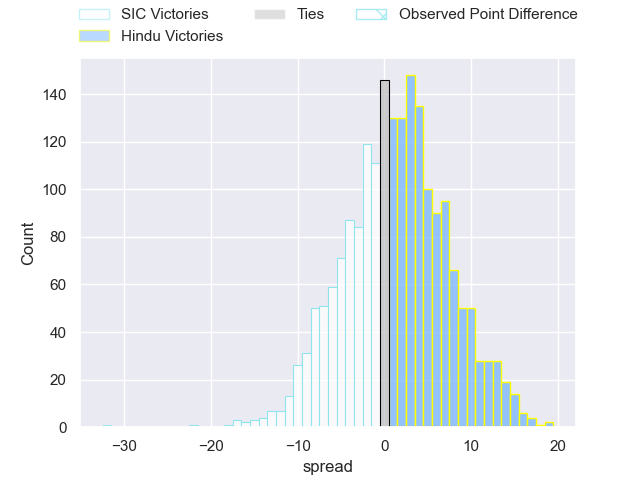
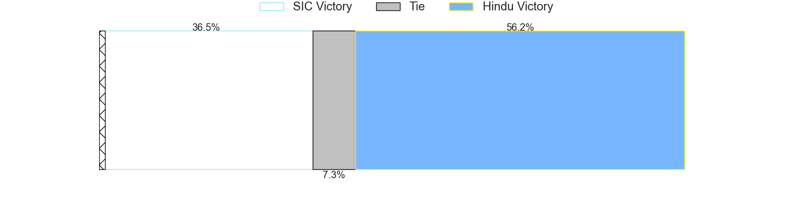
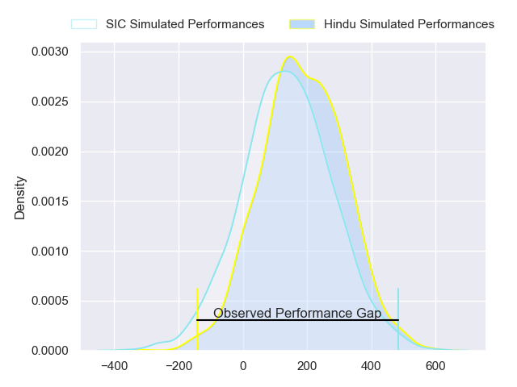
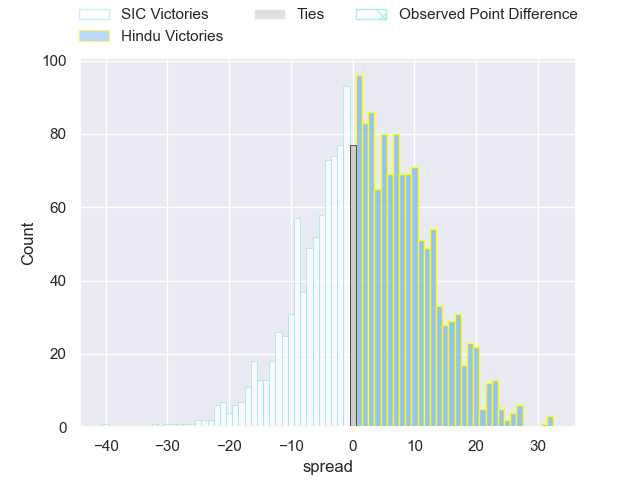
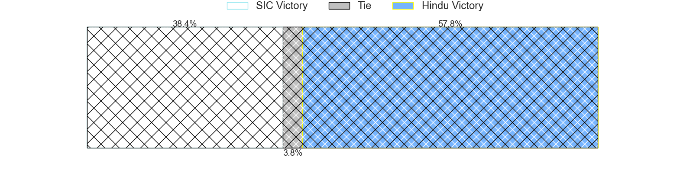

---  
layout: page  
title: SIC at Hindu; 44-12  
date: 2024-08-17 18:00:00 -0500  
categories: "URBA Top 13 2024" match review  
---
# SIC at Hindu; 44-12

# Club Level Predictions

The first set of predictions treats a club as the smallest object, as the club develops its members, organizes a gameplan, and deploys its players as needed for each match. This club model has a prediction of 0.537, which translates to predicting Hindu to win by 1.3.

Our Over/Under is 43.5 - and combined with the spread above, we have a predicted scoreline of 21 to 23

Each club has a rating and a rating deviation (similar to a Glicko rating), and expected performances can be generated. This allows for simulated matches and spreads like the ones below.
## Projected Performances - Club Model

## Projected Spreads - Club Model

## Projected Results - Club Model

# Player Level Predictions

Treating teams instead as an entity made up of the currently active players, I have ratings for each player in an altogether different system. These can be combined to form team ratings once teamsheets are announced, weighting starters a bit higher than the reserves. After the match is played, players can be weighted by their minutes on the field, allowing for an accurate measure of the team's composition. With these compiled team ratings, we can make predictions, measure inaccuracy, and update the individual player ratings.
## Prediction without Player Minutes: Hindu by 2.9

SIC by 1.2 on a neutral pitch

## Projected Performances - Player Model

## Projected Spreads - Player Model

## Projected Results - Player Model

|   Away Minutes | Away Player                  |   Away Percentile |   Number |   Home Percentile | Home Player                |   Home Minutes |
|---------------:|:-----------------------------|------------------:|---------:|------------------:|:---------------------------|---------------:|
|             80 | Marcos Piccinini             |             86.73 |        1 |             48.03 | Juan Ignacio Martinez Sosa |             80 |
|             80 | Ignacio Bottazzini           |             84.81 |        2 |             19.22 | Agustin Capurro            |             80 |
|             80 | Benjamin Chiappe             |             81.83 |        3 |              9.16 | Nicolas Leiva              |             80 |
|             80 | Bautista Viero               |             84.12 |        4 |             51.58 | Carlos Repetto             |             80 |
|             80 | Tomas Borghi                 |             86.39 |        5 |             28.4  | Juan Ignacio Comolli       |             80 |
|             80 | Andrea Panzarini             |             80.12 |        6 |             52.64 | Nicolas D'Amorim           |             80 |
|             80 | Franco Delger                |             87.8  |        7 |              2.98 | Agustin Arburua            |             80 |
|             80 | Alejo Daireaux               |             63.83 |        8 |             51.56 | Lautaro Bavaro             |             80 |
|             80 | Mateo Albanese               |             69.61 |        9 |             94.23 | Felipe Ezcurra             |             80 |
|             80 | Santiago Pavlovsky           |             78.69 |       10 |             96.72 | Santiago Fernandez         |             80 |
|             80 | Nicanor Acosta               |             75.28 |       11 |             13.85 | Tomas Amher                |             80 |
|             80 | Santos Rubio                 |             79.77 |       12 |             48.8  | Juan Fernandez Miranda     |             80 |
|             80 | Carlos Piran                 |             72.58 |       13 |             57.66 | Federico Graglia           |             80 |
|             80 | Justo Piccardo               |             74.72 |       14 |             40.15 | Alfredo Mayol              |             80 |
|             80 | Francisco González Capdevila |             60.79 |       15 |              7.05 | Lisandro Rodriguez         |             80 |
|              0 | Francisco Calandra           |             44.55 |       16 |             65.59 | Facundo Gattas             |              0 |
|              0 | Ricardo Alberto Macchiavello |             34.09 |       17 |             14.61 | Franco Diviesti            |              0 |
|              0 | Juan Pedro Olcese            |             50.79 |       18 |             64.53 | Mariano Leiva              |              0 |
|              0 | Pedro Georgalo               |             51.77 |       19 |            nan    | Federico Lavanini          |              0 |
|              0 | Ciro Ploruti                 |             24.69 |       20 |             22.09 | Tomas Scallan              |              0 |
|              0 | Marcos Rodriguez Gauxax      |            nan    |       21 |             66.89 | Lucas Fernandez Miranda    |              0 |
|              0 | Agustin Sascaro              |            nan    |       22 |            nan    | Nicolas Marzano            |              0 |
|              0 | Timoteo Silva                |            nan    |       23 |             88.57 | Belisario Agulla           |              0 |

