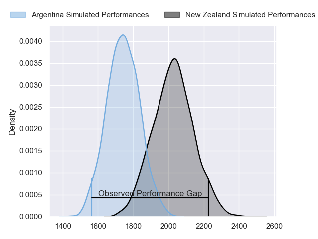
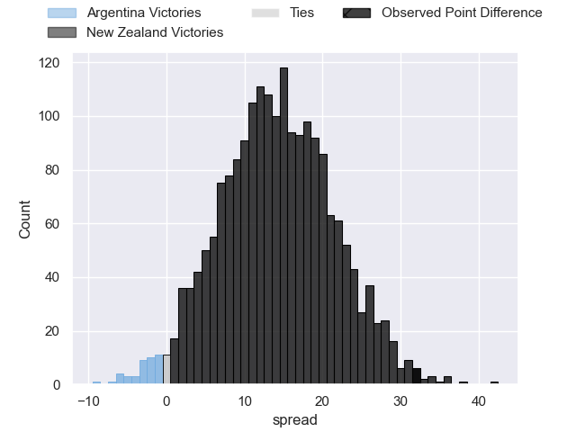
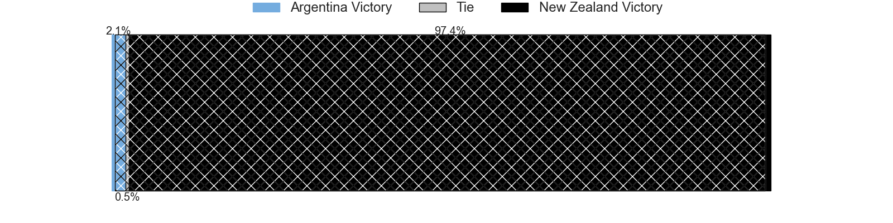
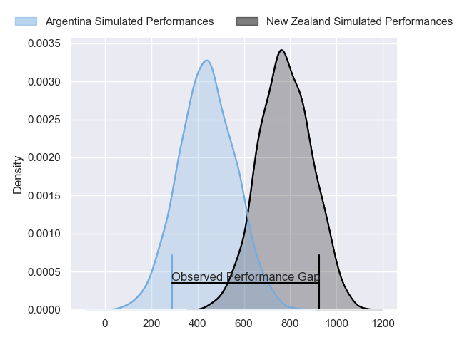
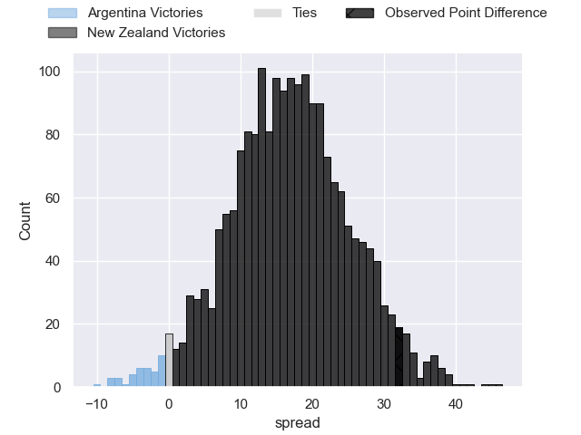
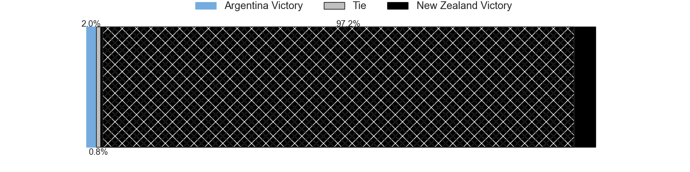

---  
layout: page  
title: Argentina at New Zealand; 10-42  
date: 2024-08-17 18:00:00 -0500  
categories: "Rugby Championship 2024" match review  
---
# Argentina at New Zealand; 10-42

# Club Level Predictions

The first set of predictions treats a club as the smallest object, as the club develops its members, organizes a gameplan, and deploys its players as needed for each match. This club model has a prediction of 0.823, which translates to predicting New Zealand to win by 13.9.

Our Over/Under is 53.5 - and combined with the spread above, we have a predicted scoreline of 20 to 33

Each club has a rating and a rating deviation (similar to a Glicko rating), and expected performances can be generated. This allows for simulated matches and spreads like the ones below.
## Projected Performances - Club Model

## Projected Spreads - Club Model

## Projected Results - Club Model

# Player Level Predictions

Treating teams instead as an entity made up of the currently active players, I have ratings for each player in an altogether different system. These can be combined to form team ratings once teamsheets are announced, weighting starters a bit higher than the reserves. After the match is played, players can be weighted by their minutes on the field, allowing for an accurate measure of the team's composition. With these compiled team ratings, we can make predictions, measure inaccuracy, and update the individual player ratings.
## Prediction without Player Minutes: New Zealand by 20.6

New Zealand by 17.1 on a neutral pitch

## Projected Performances - Player Model

## Projected Spreads - Player Model

## Projected Results - Player Model

|   Away Minutes | Away Player          |   Away Percentile |   Number |   Home Percentile | Home Player         |   Home Minutes |
|---------------:|:---------------------|------------------:|---------:|------------------:|:--------------------|---------------:|
|             61 | Thomas Gallo         |             94.55 |        1 |             91.4  | Tamaiti Williams    |             53 |
|             61 | Julian Montoya       |             90.47 |        2 |             98.22 | Codie Taylor        |             54 |
|             51 | Lucio Sordoni        |             95.19 |        3 |             88.95 | Tyrel Lomax         |             51 |
|             80 | Marcos Kremer        |             93.49 |        4 |             94.77 | Tupou Vaa'i         |             80 |
|             60 | Pedro Rubiolo        |             47.73 |        5 |             46.45 | Sam Darry           |             55 |
|             80 | Pablo Matera         |             99.52 |        6 |             98.46 | Ethan Blackadder    |             80 |
|             80 | Juan Martin Gonzalez |             96.16 |        7 |             98.66 | Dalton Papalii      |             51 |
|             51 | Joaquin Oviedo       |             90.64 |        8 |             98.96 | Ardie Savea         |             80 |
|             43 | Gonzalo Bertranou    |             81.49 |        9 |             97.11 | TJ Perenara         |             51 |
|             46 | Santiago Carreras    |             87.14 |       10 |             97.96 | Damian McKenzie     |             51 |
|             77 | Mateo Carreras       |             67.57 |       11 |             86.25 | Caleb Clarke        |             60 |
|             80 | Santiago Chocobares  |             69.38 |       12 |             94.69 | Jordie Barrett      |             80 |
|             80 | Lucio Cinti          |             68.12 |       13 |             89.27 | Rieko Ioane         |             77 |
|             43 | Matias Moroni        |             99.16 |       14 |             97.68 | Will Jordan         |             80 |
|             80 | Juan Cruz Mallia     |             99.59 |       15 |            100    | Beauden Barrett     |             80 |
|             19 | Ignacio Ruiz         |             94.51 |       16 |             95.64 | Asafo Aumua         |             29 |
|             19 | Mayco Vivas          |              5.29 |       17 |             99.45 | Ofa Tu'ungafasi     |             27 |
|             29 | Joel Sclavi          |             88.56 |       18 |              1.42 | Fletcher Newell     |             29 |
|             29 | Franco Molina        |             74.46 |       19 |             79.09 | Josh Lord           |             25 |
|             20 | Tomas Lavanini       |             93.89 |       20 |             99.33 | Sam Cane            |             29 |
|             37 | Lautaro Bazan Velez  |             49.24 |       21 |             83.02 | Cortez Ratima       |             29 |
|             37 | Tomas Albornoz       |             85.92 |       22 |             96.35 | Anton Lienert-Brown |             20 |
|             37 | Bautista Delguy      |             88.66 |       23 |             82.71 | Mark Tele'a         |             29 |

