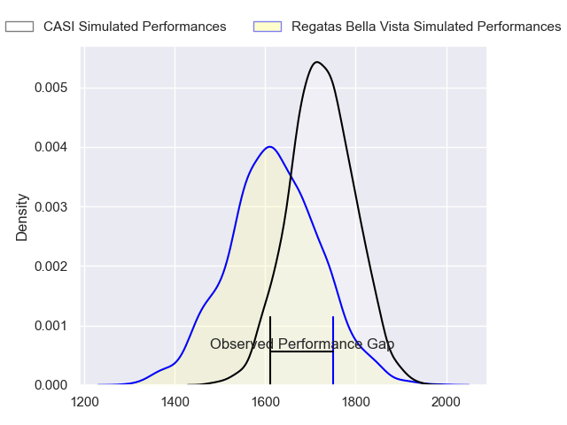
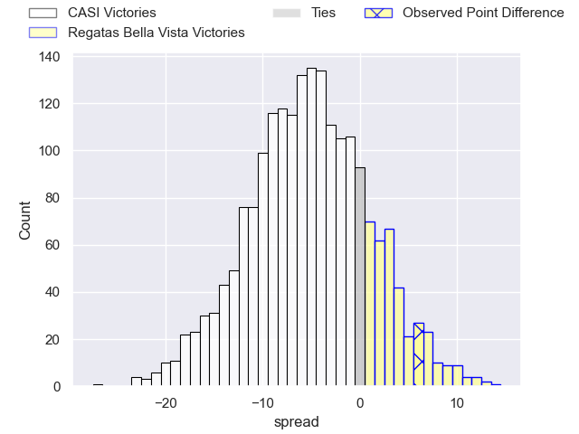
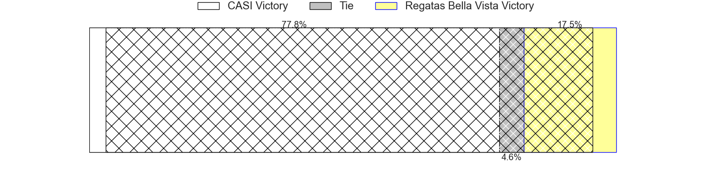
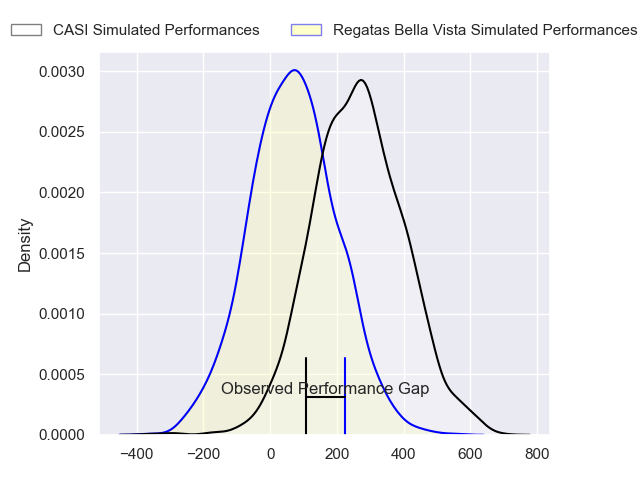
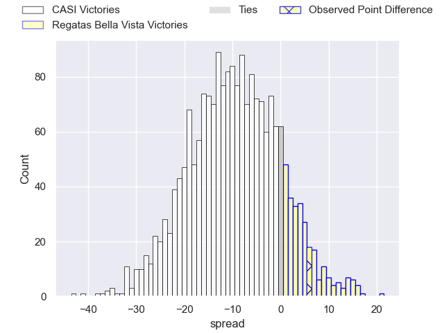
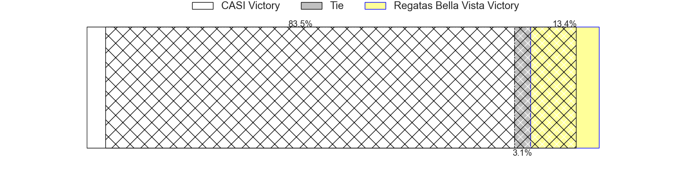

---  
layout: page  
title: CASI at Regatas Bella Vista; 24-30  
date: 2024-08-17 18:00:00 -0500  
categories: "URBA Top 13 2024" match review  
---
# CASI at Regatas Bella Vista; 24-30

# Club Level Predictions

The first set of predictions treats a club as the smallest object, as the club develops its members, organizes a gameplan, and deploys its players as needed for each match. This club model has a prediction of 0.362, which translates to predicting CASI to win by 5.0.

Our Over/Under is 46.5 - and combined with the spread above, we have a predicted scoreline of 26 to 21

Each club has a rating and a rating deviation (similar to a Glicko rating), and expected performances can be generated. This allows for simulated matches and spreads like the ones below.
## Projected Performances - Club Model

## Projected Spreads - Club Model

## Projected Results - Club Model

# Player Level Predictions

Treating teams instead as an entity made up of the currently active players, I have ratings for each player in an altogether different system. These can be combined to form team ratings once teamsheets are announced, weighting starters a bit higher than the reserves. After the match is played, players can be weighted by their minutes on the field, allowing for an accurate measure of the team's composition. With these compiled team ratings, we can make predictions, measure inaccuracy, and update the individual player ratings.
## Prediction without Player Minutes: CASI by 9.1

CASI by 12.8 on a neutral pitch

## Projected Performances - Player Model

## Projected Spreads - Player Model

## Projected Results - Player Model

|   Away Minutes | Away Player                |   Away Percentile |   Number |   Home Percentile | Home Player          |   Home Minutes |
|---------------:|:---------------------------|------------------:|---------:|------------------:|:---------------------|---------------:|
|             80 | Facundo Scaiano            |             35.99 |        1 |             66.14 | Matias Medrano       |             80 |
|             80 | Juan Torres Obeid          |             76.09 |        2 |             72.21 | Marcos Camerlinckx   |             80 |
|             80 | Juan Ignacio Nieto Sanchez |             77.82 |        3 |             38.12 | Juan Gobet           |             80 |
|             80 | Agustin Posleman           |             47.24 |        4 |             44.18 | Tomas Sanguinetti    |             80 |
|             80 | Leo Mazzini                |             52.66 |        5 |             54.64 | Francisco Ploder     |             80 |
|             80 | Eugenio Sartori            |             82.23 |        6 |             39.29 | Pedro Vega           |             80 |
|             80 | Ignacio Torrado            |             31.32 |        7 |             20.85 | Lucas Gobet          |             80 |
|             80 | Luis Briatore              |             52.18 |        8 |             37.21 | Felipe Camerlinckx   |             80 |
|             80 | Luca Canzani               |             72.33 |        9 |             35.48 | Marcos Joseph        |             80 |
|             80 | Felipe Hileman             |             62.24 |       10 |             49.39 | Justo Camerlinckx    |             80 |
|             80 | Jeronimo Tumbarello        |             51.58 |       11 |             34.2  | Enrique Camerlinckx  |             80 |
|             80 | Benjamin Belaga            |             58.33 |       12 |             61.56 | Juan Corso           |             80 |
|             80 | Jeronimo Solveyra          |             67.6  |       13 |             33.96 | Alejo Barrera        |             80 |
|             80 | Santiago David             |             72.86 |       14 |             46.93 | Rafael Santana       |             80 |
|             80 | Juan Akemeier              |             64.94 |       15 |             44.19 | Cruz Camerlinckx     |             80 |
|              0 | Facundo Andreotti          |            nan    |       16 |             15.94 | Tomas Barbaccia      |              0 |
|              0 | Hugo Garcia                |            nan    |       17 |            nan    | Felipe Galli         |              0 |
|              0 | Joaquin Britto             |             81.22 |       18 |            nan    | Diego Aguero         |              0 |
|              0 | Benjamin Rocca Rivarola    |             37.18 |       19 |             60.06 | Bautista Lopez Manan |              0 |
|              0 | Tobias Casaurang           |             43.8  |       20 |             35.06 | Beltran Landivar     |              0 |
|              0 | Tomas Phelan               |             27.92 |       21 |            nan    | Gonzalo Deluca       |              0 |
|              0 | Nicolas Cotella            |            nan    |       22 |             23.67 | Mateo Camerlinckx    |              0 |
|              0 | Salvador Ochoa             |             68.15 |       23 |             43.15 | Felipe Rugolo        |              0 |

