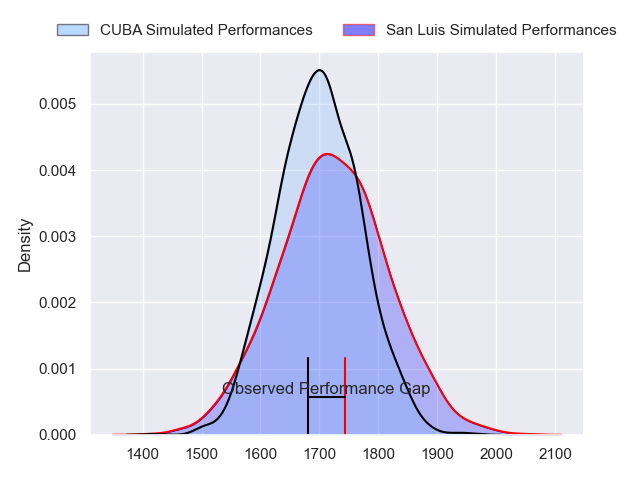
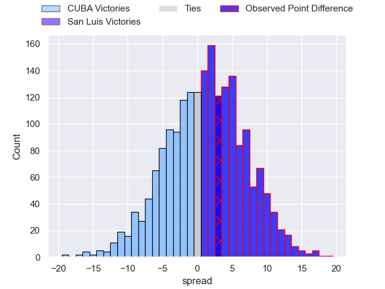
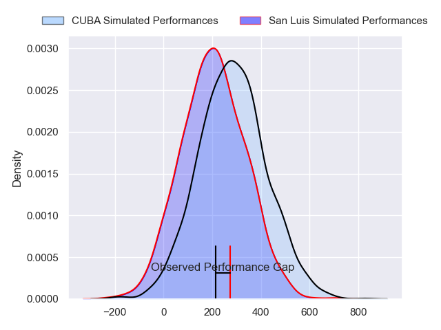
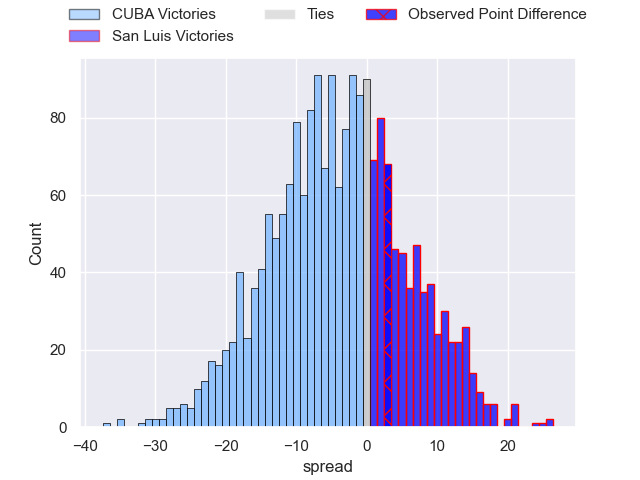
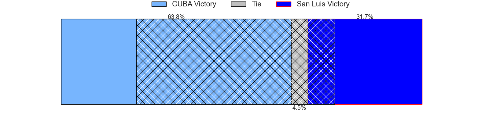

---  
layout: page  
title: CUBA at San Luis; 28-31  
date: 2024-08-17 18:00:00 -0500  
categories: "URBA Top 13 2024" match review  
---
# CUBA at San Luis; 28-31

# Club Level Predictions

The first set of predictions treats a club as the smallest object, as the club develops its members, organizes a gameplan, and deploys its players as needed for each match. This club model has a prediction of 0.535, which translates to predicting San Luis to win by 1.3.

Our Over/Under is 57.5 - and combined with the spread above, we have a predicted scoreline of 28 to 30

Each club has a rating and a rating deviation (similar to a Glicko rating), and expected performances can be generated. This allows for simulated matches and spreads like the ones below.
## Projected Performances - Club Model

## Projected Spreads - Club Model

## Projected Results - Club Model

# Player Level Predictions

Treating teams instead as an entity made up of the currently active players, I have ratings for each player in an altogether different system. These can be combined to form team ratings once teamsheets are announced, weighting starters a bit higher than the reserves. After the match is played, players can be weighted by their minutes on the field, allowing for an accurate measure of the team's composition. With these compiled team ratings, we can make predictions, measure inaccuracy, and update the individual player ratings.
## Prediction without Player Minutes: CUBA by 3.3

CUBA by 7.6 on a neutral pitch

## Projected Performances - Player Model

## Projected Spreads - Player Model

## Projected Results - Player Model

|   Away Minutes | Away Player           |   Away Percentile |   Number |   Home Percentile | Home Player                |   Home Minutes |
|---------------:|:----------------------|------------------:|---------:|------------------:|:---------------------------|---------------:|
|             80 | Joaquin Yakiche       |             21.01 |        1 |             39.49 | Santiago Bonavento         |             80 |
|             80 | Tomas Anderlic        |             12.12 |        2 |             55.41 | Mateo Caffaro              |             80 |
|             80 | Facundo Aguirre       |             86.26 |        3 |             42.42 | Mateo Calistro             |             80 |
|             80 | Santiago Uriarte      |             79.39 |        4 |             56.51 | Ramiro Bruni               |             80 |
|             80 | Santiago Landau       |             79.29 |        5 |             56.21 | Lahuen Argemi              |             80 |
|             80 | Lucas Campion         |             25.94 |        6 |             55.91 | Franco Gnecco              |             80 |
|             80 | Segundo Pisani        |             76.66 |        7 |             68.3  | Manuel Gnecco              |             80 |
|             80 | Benito Ortiz de Rozas |             75.47 |        8 |             44.07 | Agustin Torello            |             80 |
|             80 | Rafael Iriarte        |             69.1  |        9 |             18.51 | Martin Aereboe             |             80 |
|             80 | Valentin Mastroizi    |             79.92 |       10 |             50    | Felipe Campodonico         |             80 |
|             80 | Pedro Mesones         |             23.42 |       11 |             36.34 | Eduardo Ruesta             |             80 |
|             80 | Felipe de la Vega     |             63.09 |       12 |             59.65 | Segundo Fresco             |             80 |
|             80 | Felipe Perdomo        |             74.66 |       13 |             43.59 | Benjamin Marban            |             80 |
|             80 | Bautista Casaurang    |             86.43 |       14 |             57.81 | Wilmer Ramirez             |             80 |
|             80 | Simon Benitez Cruz    |             24.69 |       15 |             29.88 | Valentino Quattrocchi      |             80 |
|              0 | Francisco Garoby      |             80.25 |       16 |             25.69 | Agustin Fitzsimons Herrera |              0 |
|              0 | Esteban Iribarne      |            nan    |       17 |             28.91 | Alejo Garcia               |              0 |
|              0 | Bautista Carullo      |            nan    |       18 |             68.4  | Alexis Uvieda              |              0 |
|              0 | Felipe Mendonca       |            nan    |       19 |             28.48 | Facundo Alvarez Amado      |              0 |
|              0 | Francisco Sied        |             86.46 |       20 |             22.19 | Nahuel Curti               |              0 |
|              0 | Santiago Viacava      |            nan    |       21 |             66.72 | Juan Vaca                  |              0 |
|              0 | Marcos Young          |            nan    |       22 |             45.24 | Felipe Piatti              |              0 |
|              0 | Pedro Mastroizi       |             24.98 |       23 |             35.25 | Isidro Lazzarini           |              0 |

