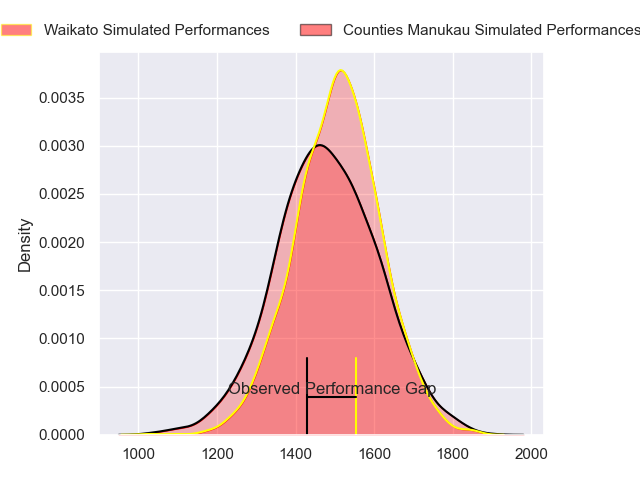
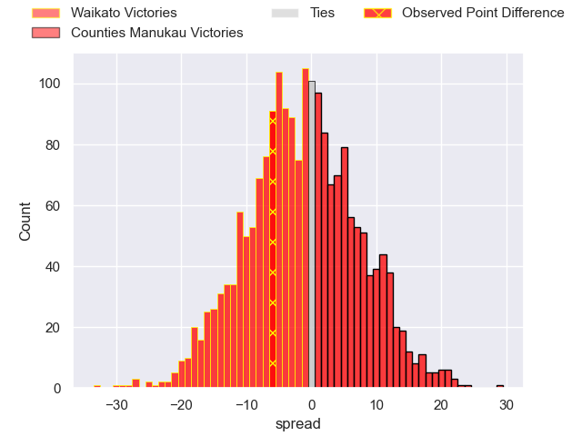
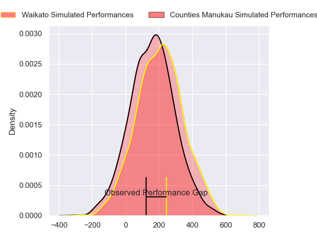
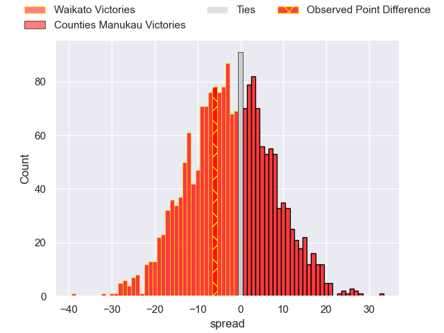

---  
layout: page  
title: Waikato at Counties Manukau; 26-20  
date: 2024-08-18 18:00:00 -0500  
categories: "Bunnings NPC 2024" match review  
---
# Waikato at Counties Manukau; 26-20

# Club Level Predictions

The first set of predictions treats a club as the smallest object, as the club develops its members, organizes a gameplan, and deploys its players as needed for each match. This club model has a prediction of 0.466, which translates to predicting Waikato to win by 1.3.

Our Over/Under is 54.5 - and combined with the spread above, we have a predicted scoreline of 28 to 27

Each club has a rating and a rating deviation (similar to a Glicko rating), and expected performances can be generated. This allows for simulated matches and spreads like the ones below.
## Projected Performances - Club Model

## Projected Spreads - Club Model

## Projected Results - Club Model

# Player Level Predictions

Treating teams instead as an entity made up of the currently active players, I have ratings for each player in an altogether different system. These can be combined to form team ratings once teamsheets are announced, weighting starters a bit higher than the reserves. After the match is played, players can be weighted by their minutes on the field, allowing for an accurate measure of the team's composition. With these compiled team ratings, we can make predictions, measure inaccuracy, and update the individual player ratings.
## Prediction without Player Minutes: Waikato by 3.9

Waikato by 6.9 on a neutral pitch

## Projected Performances - Player Model

## Projected Spreads - Player Model

## Projected Results - Player Model

|   Away Minutes | Away Player            |   Away Percentile |   Number |   Home Percentile | Home Player          |   Home Minutes |
|---------------:|:-----------------------|------------------:|---------:|------------------:|:---------------------|---------------:|
|             80 | Ayden Johnstone        |             97.24 |        1 |            nan    | Kauvaka Kaivelata    |             80 |
|             80 | Manaaki Boyle-Tiatia   |             31.83 |        2 |            nan    | Zuriel Togiatama     |             80 |
|             80 | George Dyer            |             83.1  |        3 |            nan    | Suetena Asomua       |             80 |
|             80 | Tai Cribb              |             53.85 |        4 |            nan    | William Furniss      |             80 |
|             80 | Laghlan McWhannell     |             95.66 |        5 |            nan    | James Thompson       |             80 |
|             80 | Malachi Wrampling-Alec |             37.08 |        6 |            nan    | Leo Ngatai-Tafau     |             80 |
|             80 | Senita Lauaki          |             50.53 |        7 |            nan    | Alamanda Motuga      |             80 |
|             80 | Patrick McCurran       |             20.79 |        8 |            nan    | Adam Brash           |             80 |
|             80 | Xavier Roe             |             47.03 |        9 |            nan    | Jonathan Taumateine  |             80 |
|             80 | Taha Kemara            |              6.35 |       10 |             69.26 | AJ Alatimu           |             80 |
|             80 | Gideon Wrampling       |             59.67 |       11 |            nan    | Josh Gray            |             80 |
|             80 | Quinn Tupaea           |             89.89 |       12 |            nan    | Gibson Popoali'i     |             80 |
|             80 | Bailyn Sullivan        |             15.33 |       13 |            nan    | Tevita Ofa           |             80 |
|             80 | Dan Sinkinson          |             44.52 |       14 |            nan    | Blake Makiri         |             80 |
|             80 | Austin Anderson        |             39.21 |       15 |            nan    | Simon-Peter Toleafoa |             80 |
|              0 | Pita Anae Ah-Sue       |             93.21 |       16 |            nan    | Ioane Moananu        |              0 |
|              0 | Mason Tupaea           |            nan    |       17 |            nan    | Sateki Latu          |              0 |
|              0 | Solomone Tukuafu       |            nan    |       18 |            nan    | Lionel Evans         |              0 |
|              0 | Ollie Norris           |             83.57 |       19 |             25.57 | Jadin Kingi          |              0 |
|              0 | Samipeni Finau         |             96.35 |       20 |            nan    | Cameron Church       |              0 |
|              0 | Quintony Ngatai        |            nan    |       21 |            nan    | Liam Daniela         |              0 |
|              0 | Aaron Cruden           |             93.03 |       22 |            nan    | Riley Hohepa         |              0 |
|              0 | Newton Tudreu          |             61.43 |       23 |            nan    | Kalione Hala         |              0 |

