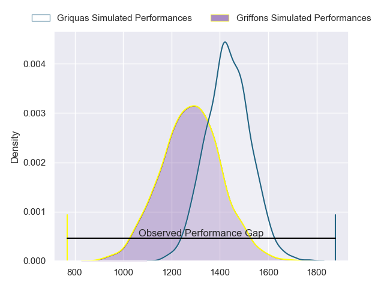
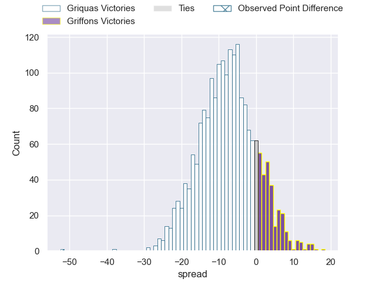
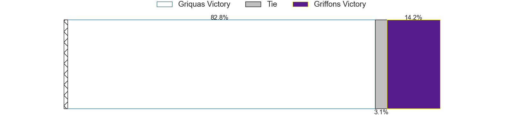
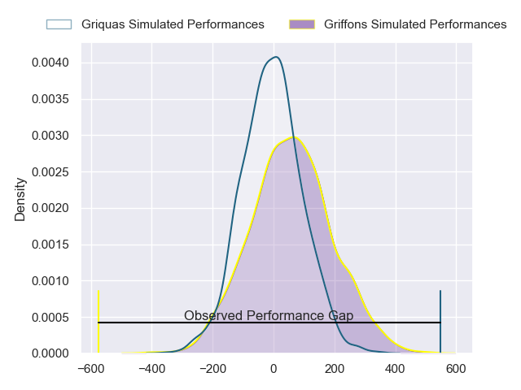
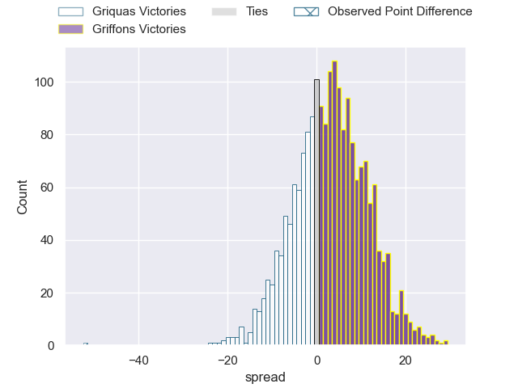
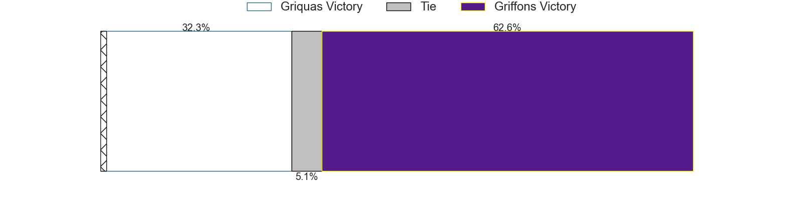

---  
layout: page  
title: Griquas at Griffons; 59-7  
date: 2024-08-18 18:00:00 -0500  
categories: "Currie Cup 2024" match review  
---
# Griquas at Griffons; 59-7

# Club Level Predictions

The first set of predictions treats a club as the smallest object, as the club develops its members, organizes a gameplan, and deploys its players as needed for each match. This club model has a prediction of 0.299, which translates to predicting Griquas to win by 7.7.

Our Over/Under is 66.5 - and combined with the spread above, we have a predicted scoreline of 37 to 29

Each club has a rating and a rating deviation (similar to a Glicko rating), and expected performances can be generated. This allows for simulated matches and spreads like the ones below.
## Projected Performances - Club Model

## Projected Spreads - Club Model

## Projected Results - Club Model

# Player Level Predictions

Treating teams instead as an entity made up of the currently active players, I have ratings for each player in an altogether different system. These can be combined to form team ratings once teamsheets are announced, weighting starters a bit higher than the reserves. After the match is played, players can be weighted by their minutes on the field, allowing for an accurate measure of the team's composition. With these compiled team ratings, we can make predictions, measure inaccuracy, and update the individual player ratings.
## Prediction without Player Minutes: Griffons by 3.2

Griffons by 0.3 on a neutral pitch

## Projected Performances - Player Model

## Projected Spreads - Player Model

## Projected Results - Player Model

|   Away Minutes | Away Player         |   Away Percentile |   Number |   Home Percentile | Home Player               |   Home Minutes |
|---------------:|:--------------------|------------------:|---------:|------------------:|:--------------------------|---------------:|
|             80 | Leon Lyons          |             11.68 |        1 |             20.92 | Simon Westraadt           |             80 |
|             80 | Dandré Delport      |             23.91 |        2 |             13.57 | Chadley Wenn              |             80 |
|             80 | Cebolenkosi Dlamini |             65.67 |        3 |              1.03 | Ebune Moango Ngundue      |             80 |
|             80 | Dylan Sjoblom       |             47.14 |        4 |              3.25 | Rian Olivier              |             80 |
|             80 | Derrick Pretorius   |             11.14 |        5 |             17.65 | Matthew Gray              |             80 |
|             80 | Thabo Ndimande      |             65.42 |        6 |              6.05 | Thato Siward Mavundla     |             80 |
|             80 | Marco De Witt       |             37.85 |        7 |              9.89 | Thomas Ongera             |             80 |
|            nan | nan                 |            nan    |        8 |             18.09 | Carl-Evert Pienaar        |             80 |
|            nan | nan                 |            nan    |        9 |             27.67 | Dewald Human              |             80 |
|            nan | nan                 |            nan    |       10 |             21.22 | Duan Pretorius            |             80 |
|            nan | nan                 |            nan    |       11 |              2.6  | Andrew Kota               |             80 |
|            nan | nan                 |            nan    |       12 |              8.96 | Jeandre De Beer           |             80 |
|            nan | nan                 |            nan    |       13 |             13.75 | Christopher Hollis        |             80 |
|            nan | nan                 |            nan    |       14 |              2.88 | Keanu Armandio Vers       |             80 |
|            nan | nan                 |            nan    |       15 |              2.9  | Gurshwin Wehr             |             80 |
|            nan | nan                 |            nan    |       16 |             46.53 | Willem Van der Heever     |              0 |
|            nan | nan                 |            nan    |       17 |             16.89 | Mthokozisi Charles Gumede |              0 |
|            nan | nan                 |            nan    |       18 |            nan    | Buhle Nojekwa             |              0 |
|            nan | nan                 |            nan    |       19 |              4.83 | Curtley Thomas            |              0 |
|            nan | nan                 |            nan    |       20 |             21.52 | Jared Kruger              |              0 |
|            nan | nan                 |            nan    |       21 |            nan    | David Bunduki             |              0 |
|            nan | nan                 |            nan    |       22 |             48.39 | Cheslin Arendse           |              0 |
|            nan | nan                 |            nan    |       23 |             14.94 | Kyle Cyster               |              0 |

