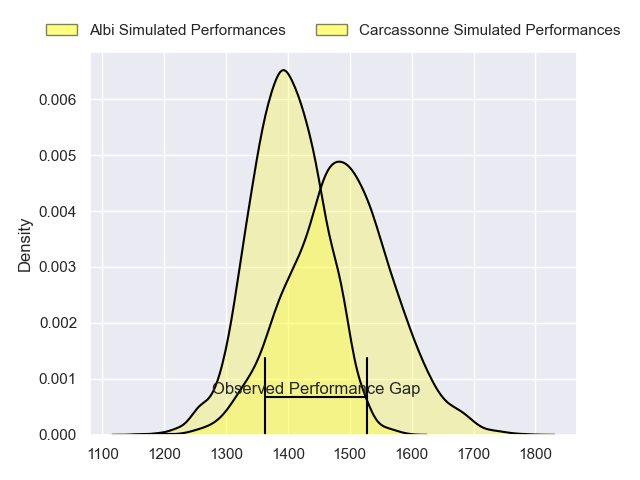
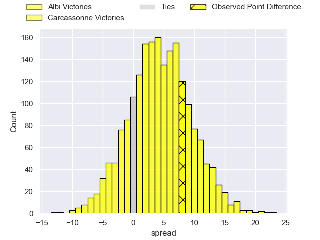
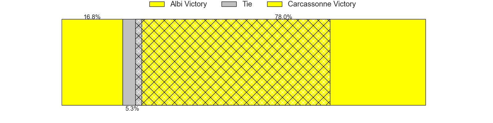
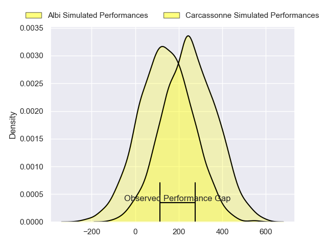
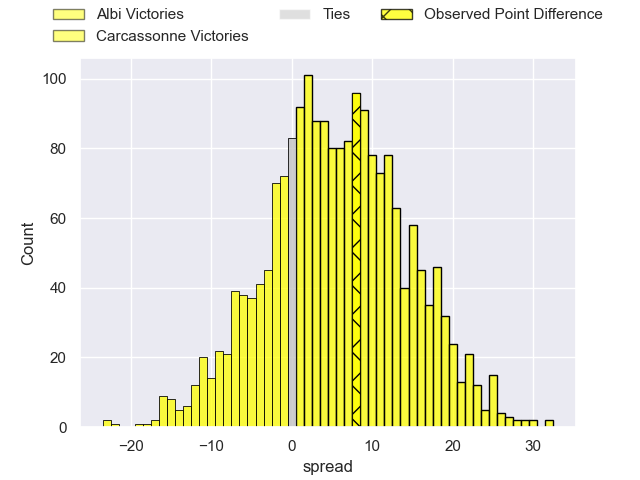
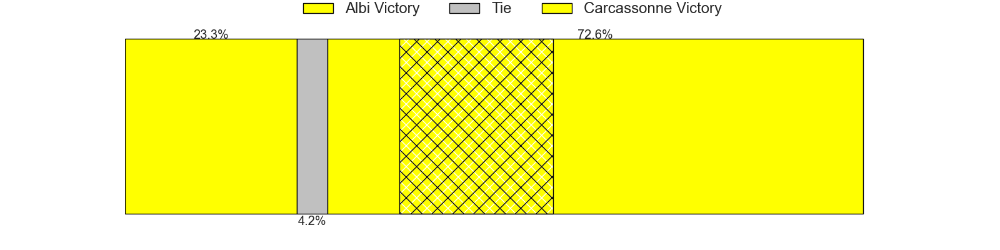

---  
layout: page  
title: Albi at Carcassonne; 19-27  
date: 2024-08-23 18:00:00 -0500  
categories: "Nationale 2024" match review  
---
# Albi at Carcassonne; 19-27

# Club Level Predictions

The first set of predictions treats a club as the smallest object, as the club develops its members, organizes a gameplan, and deploys its players as needed for each match. This club model has a prediction of 0.621, which translates to predicting Carcassonne to win by 4.4.

Our Over/Under is 39.5 - and combined with the spread above, we have a predicted scoreline of 17 to 22

Each club has a rating and a rating deviation (similar to a Glicko rating), and expected performances can be generated. This allows for simulated matches and spreads like the ones below.
## Projected Performances - Club Model

## Projected Spreads - Club Model

## Projected Results - Club Model

# Player Level Predictions

Treating teams instead as an entity made up of the currently active players, I have ratings for each player in an altogether different system. These can be combined to form team ratings once teamsheets are announced, weighting starters a bit higher than the reserves. After the match is played, players can be weighted by their minutes on the field, allowing for an accurate measure of the team's composition. With these compiled team ratings, we can make predictions, measure inaccuracy, and update the individual player ratings.
## Prediction without Player Minutes: Carcassonne by 6.0

Albi by 0.1 on a neutral pitch

## Projected Performances - Player Model

## Projected Spreads - Player Model

## Projected Results - Player Model

|   Away Minutes | Away Player             |   Away Percentile |   Number |   Home Percentile | Home Player         |   Home Minutes |
|---------------:|:------------------------|------------------:|---------:|------------------:|:--------------------|---------------:|
|             54 | Lucas Pindor            |             43.96 |        1 |             41.38 | Nika Neparidze      |             61 |
|             54 | Reinach Venter          |             22.35 |        2 |             80.91 | Raphael Carbou      |             72 |
|             65 | Jean Baptiste De Clercq |             33.57 |        3 |             70.29 | Siua Halanukonuka   |             38 |
|             80 | Yanis Horvat            |             56.94 |        4 |             43.95 | Romain Manchia      |             80 |
|             54 | Jonathan Kpoku          |             79.17 |        5 |             80.85 | Romain Guyot        |             61 |
|             80 | Vincent Calas           |             57.79 |        6 |             30.95 | Noe Bedou           |             46 |
|             80 | Simon Meka              |             65.72 |        7 |             86.58 | Etienne Herjean     |             80 |
|             40 | Camille Jarreau         |             61.43 |        8 |             68.55 | Ferdinand Dreno     |             80 |
|             59 | Titouan Pouzoullic      |             33.56 |        9 |             18.42 | Gaetan Pichon       |             80 |
|             59 | Victor Pisano           |             40.04 |       10 |             43.36 | Nils Chalies        |             80 |
|             80 | Kamilieni Raivono       |             52.08 |       11 |              1.51 | Paul Gadea          |             67 |
|             80 | Leo Treilles            |             23.48 |       12 |             44.29 | Jordan Puletua      |             80 |
|             80 | Victorien Jacomme       |             51.12 |       13 |              0.32 | Lukas Doyhenard     |             80 |
|             57 | Sean Robinson           |              8.51 |       14 |             98.68 | Sefa Naivalu        |             80 |
|             80 | Téo Dospital            |             48.75 |       15 |             42.29 | Naim Ben Alla       |             80 |
|             40 | Guillem Calmon          |             62.2  |       16 |            nan    | Nicolas Fenuafanote |             42 |
|             26 | Dion Evrard Oulai       |             23.51 |       17 |             67.16 | Clément Fontaine    |             34 |
|             26 | Arthur Castant          |             61.5  |       18 |            nan    | Yan Arnold          |             19 |
|             26 | Antoine Soave           |             75.85 |       19 |             68.66 | Valentin Sese       |             19 |
|             23 | Baptiste Couchinave     |             87.3  |       20 |             90.36 | Clement Egiziano    |             13 |
|             21 | Thibault Olender        |             75.52 |       21 |            nan    | Baptiste Moreno     |              8 |
|             21 | Gilen Queheille         |             77.62 |       22 |            nan    | nan                 |            nan |
|             15 | Thomas Cretu            |             31.32 |       23 |            nan    | nan                 |            nan |

