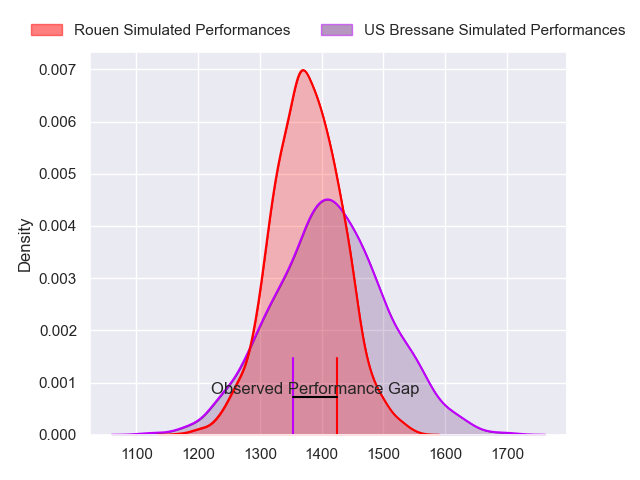
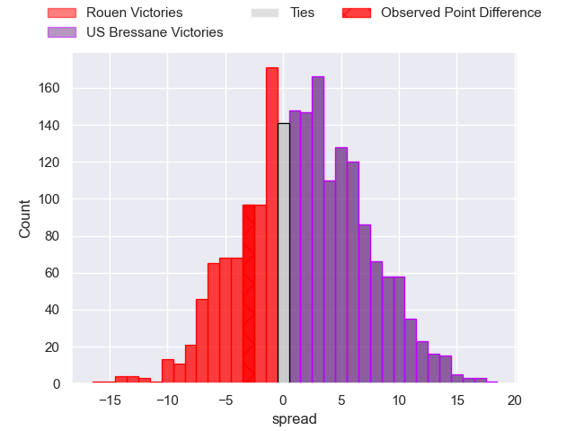
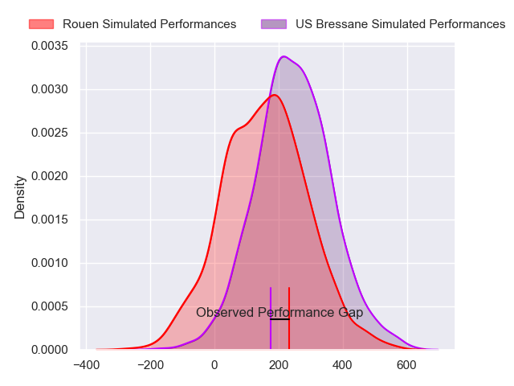
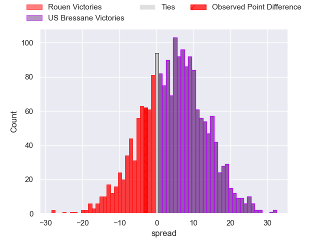

---  
layout: page  
title: Rouen at US Bressane; 20-17  
date: 2024-08-23 18:00:00 -0500  
categories: "Nationale 2024" match review  
---
# Rouen at US Bressane; 20-17

# Club Level Predictions

The first set of predictions treats a club as the smallest object, as the club develops its members, organizes a gameplan, and deploys its players as needed for each match. This club model has a prediction of 0.552, which translates to predicting US Bressane to win by 1.8.

Our Over/Under is 41.5 - and combined with the spread above, we have a predicted scoreline of 20 to 22

Each club has a rating and a rating deviation (similar to a Glicko rating), and expected performances can be generated. This allows for simulated matches and spreads like the ones below.
## Projected Performances - Club Model

## Projected Spreads - Club Model

## Projected Results - Club Model

# Player Level Predictions

Treating teams instead as an entity made up of the currently active players, I have ratings for each player in an altogether different system. These can be combined to form team ratings once teamsheets are announced, weighting starters a bit higher than the reserves. After the match is played, players can be weighted by their minutes on the field, allowing for an accurate measure of the team's composition. With these compiled team ratings, we can make predictions, measure inaccuracy, and update the individual player ratings.
## Prediction without Player Minutes: US Bressane by 3.8

Rouen by 0.1 on a neutral pitch

## Projected Performances - Player Model

## Projected Spreads - Player Model

## Projected Results - Player Model

|   Away Minutes | Away Player           |   Away Percentile |   Number |   Home Percentile | Home Player          |   Home Minutes |
|---------------:|:----------------------|------------------:|---------:|------------------:|:---------------------|---------------:|
|             61 | Alexis Decaux         |             84.86 |        1 |             53.69 | Teo Bordenave        |             46 |
|             77 | Mathieu Bonnot        |             78.9  |        2 |             12.01 | Arnaud Feltrin       |             20 |
|             77 | Soso Bekoshvili       |             81.57 |        3 |             10.1  | Atonio Ulutuipalelei |             60 |
|             80 | John-Charles Astle    |             58    |        4 |             46.34 | Thomas Déliance      |             80 |
|             61 | Will Witty            |             52.96 |        5 |             14.03 | Josh Peters          |             60 |
|             80 | Willy N'Diaye         |              4.37 |        6 |             49.76 | Pierre Reynaud       |             80 |
|             80 | Tienie Burger         |             89.99 |        7 |              9.14 | Quentin Witt         |             60 |
|             73 | Julien Ruaud          |             81.67 |        8 |             71.25 | Wael May             |             80 |
|             80 | Florent Campeggia     |             69.52 |        9 |             59.08 | Jeremy Valencot      |             58 |
|             80 | Maxime Javaux         |             52.99 |       10 |             33.2  | Nathan Azais         |             80 |
|             80 | Benjamin Descamps     |             69.8  |       11 |             63.97 | Élie De Fleurian     |             80 |
|             61 | Benjamin Pehau        |             79.47 |       12 |             62.33 | Benjamin Doy         |             80 |
|             80 | Opetera Peleseuma     |             10.79 |       13 |             17.99 | Alexandre Badet      |             51 |
|             52 | Nicolas Nieto         |             53.62 |       14 |             62.18 | Dimitri Doucet       |             80 |
|             80 | Axel Malaret          |             48.76 |       15 |             83.2  | Florent Massip       |             80 |
|             28 | Sakiusa Bureitakiyaca |             64.63 |       16 |             57.31 | Louis Dasalmartini   |             60 |
|             19 | Noe Khier             |            nan    |       17 |             64.5  | Vazha Kapanadze      |             34 |
|             19 | Corentin Vernet       |             28.95 |       18 |             65.82 | Joe Margetts         |             29 |
|             19 | Joaquin Riera         |             50.26 |       19 |            nan    | Audric Sanlaville    |             22 |
|              7 | Manolo Laffond        |            nan    |       20 |             66.4  | Grégoire Demangel    |             20 |
|              3 | Diego Arbelo          |             40.62 |       21 |             49.37 | Nail Ait Naceur      |             20 |
|              3 | Lucas Poisson         |            nan    |       22 |             77.96 | Erich de Jager       |             20 |

