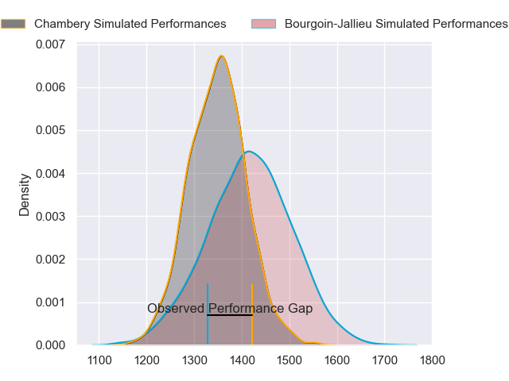
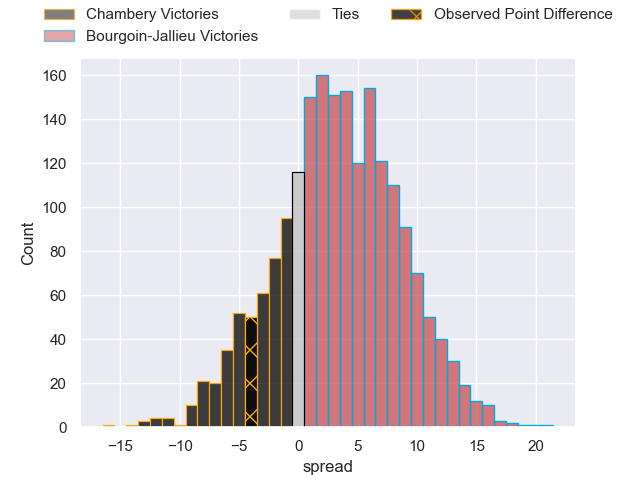
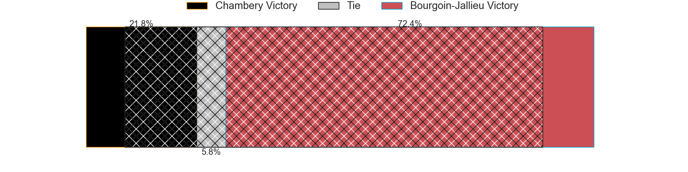
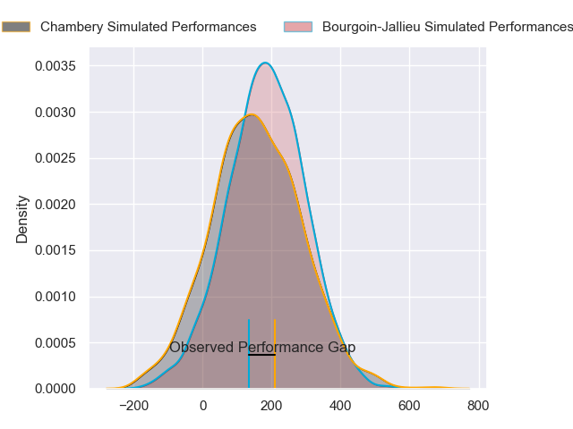
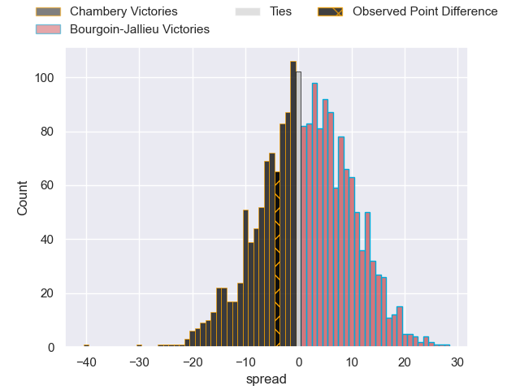

---  
layout: page  
title: Chambery at Bourgoin-Jallieu; 24-20  
date: 2024-08-24 18:00:00 -0500  
categories: "Nationale 2024" match review  
---
# Chambery at Bourgoin-Jallieu; 24-20

# Club Level Predictions

The first set of predictions treats a club as the smallest object, as the club develops its members, organizes a gameplan, and deploys its players as needed for each match. This club model has a prediction of 0.595, which translates to predicting Bourgoin-Jallieu to win by 3.4.

Our Over/Under is 38.5 - and combined with the spread above, we have a predicted scoreline of 18 to 21

Each club has a rating and a rating deviation (similar to a Glicko rating), and expected performances can be generated. This allows for simulated matches and spreads like the ones below.
## Projected Performances - Club Model

## Projected Spreads - Club Model

## Projected Results - Club Model

# Player Level Predictions

Treating teams instead as an entity made up of the currently active players, I have ratings for each player in an altogether different system. These can be combined to form team ratings once teamsheets are announced, weighting starters a bit higher than the reserves. After the match is played, players can be weighted by their minutes on the field, allowing for an accurate measure of the team's composition. With these compiled team ratings, we can make predictions, measure inaccuracy, and update the individual player ratings.
## Prediction without Player Minutes: Chambery by 0.1

Chambery by 7.7 on a neutral pitch

## Projected Performances - Player Model

## Projected Spreads - Player Model

## Projected Results - Player Model

|   Away Minutes | Away Player                  |   Away Percentile |   Number |   Home Percentile | Home Player       |   Home Minutes |
|---------------:|:-----------------------------|------------------:|---------:|------------------:|:------------------|---------------:|
|             80 | Nugzar Somkhishvili          |             82.05 |        1 |             56.99 | Rémy Gaborit      |             80 |
|             80 | Yan Tabarot                  |              2.13 |        2 |             68.09 | Maxime Castant    |             80 |
|             55 | Lasha Tabidze                |             64.51 |        3 |             87.87 | Dimitri Tchapnga  |             40 |
|             57 | Fabien Witz                  |             50.65 |        4 |             41.39 | Thomas Adélaïde   |             55 |
|             80 | Taniela Matakaiongo          |             39.2  |        5 |              1    | Morgan Eames      |             49 |
|             80 | Jean-Baptiste Grenod         |             89.11 |        6 |             16.19 | Sam Daly          |             80 |
|             13 | Colin Lebian                 |             50.15 |        7 |             10.89 | Kevin Rivoire     |             60 |
|             80 | Tui Uru                      |             83.86 |        8 |              6.37 | Poutasi Luafutu   |              7 |
|             60 | Aubin Eymeri                 |             29.46 |        9 |             34.14 | Martin Doan       |             25 |
|             80 | Thibault Moreno              |             49.48 |       10 |             81.21 | Nicolas Vuillemin |             80 |
|             80 | Arthur Nennig                |             82.77 |       11 |             77.75 | Joe Ravouvou      |             50 |
|             54 | Bastien Reymond              |             67.7  |       12 |             10.94 | Aviata Silago     |             40 |
|             20 | Va'aufauese Apelu Maliko     |             60.3  |       13 |              3.76 | Christopher Bosch |             40 |
|             48 | Paul Baptiste Florent Altier |             65.72 |       14 |              1.89 | Remi Bouet        |             80 |
|             26 | Thomas Hecquet               |             43.61 |       15 |              1.05 | Antoine Renaud    |             40 |
|             80 | Mateo Guerret                |             37.03 |       16 |             13.26 | Lucas Dycke       |             31 |
|             67 | Youenn Floch                 |             39.59 |       17 |             39.4  | Robin Gascou      |             80 |
|             73 | Ahmed Tidiane Kane           |             76.22 |       18 |            nan    | Kamil Bouregba    |             31 |
|             18 | Baptiste Collet              |             23.85 |       19 |            nan    | Julien Ratajczak  |             30 |
|             20 | Arwel Robson                 |            nan    |       20 |            nan    | Keynan Knox       |             25 |
|             20 | Gela Murusidze               |            nan    |       21 |             19.8  | Léandre Cotte     |             49 |
|             32 | Alessio Caiolo               |            nan    |       22 |            nan    | Tom Danovaro      |             24 |
|             56 | Antoine Ferreira             |            nan    |       23 |             46.1  | Liam Rimet        |             62 |

