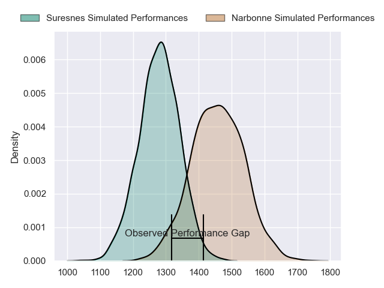
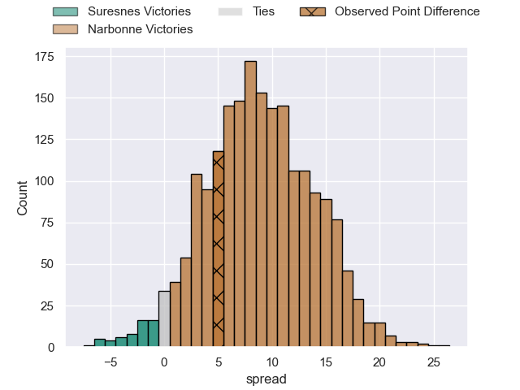
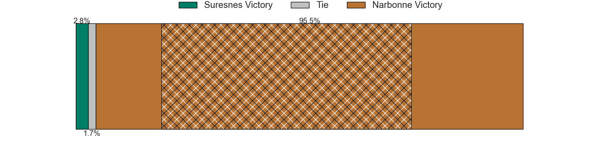
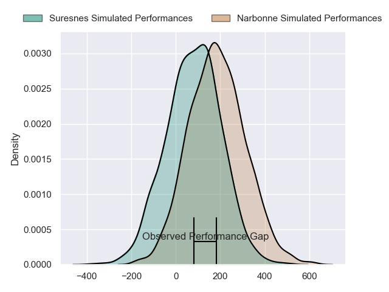
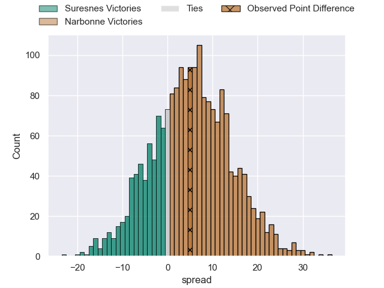
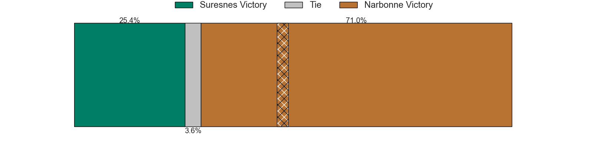

---  
layout: page  
title: Suresnes at Narbonne; 18-23  
date: 2024-08-24 18:00:00 -0500  
categories: "Nationale 2024" match review  
---
# Suresnes at Narbonne; 18-23

# Club Level Predictions

The first set of predictions treats a club as the smallest object, as the club develops its members, organizes a gameplan, and deploys its players as needed for each match. This club model has a prediction of 0.734, which translates to predicting Narbonne to win by 9.0.

Our Over/Under is 43.5 - and combined with the spread above, we have a predicted scoreline of 17 to 26

Each club has a rating and a rating deviation (similar to a Glicko rating), and expected performances can be generated. This allows for simulated matches and spreads like the ones below.
## Projected Performances - Club Model

## Projected Spreads - Club Model

## Projected Results - Club Model

# Player Level Predictions

Treating teams instead as an entity made up of the currently active players, I have ratings for each player in an altogether different system. These can be combined to form team ratings once teamsheets are announced, weighting starters a bit higher than the reserves. After the match is played, players can be weighted by their minutes on the field, allowing for an accurate measure of the team's composition. With these compiled team ratings, we can make predictions, measure inaccuracy, and update the individual player ratings.
## Prediction without Player Minutes: Narbonne by 0.3

Suresnes by 7.8 on a neutral pitch

## Projected Performances - Player Model

## Projected Spreads - Player Model

## Projected Results - Player Model

|   Away Minutes | Away Player            |   Away Percentile |   Number |   Home Percentile | Home Player               |   Home Minutes |
|---------------:|:-----------------------|------------------:|---------:|------------------:|:--------------------------|---------------:|
|             57 | Elias Coulibaly        |             45.75 |        1 |              9.29 | Gregory Fichten           |             15 |
|             80 | Jean-Étienne Lesueur   |              9.58 |        2 |             11.36 | Clément Esteriola         |             65 |
|             80 | Leandro Mario Assi     |             81.81 |        3 |             17.23 | Chris Talakai             |             57 |
|             28 | Damien Bozic           |             36.07 |        4 |             72.92 | Marius Antonescu          |             51 |
|             58 | Sacha Yahi             |             78.56 |        5 |             10.08 | Leva Fifita               |             62 |
|             80 | Florian Desbordes      |             34.31 |        6 |             62.68 | Arthur Christienne        |             80 |
|             80 | Wian Vosloo            |             79.4  |        7 |              3.98 | Paul Belzons              |             80 |
|             47 | Jean-Baptiste Lachaise |             67.92 |        8 |             23.96 | Charles Malet             |             48 |
|             80 | Thomas Lacroix         |             11.13 |        9 |             71.92 | Pablo Barbaste            |             70 |
|             80 | Tanguy Lacoste         |             24.33 |       10 |              3.3  | Gilles Bosch              |             32 |
|             15 | Faraj Fartass          |             96.33 |       11 |             23.42 | Étienne Ducom             |             57 |
|             80 | JJ Taulagi             |              0.63 |       12 |             62.96 | Parataiso Silafai-Lea'ana |             57 |
|             23 | Victor Barnier         |             91.32 |       13 |             46.88 | Pierre Nueno              |             80 |
|             80 | Alexis Clement         |             31.33 |       14 |             10.16 | Pierre-Hugo Ducom         |             80 |
|             58 | Goulwen Gueho          |              2.28 |       15 |              0.41 | Boris Goutard             |             23 |
|             23 | Thibaud Sebire         |             67.07 |       16 |             91.4  | Mehdi Boundjema           |             40 |
|             23 | Ismael Martin          |            nan    |       17 |            nan    | Jérémy Boyadjis           |             29 |
|             23 | Nail Audoire           |             43.51 |       18 |             86.86 | Darrell Dyer              |             18 |
|             22 | Marvin Woki            |             92.09 |       19 |             31.78 | Nicolas Mousties          |             52 |
|             22 | Simon Veyrac           |             92.52 |       20 |            nan    | James Hart                |             80 |
|             33 | Jean Chezeau           |             77.53 |       21 |             54.23 | Tom Chauvet               |             65 |
|             80 | Germain de Borda       |            nan    |       22 |             63.94 | Théo Castinel             |             80 |
|             10 | Gauthier Wolf          |            nan    |       23 |             82.22 | Clément Clavières         |             40 |

