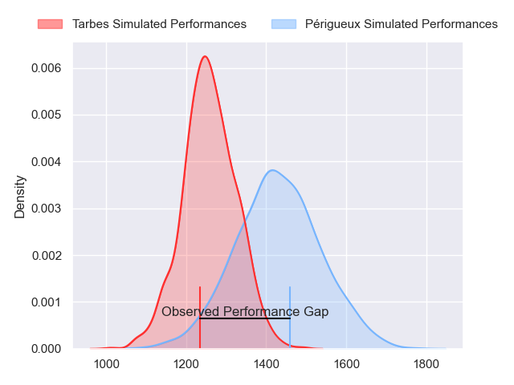
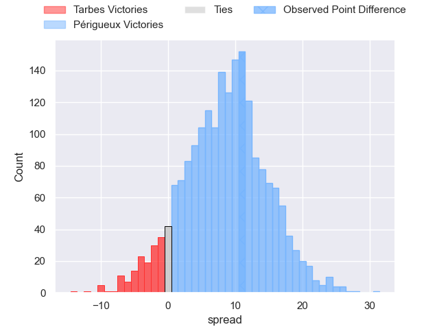
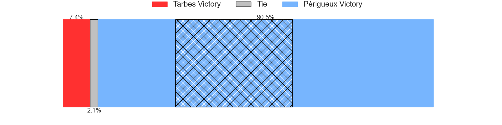
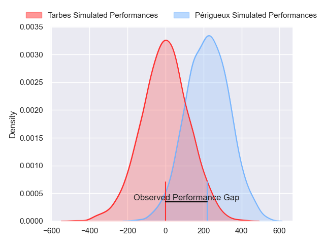
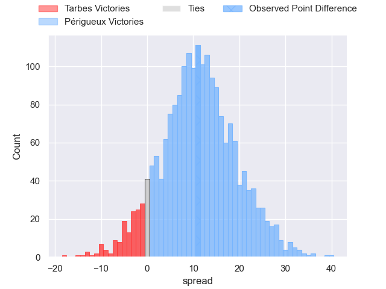
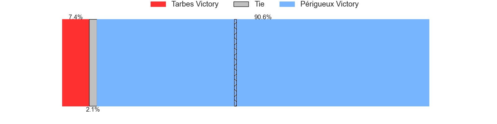

---  
layout: page  
title: Tarbes at Perigueux; 13-24  
date: 2024-08-24 18:00:00 -0500  
categories: "Nationale 2024" match review  
---
# Tarbes at Perigueux; 13-24

# Club Level Predictions

The first set of predictions treats a club as the smallest object, as the club develops its members, organizes a gameplan, and deploys its players as needed for each match. This club model has a prediction of 0.725, which translates to predicting Périgueux to win by 8.6.

Our Over/Under is 35.5 - and combined with the spread above, we have a predicted scoreline of 13 to 22

Each club has a rating and a rating deviation (similar to a Glicko rating), and expected performances can be generated. This allows for simulated matches and spreads like the ones below.
## Projected Performances - Club Model

## Projected Spreads - Club Model

## Projected Results - Club Model

# Player Level Predictions

Treating teams instead as an entity made up of the currently active players, I have ratings for each player in an altogether different system. These can be combined to form team ratings once teamsheets are announced, weighting starters a bit higher than the reserves. After the match is played, players can be weighted by their minutes on the field, allowing for an accurate measure of the team's composition. With these compiled team ratings, we can make predictions, measure inaccuracy, and update the individual player ratings.
## Prediction without Player Minutes: Périgueux by 11.0

Périgueux by 8.5 on a neutral pitch

## Projected Performances - Player Model

## Projected Spreads - Player Model

## Projected Results - Player Model

|   Away Minutes | Away Player         |   Away Percentile |   Number |   Home Percentile | Home Player       |   Home Minutes |
|---------------:|:--------------------|------------------:|---------:|------------------:|:------------------|---------------:|
|             57 | Ximun Bessonart     |              8.01 |        1 |             66.91 | Emilien Borges    |             57 |
|             80 | Florian Lamothe     |             29.87 |        2 |             44.97 | Lucas Marijon     |             30 |
|             80 | Irakli Mirtskhulava |             85.18 |        3 |             62.82 | Anthony Pelmard   |             80 |
|             48 | Baptiste Peytavi    |             12.55 |        4 |             37.65 | Clement Lanen     |             48 |
|             57 | Léo Estaque         |             35.57 |        5 |             14.43 | Jaco Willemse     |             60 |
|             80 | Alexis Armary       |             78.43 |        6 |              7.39 | Madioke Konate    |             48 |
|             50 | Léo Saint-Guilhem   |             44.51 |        7 |             93    | Afaesetiti Amosa  |             80 |
|             80 | Julien Cantan       |             10.83 |        8 |             54.37 | Karl Lambert      |             13 |
|             47 | Mickael Thébault    |             39.38 |        9 |             16.78 | Thibaut Dulucq    |             23 |
|             80 | Alexandre Perez     |             21.24 |       10 |             63.71 | Juan Kotze        |             48 |
|             50 | Jone Tuva           |              1.22 |       11 |             84.48 | Tim Giresse       |             50 |
|             30 | Johan Paulet        |             13.02 |       12 |             86.03 | Cyril Couturier   |             67 |
|             14 | Savenaca Rawaca     |              8.25 |       13 |             54.71 | Dorian Lavernhe   |             80 |
|             80 | Jonathan Duffau     |             20.41 |       14 |             80.9  | Vincent Fouillade |             80 |
|             23 | Tiaan Swanepoel     |             39.83 |       15 |             47.72 | Anderson Neisen   |             32 |
|             50 | Enzo Baggiani       |             30.69 |       16 |             76.76 | Thomas Vidal      |             32 |
|             30 | Vincent Dolier      |             83.44 |       17 |              0.97 | Manu Leiataua     |             32 |
|             30 | Luka Vea            |            nan    |       18 |             31.01 | Martin Augeix     |             32 |
|             57 | Mathieu Soufflet    |            nan    |       19 |             46.25 | Damien Lavergne   |             20 |
|             66 | Filipe Manu         |              1.46 |       20 |             63.95 | Hendri Storm      |             32 |
|             33 | Matias Brocal       |            nan    |       21 |             37.71 | Nahum Merigan     |             48 |
|             23 | Hugo Cellier        |            nan    |       22 |             34.08 | Nicolas Faltrept  |             80 |
|             80 | Mathieu Berbizier   |              4.12 |       23 |             70.33 | Yon Camou         |             80 |

